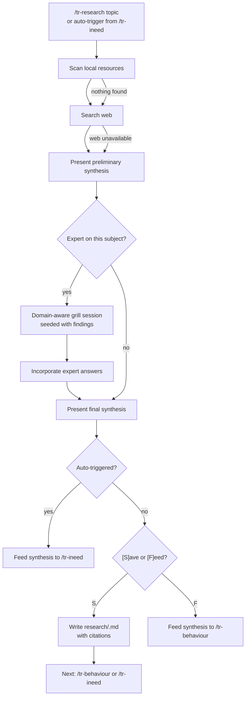

# Behaviour: Research a Subject

## Actor
Developer or AI agent — either invoking `/tr-research <topic>` explicitly, or triggered automatically from within `/tr-ineed` when a knowledge-intensive topic is detected.

## Preconditions
- A topic or domain to research has been identified (stated explicitly or extracted from a requirement)
- At least one research channel is available: local files, web search, or the developer is present as a potential domain expert

## Main Flow
1. Actor invokes `/tr-research <topic>` — or `/tr-ineed` triggers research internally after identifying a knowledge-intensive domain.
2. Skill announces the topic and begins gathering.
3. Skill scans local resources: PDFs, datasheets, and reference implementations found in the project (e.g. a `research/` folder, files linked from OVERVIEW.md, or any `.pdf`/`.md` files whose names match the topic).
4. Skill searches the web for the topic: existing libraries, papers, GitHub repos, Stack Overflow threads, standards documents — anything that informs implementation or design.
5. Skill presents a preliminary synthesis: what was found locally, what was found on the web, and the key take-aways so far.
6. Skill asks: **"Are you an expert on this subject?"**
   - If **yes** → skill runs a domain-aware grill session (seeded with the actual findings — library APIs, paper abstracts, known constraints — not generic questions), then incorporates the expert's answers into the synthesis.
   - If **no** → skill proceeds with the gathered synthesis.
7. Skill presents the final structured research summary (topic, local sources, web sources, expert insights, key conclusions, open questions).
8. Skill asks: **"[S] Save as `research/<topic>.md` with citations, or [F] Feed directly into a spec?"**
   - **[S]** → writes `research/<topic-slug>.md` (see Postconditions); presents **Next:** `/tr-behaviour` or `/tr-ineed <topic>`
   - **[F]** → feeds synthesis forward as input context for `/tr-behaviour`; no file written

## Alternate Flows

### No local resources found
- **Trigger:** Scan in step 3 finds no matching local files
- **Steps:**
  1. Skill notes "No local resources found" and proceeds to web search (step 4)

### Web search unavailable
- **Trigger:** Web search tool is not available in the agent's tool context
- **Steps:**
  1. Skill notes the limitation ("web search unavailable — running on local + expert only")
  2. Proceeds from step 5 with only local findings

### Expert grilling triggered
- **Trigger:** Developer answers "yes" in step 6
- **Steps:**
  1. Skill loads the preliminary synthesis as grilling material
  2. Runs a domain-aware grill session: questions reference specific libraries found, paper conclusions, known trade-offs — not generic prompts
  3. Developer answers; skill incorporates responses into the synthesis
  4. Returns to step 7

### Auto-triggered from `/tr-ineed`
- **Trigger:** `/tr-ineed` detects a knowledge-intensive domain and invokes research internally (no explicit `/tr-research` invocation)
- **Steps:**
  1. Steps 2–7 run as normal
  2. Step 8 is skipped — synthesis is always fed forward to `/tr-ineed`; save option is not presented
  3. `/tr-ineed` continues with the enriched synthesis as input context

### Topic already researched
- **Trigger:** A file at `research/<topic-slug>.md` already exists at step 2
- **Steps:**
  1. Skill presents: "Found existing research at `research/<topic-slug>.md` (last updated: `<date>`). [U]se it / [R]efresh it / [S]tart fresh?"
  2. **[U]** → loads existing document as the synthesis; skips to step 8
  3. **[R]** → runs the full flow; merges new findings with the existing document; updates citations
  4. **[S]** → overwrites; runs the full flow

## Postconditions
- **Save path:** `research/<topic-slug>.md` exists with: topic title, local sources (file paths), web sources (URLs + titles), expert insights (if any), key conclusions, open questions, and a `## References` section with full citations
- **Feed path:** A structured synthesis (same structure as above, minus the file) has been passed as input context to the downstream skill

## Error Conditions
- **All research channels unavailable** (offline, no local files, no expert present): Skill announces "No research sources available" and asks whether to proceed with the spec based on the stated requirement alone or abort
- **Web search returns no relevant results**: Skill announces the null result and continues with local + expert sources; notes the gap in the synthesis

## Flow

## Related
- `../human-integration/route-requirement/usecase.md` — `/tr-ineed` is the primary auto-trigger for research; shares the discovery-path flow
- `../human-integration/grill-me/usecase.md` — expert grilling in step 6 reuses the grill-me pattern; research seeds it with domain-specific material

## Acceptance Criteria

**AC-1: Full research flow — save path**
- Given a topic has been identified and local resources, web search, and the developer are all available
- When the developer invokes `/tr-research <topic>` and answers "no" to expert question and chooses [S]ave
- Then a `research/<topic-slug>.md` file is written with cited local sources, web sources, key conclusions, and a References section

**AC-2: Expert grilling seeded with findings**
- Given the preliminary synthesis includes at least one library or paper
- When the developer answers "yes" to the expert question
- Then the grill session asks questions that reference specific findings (library name, paper conclusion, or known trade-off) — not generic topic questions

**AC-3: Feed path — synthesis passed to spec**
- Given a topic has been researched
- When the developer chooses [F]eed
- Then the synthesis is passed as input context to `/tr-behaviour` and no research file is written

**AC-4: Auto-trigger from `/tr-ineed`**
- Given `/tr-ineed` identifies a knowledge-intensive domain
- When it invokes research internally
- Then steps 2–7 run, the save/feed prompt is skipped, and the synthesis is returned to `/tr-ineed` as enriched context

**AC-5: No local resources — graceful skip**
- Given no local files match the topic
- When the scan in step 3 completes
- Then the skill notes the null result and proceeds to web search without blocking

**AC-6: Web search unavailable — graceful degradation**
- Given the agent's tool context has no web search
- When step 4 is reached
- Then the skill notes the limitation and continues with local + expert sources only

**AC-7: Topic already researched — use/refresh/start-fresh**
- Given `research/<topic-slug>.md` already exists
- When `/tr-research <topic>` is invoked
- Then the skill presents the existing file and offers [U]se / [R]efresh / [S]tart fresh before proceeding

**AC-8: All channels unavailable — graceful fail**
- Given no local files, no web search, and no expert available
- When research is attempted
- Then the skill announces the gap and asks whether to proceed with the raw requirement or abort — it does not silently produce an empty synthesis

## Status
- **State:** specified
- **Created:** 2026-03-20
- **Last reviewed:** 2026-03-20
