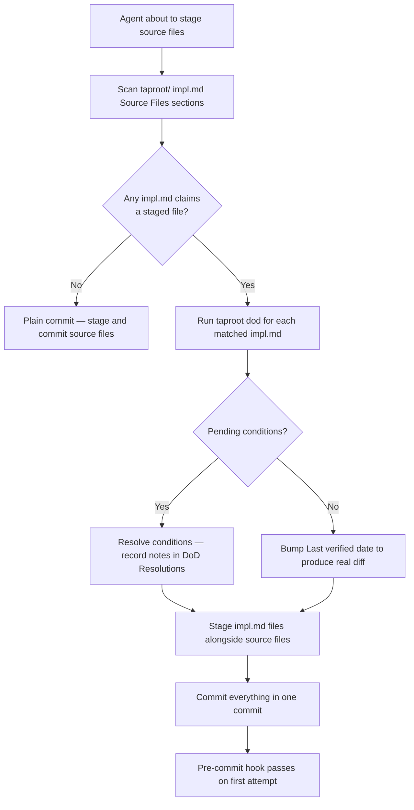

# Behaviour: Proactive Impl.md Scan Before Ad-Hoc Commits

## Actor
Agent executing an ad-hoc implementation task — modifying source files outside any taproot skill (e.g. a direct bug fix, refactor, or exploratory change not driven by `/tr-implement`)

## Preconditions
- The agent has modified one or more source files as part of an ad-hoc task
- The agent is about to stage and commit those files
- A taproot hierarchy exists with impl.md files that may claim ownership of the modified files

## Main Flow
1. Agent identifies which source files it is about to stage
2. Agent scans all impl.md files under `taproot/` — for each, reads the `## Source Files` section
3. Agent cross-references: for each staged source file, finds any impl.md that lists it
4. For each matched impl.md, agent runs `taproot dod <impl-path>` to check pending conditions and resolve them, producing a real diff in the impl.md
5. Agent stages matched impl.md files alongside the source files
6. Agent commits everything in a single commit

## Alternate Flows

### No impl.md claims ownership
- **Trigger:** No impl.md lists any of the staged source files
- **Steps:**
  1. Agent treats this as a plain commit — no taproot gate runs
  2. Agent stages and commits the source files normally

### Impl.md already resolved — no pending conditions
- **Trigger:** `taproot dod` reports all conditions resolved and impl.md has no meaningful diff to add
- **Steps:**
  1. Agent updates `Last verified` date in the impl.md to produce a real diff
  2. Agent stages and commits impl.md alongside source files

### Multiple impl.md files claim the same source file
- **Trigger:** Two or more impl.md files list the same modified source file in their `## Source Files` section
- **Steps:**
  1. Agent resolves DoD for all owners
  2. All matched impl.md files are staged and included in the same commit

## Postconditions
- The pre-commit hook passes on the first attempt — no "Stage impl.md alongside source files" error
- All impl.md files that claim ownership of modified source files are updated in the same commit

## Error Conditions
- **Taproot hierarchy absent** (`taproot/` directory does not exist): agent skips the scan and treats all commits as plain commits
- **`taproot dod` surfaces a condition requiring human judgement** (e.g. a `check:` condition): agent pauses, presents the condition to the developer, and waits for a resolution note before continuing

## Flow

## Related
- `../usecase.md` — parent: commit-awareness governs skill design; this behaviour governs ad-hoc agent commits outside any skill
- `../../../hierarchy-integrity/pre-commit-enforcement/usecase.md` — the hook this behaviour prevents from firing unexpectedly

## Acceptance Criteria

**AC-1: Owned source file triggers impl.md staging**
- Given an agent stages a source file listed in an impl.md's `## Source Files` section
- When the agent scans the hierarchy before committing
- Then the agent stages the matching impl.md (with a real diff) in the same commit

**AC-2: Unowned source file proceeds as plain commit**
- Given an agent stages a source file not listed in any impl.md
- When the agent scans the hierarchy
- Then no impl.md is staged and the commit proceeds as a plain commit

**AC-3: Already-resolved impl.md gets Last verified bump**
- Given a matched impl.md has no pending DoD conditions and no other diff
- When the agent prepares the commit
- Then the agent updates `Last verified` to produce a real diff before staging

**AC-4: Multiple owners all staged in one commit**
- Given two impl.md files both list the same staged source file
- When the agent scans the hierarchy
- Then both impl.md files are resolved and staged in the same commit

**AC-5: Pre-commit hook passes on first attempt**
- Given the agent has completed the proactive scan and staged all owners
- When `git commit` runs
- Then the pre-commit hook does not emit "Stage impl.md alongside source files"

## Implementations <!-- taproot-managed -->

## Status
- **State:** specified
- **Created:** 2026-03-20
