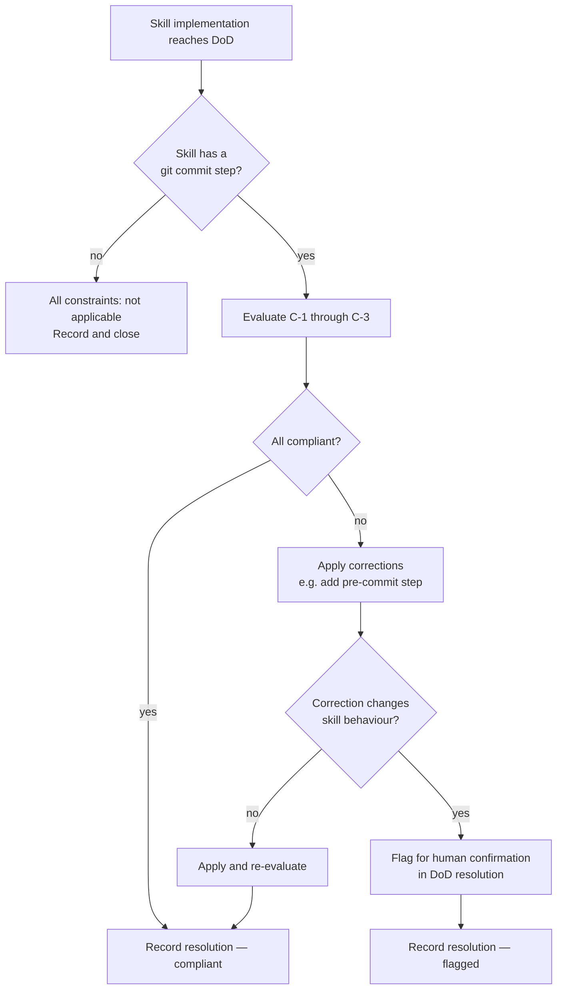

# Behaviour: Commit-Aware Skill Design

## Actor
Skill author — a human developer or AI agent writing or updating a taproot skill file (`skills/*.md`) that includes a `git commit` step.

## Preconditions
- A new skill is being implemented, or an existing skill is being significantly revised
- The skill contains one or more steps that instruct an agent to run `git commit`
- The `check-if-affected-by: skill-architecture/commit-awareness` condition is present in `.taproot/settings.yaml`'s `definitionOfDone`, causing this spec to be evaluated at DoD time for every skill implementation

## Main Flow
1. Skill author writes (or updates) a skill file that includes a commit step.
2. At DoD time, the agent reads this spec and evaluates the skill against each constraint below.
3. For each constraint, the agent determines: **compliant**, **non-compliant**, or **not applicable** (with a stated reason).
4. If any constraint is non-compliant, the agent applies the correction before recording the DoD resolution.
5. Agent records the resolution via `taproot dod --resolve "check-if-affected-by: skill-architecture/commit-awareness" --note "<findings>"`.

## Constraints

### C-1: Pre-commit context step
Any skill that instructs an agent to run `git commit` must include an explicit step **before** the commit that:
- Reads `.taproot/settings.yaml` to identify all configured DoD and DoR conditions (`definitionOfDone`, `definitionOfReady` entries — including `check-if-affected-by`, `check-if-affected`, and `check:` entries)
- Runs the applicable taproot gate based on commit type — **proactively**, before staging or committing, not as a reaction to hook failure:
  - **Implementation commit** → `taproot dod <impl-path>` — resolve all conditions before staging
  - **Declaration commit** → `taproot dor <impl-path>` — ensure the parent `usecase.md` is fully specified
  - **Requirement commit** → `taproot validate-format --path <path>` and `taproot validate-structure` — proactively validate hierarchy files before committing

The agent must identify which commit type applies and execute the corresponding gate. Reacting to hook failure means the agent must `git restore --staged`, resolve conditions, re-stage, and re-commit — avoidable friction.

**Compliant:** A step such as "Before committing: read `.taproot/settings.yaml`, identify the DoD conditions for this impl, run `taproot dod` and resolve all conditions, then stage and commit."

**Non-compliant:** A skill that jumps straight to `git add ... && git commit` with no prior context-loading or gate-execution step.

### C-2: Commit classification awareness
The pre-commit step must surface the commit classification(s) **relevant to the commits that skill makes** — a skill that only ever commits `usecase.md` files only needs to explain requirement commits; it need not document impl.md staging rules it never uses.

The relevant classifications and their hook behaviour:
- **Implementation commit** — staged files include source files tracked by an `impl.md` → DoD runs; `impl.md` must also be staged with a real diff
- **Declaration commit** — staged files include `impl.md` only (no matched source files) → DoR runs against the parent `usecase.md`
- **Requirement commit** — staged files include `taproot/` hierarchy files (`intent.md`, `usecase.md`) only → `validate-structure` and `validate-format` run
- **Plain commit** — none of the above → no taproot checks run

The skill may include relevant classification(s) as an inline summary, or reference `taproot/hierarchy-integrity/pre-commit-enforcement/usecase.md` as the authoritative source.

### C-3: Impl.md staging rule
For implementation commits, the skill must explicitly state both:
- (a) The matching `impl.md` must be staged alongside source files in the same commit — the hook rejects any implementation commit missing its traceability record
- (b) `impl.md` must contain a **real diff** — attempting to `git add` an unchanged `impl.md` is a no-op; if no change exists, a meaningful update must be made first

**Note on producing the diff:** Running `taproot dod` proactively (per C-1) naturally produces impl.md's real diff — the `--resolve` invocations write DoD resolution records into `## DoD Resolutions`. If `taproot dod` reports no pending conditions and impl.md's Status is already accurate, the impl.md does not need to be staged in this commit — re-examine whether this is truly an implementation commit or whether a separate hierarchy-only commit is appropriate.

## Alternate Flows

### No commit step — constraint not applicable
- **Trigger:** The skill contains no step that instructs an agent to run `git commit` (e.g. read-only reporting skills)
- **Steps:**
  1. Agent records all three constraints as "not applicable — skill contains no commit step"
  2. DoD resolution recorded normally

### Skill delegates committing to another skill
- **Trigger:** The skill calls another skill (e.g. `/tr-implement`) which owns the commit step
- **Steps:**
  1. The delegating skill is not responsible for the commit step — constraints apply to the skill that owns the `git commit` instruction
  2. Agent records "not applicable — commit step owned by delegated skill `<name>`"

### No `.taproot/settings.yaml` or no DoD/DoR sections
- **Trigger:** The file doesn't exist or contains no `definitionOfDone`/`definitionOfReady` sections
- **Steps:**
  1. Agent notes: only baseline hook checks will run — no user-configured conditions exist
  2. Skill still must satisfy C-2 (classification awareness) and C-3 (impl.md staging rule) — the baseline checks are not optional
  3. DoD resolution recorded as "settings.yaml absent or has no DoD/DoR sections — baseline checks only"

### Existing skill being revised
- **Trigger:** A previously compliant skill is updated in any way — all constraints are re-evaluated against the updated content regardless of which step changed
- **Steps:**
  1. All constraints re-evaluated against the updated content
  2. If a previously-compliant constraint is now violated, the agent corrects it before resolving DoD

## Postconditions
- Every commit-bearing skill includes a pre-commit context step that reads `.taproot/settings.yaml` and runs the applicable taproot gate proactively
- The skill surfaces the commit classification(s) relevant to the commits it makes
- The impl.md staging rule (staged + real diff) is stated explicitly for implementation commits
- Agents executing compliant skills complete commits on the first attempt — no hook surprises, no `git restore --staged`, no re-staging

## Error Conditions
- **Skill content is ambiguous about commit ownership** (e.g. it says "commit your changes" without specifying who is responsible): agent records "uncertain — commit ownership unclear" and flags for human review rather than silently passing
- **Constraint is non-compliant and adding the pre-commit step would change skill flow significantly**: agent describes the violation and proposes the corrected step text, but flags for human confirmation before applying

## Flow

## Related
- `../context-engineering/usecase.md` — sibling architectural constraint; same `check-if-affected-by` enforcement pattern; context-engineering governs context efficiency, commit-awareness governs commit process knowledge
- `../../hierarchy-integrity/pre-commit-enforcement/usecase.md` — the authoritative source for commit classification logic that C-2 requires skills to surface
- `../../quality-gates/definition-of-done/usecase.md` — the DoD gate that C-1 requires skills to invoke proactively for implementation commits
- `../../quality-gates/definition-of-ready/usecase.md` — the DoR gate for declaration commits

## Acceptance Criteria

**AC-1: Commit-bearing skill passes all constraints**
- Given a skill that includes a `git commit` step with a pre-commit context step, relevant commit classification(s), impl.md staging rule, and proactive gate instruction
- When DoD evaluates this spec
- Then all three constraints are recorded as compliant

**AC-2: Read-only skill — all constraints not applicable**
- Given a skill that produces output but contains no `git commit` step
- When DoD evaluates this spec
- Then all constraints are recorded as "not applicable — skill contains no commit step"

**AC-3: Missing pre-commit context step detected**
- Given a skill that jumps straight from "stage files" to `git commit` with no `.taproot/settings.yaml` read or gate execution
- When DoD evaluates this spec
- Then agent flags C-1 and C-3 as non-compliant and adds the pre-commit context step before recording resolution

**AC-4: Missing impl.md staging rule detected**
- Given a skill that instructs `git add <source-files> && git commit` without mentioning impl.md or the real-diff requirement
- When DoD evaluates this spec
- Then agent flags C-3 as non-compliant and adds the impl.md staging rule

**AC-5: Delegating skill correctly excluded**
- Given a skill that calls `/tr-implement` (which owns the commit step) and contains no direct `git commit` instruction
- When DoD evaluates this spec
- Then all constraints are recorded as "not applicable — commit step owned by delegated skill tr-implement"

**AC-6: Requirement commit skill correctly scoped**
- Given a skill that only commits `usecase.md` or `intent.md` files, surfaces the requirement-commit classification, and instructs proactive `taproot validate-format` and `taproot validate-structure` before committing
- When DoD evaluates this spec
- Then C-1 is compliant (gate = validate-format/structure), C-2 is compliant (only requirement commit surfaced), C-3 is recorded as "not applicable — no impl.md involved"

## Behaviours <!-- taproot-managed -->
- [Proactive Impl.md Scan Before Ad-Hoc Commits](./ad-hoc-commit-prep/usecase.md)
- [Commit Procedure Skill](./commit-skill/usecase.md)

## Implementations <!-- taproot-managed -->
- [Multi-Surface — settings.yaml + implement.md + tests](./multi-surface/impl.md)

## Status
- **State:** implemented
- **Created:** 2026-03-20
- **Last reviewed:** 2026-03-20
