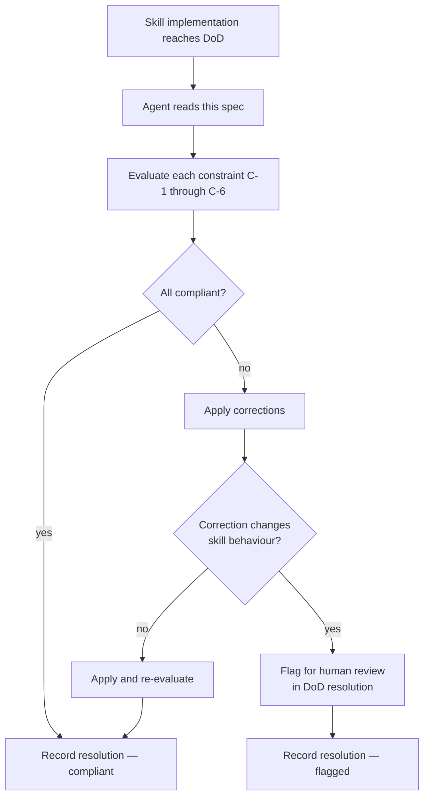

# Behaviour: Context-Efficient Skill Design

## Actor
Skill author — a human developer or AI agent writing or updating a taproot skill file (`skills/*.md`).

## Preconditions
- A new skill is being implemented, or an existing skill is being significantly revised
- The `check-if-affected-by: skill-architecture/context-engineering` condition is present in `.taproot.yaml`'s `definitionOfDone`, causing this spec to be evaluated at DoD time for every skill implementation

## Main Flow
1. Skill author writes (or updates) a skill file.
2. At DoD time, the agent reads this spec and evaluates the skill against each constraint below.
3. For each constraint, the agent determines: **compliant**, **non-compliant**, or **not applicable** (with a stated reason).
4. If any constraint is non-compliant, the agent applies the correction before recording the DoD resolution.
5. Agent records the resolution via `taproot dod --resolve "check-if-affected-by: skill-architecture/context-engineering" --note "<findings>"`.

## Constraints

### C-1: Description fits in ~50 tokens
The `## Description` section must be concise enough to serve as a matchable skill index entry — the description is what an agent scans to decide whether to load the full skill. A description longer than ~50 tokens forces unnecessary context load at session start.

**Compliant:** `"Research any domain or technical subject before writing a behaviour spec — by scanning local resources, searching the web, and drawing on expert knowledge."`
**Non-compliant:** A multi-paragraph description that restates what the steps section already says.

### C-2: No embedded reference docs
Skill files must not embed large reference content (API specs, full examples, documentation excerpts) inline. Link to the relevant file instead (e.g. `"See taproot/OVERVIEW.md for the hierarchy map"`). Embedded docs inflate the skill file size and load that cost into context on every invocation.

### C-3: No cross-skill repetition
A skill must not restate content already present in another skill or in CLAUDE.md. If two skills need the same guidance, it belongs in CLAUDE.md (if universally applicable) or in a shared reference file that both link to.

### C-4: On-demand file loading only
Skills must read files only when needed for the current step — not in a bulk pre-load at the start of every invocation. Steps that read files must name exactly what they read and why (e.g. `"Read the parent intent.md to understand the broader goal"`). A step that reads OVERVIEW.md, all sibling usecases, and the full hierarchy upfront violates this constraint.

### C-5: Session hygiene signal at natural boundaries
Skills that run long workflows (more than ~5 interactive steps) must include a natural context-clearing signal at a logical boundary in the flow. This is typically at the end of the skill, before the **What's next?** block:

> `"💡 If this session is getting long, consider running \`/compact\` or starting a fresh context before the next task."`

The signal must appear *after* the primary output is delivered — never before. It is omitted for short skills (≤ 3 steps) where context accumulation is not a concern.

### C-6: What's next block at output
All skills that produce primary output must end with a **What's next?** block presenting the developer's options. This is enforced by `check-if-affected-by: human-integration/contextual-next-steps` — but context-engineering also requires it because a missing next-step block often indicates the skill ends with an implicit "and now read back through everything", which inflates context unnecessarily.

## Alternate Flows

### Short skill — session hygiene signal omitted
- **Trigger:** Skill has ≤ 3 interactive steps and does not run a long-form workflow
- **Steps:**
  1. C-5 (session hygiene) is recorded as "not applicable — skill is short (≤3 steps)"
  2. All other constraints evaluated normally

### Existing skill being revised
- **Trigger:** A previously implemented skill is updated (new step added, description changed, etc.)
- **Steps:**
  1. All constraints re-evaluated against the updated content
  2. If a previously-compliant constraint is now violated, the agent corrects it before resolving DoD

## Postconditions
- The skill's `## Description` is ≤ 50 tokens
- The skill contains no embedded reference docs
- The skill contains no content duplicated from CLAUDE.md or other skills
- File reads within the skill are step-scoped and named
- Long skills include a `/compact` signal before the **What's next?** block
- DoD resolution recorded with findings for each constraint

## Error Conditions
- **Constraint cannot be determined** (e.g. skill content is ambiguous): agent records "uncertain — [reason]" and flags for human review rather than silently passing or failing
- **Constraint is non-compliant and correction would change skill behaviour**: agent describes the violation and proposes a fix, but does not apply it without confirmation — flags in the DoD resolution instead

## Flow

## Related
- `../../human-integration/contextual-next-steps/usecase.md` — C-6 overlaps; contextual-next-steps enforces the What's next? block from a UX perspective; context-engineering enforces it from a context-efficiency perspective
- `../../human-integration/pause-and-confirm/usecase.md` — architectural peer: same `check-if-affected-by` enforcement pattern applied to a different cross-cutting concern
- `../../research/research-subject/usecase.md` — the research that informed this spec

## Acceptance Criteria

**AC-1: Description constraint enforced**
- Given a skill with a description longer than ~50 tokens
- When DoD evaluates this spec
- Then the agent flags the violation and trims the description before recording resolution

**AC-2: No embedded docs**
- Given a skill that embeds a large reference document inline
- When DoD evaluates this spec
- Then the agent flags the violation and replaces the embedded content with a link

**AC-3: No cross-skill repetition**
- Given a skill that restates content already in CLAUDE.md or another skill
- When DoD evaluates this spec
- Then the agent identifies the duplicate and removes it, noting where the canonical source lives

**AC-4: On-demand file loading**
- Given a skill with a bulk file pre-load step at the start
- When DoD evaluates this spec
- Then the agent flags the step as violating on-demand loading and refactors it to load files only at the step that needs them

**AC-5: Session hygiene signal present in long skills**
- Given a skill with more than 5 interactive steps
- When DoD evaluates this spec
- Then the skill includes a `/compact` suggestion before the What's next? block

**AC-6: Short skill — hygiene signal correctly omitted**
- Given a skill with ≤ 3 steps
- When DoD evaluates this spec
- Then the agent records C-5 as "not applicable" without flagging it as a violation

**AC-7: Existing skill revision re-evaluated**
- Given an existing compliant skill that is updated to add a step with bulk file loading
- When DoD evaluates this spec
- Then the new step is flagged as violating C-4

## Implementations <!-- taproot-managed -->
- [Agent Skill Compliance Pass](./agent-skill/impl.md)

## Status
- **State:** specified
- **Created:** 2026-03-20
- **Last reviewed:** 2026-03-20

## Notes
- This spec is enforced via `check-if-affected-by: skill-architecture/context-engineering` in `.taproot.yaml`. To add it: `definitionOfDone: - check-if-affected-by: skill-architecture/context-engineering`
- The "context rot" phenomenon (Karpathy, 2025): focused 300-token context often outperforms unfocused 113k-token context. These constraints directly address the taproot-specific causes of context bloat.
- Chromatic Labs (2025): loading only skill metadata (~50 tokens) at session start, deferring full SKILL.md load to invocation, is the primary mechanism behind C-1 and C-4.
