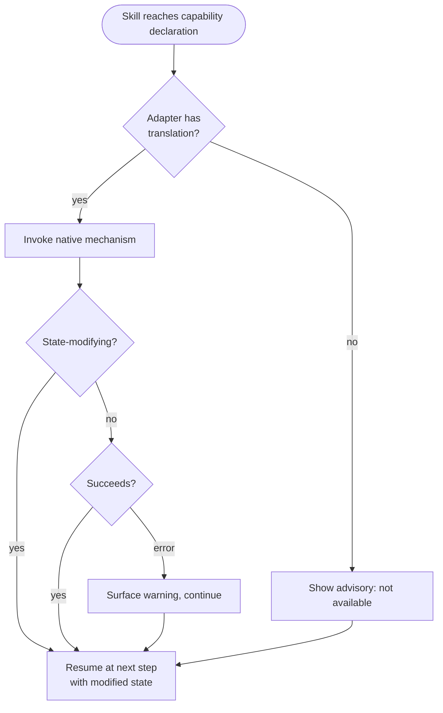

# Behaviour: Agent Capability Invocation

## Actor
Skill author — writing or updating a taproot skill file (`skills/*.md`) that needs to trigger an agent-native capability (such as context compression) without naming a specific agent or its mechanism.

## Preconditions
- A skill step requires an agent-native capability — one different agents fulfil through different native mechanisms
- The agent's adapter defines a capability map — a registry mapping capability names to native invocation instructions — as part of adapter generation
- The agent executing the skill may or may not have a translation registered for the declared capability

## Main Flow

*Authoring phase (skill author):*

1. Skill author identifies a step where an agent-native capability should be invoked.
2. Skill author writes a capability declaration using the form `[invoke: <capability-name>]` — naming the capability, not the agent mechanism. Example: `[invoke: compress-context]`.

*Execution phase (agent executing the skill):*

3. Agent reaches the capability declaration.
4. Agent consults its adapter's capability map for a translation.
5. If a translation is found: agent invokes the native mechanism.
   - For capabilities that modify agent state (such as context compression): execution resumes from the next step with the modified state — there is no completion signal to wait for.
   - For non-state-modifying capabilities: agent waits for the mechanism to return before continuing.
6. Agent continues with the next skill step.

## Alternate Flows

### No translation available
- **Trigger:** The agent has no adapter configured, the adapter has no capability map, or the capability map has no entry for the declared capability name.
- **Steps:**
  1. Agent displays an advisory: "ℹ️ Capability `<name>` is not available in this agent — continuing."
  2. Agent continues with the next step.
- **Outcome:** The skill completes normally; the capability is skipped, not a fatal error.

## Postconditions
- The native capability was invoked (if a translation was available) or an advisory was shown (if not)
- The skill file contains no agent-specific names, commands, or syntax — it passes the `agent-agnostic-language` DoD check
- Any agent adapter that encounters an unknown capability declaration falls back gracefully without error

## Error Conditions
- **Invocation fails:** The native mechanism is called but returns an error — agent surfaces a warning ("Warning: capability `<name>` returned an error — continuing") and proceeds. The skill does not abort.

## Flow

## Related
- `agent-integration/agent-agnostic-language/usecase.md` — constraint this behaviour serves: skill files must not name agents or agent-specific commands
- `agent-integration/portable-output-patterns/usecase.md` — parallel: agent-agnostic output *presentation*; this behaviour covers agent-agnostic capability *invocation*
- `agent-integration/generate-agent-adapter/usecase.md` — adapter generation must define a capability map: a named registry mapping capability identifiers (e.g. `compress-context`) to adapter-specific invocation instructions. The format and location of this map is defined by the generate-agent-adapter behaviour.
- `skill-architecture/neutral-dod-resolution/usecase.md` — primary first consumer: commit skill declares `[invoke: compress-context]` before DoD resolution steps

## Acceptance Criteria

**AC-1: Non-state-modifying capability invoked**
- Given a skill with a capability declaration that maps to a non-state-modifying mechanism
- When the agent reaches the declaration
- Then the agent invokes the mechanism, receives a completion signal, and continues to the next step with unchanged agent state

**AC-1b: State-modifying capability invoked (e.g. compress-context)**
- Given a skill with an `[invoke: compress-context]` declaration
- When the agent reaches the declaration
- Then the agent invokes the mechanism, agent context is modified, and execution resumes at the next step

**AC-2: No translation — graceful fallback**
- Given a skill with a capability declaration and an agent adapter with no translation for that capability name
- When the agent reaches the declaration
- Then the agent displays an advisory message and continues without blocking

**AC-3: Skill passes agent-agnostic-language check**
- Given a skill containing one or more capability declarations
- When the `agent-agnostic-language` DoD check runs
- Then the skill passes — no agent-specific names appear in the declaration

**AC-4: Unknown declaration does not break adapters**
- Given an adapter with no capability map entry for a declared capability
- When the adapter processes the skill at runtime
- Then the adapter falls back gracefully without throwing an error

## Implementations <!-- taproot-managed -->
- [Multi-Surface — Adapter Capability Maps + Skill Authoring Guide](./multi-surface/impl.md)

## Status
- **State:** specified
- **Created:** 2026-04-13
- **Last reviewed:** 2026-04-13
