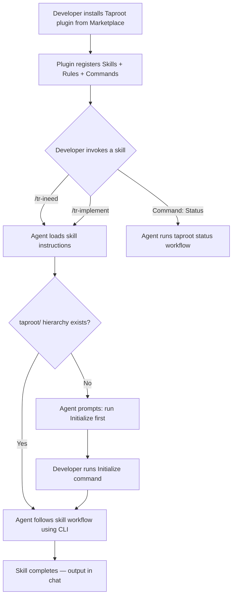

# Behaviour: Native Cursor Plugin

## Actor
Developer using Cursor IDE who wants taproot's requirement workflow available natively through Cursor's plugin system

## Preconditions
- Cursor IDE with plugin system support is installed
- The Taproot plugin is listed on the public Cursor Marketplace

## Main Flow
1. Developer finds the Taproot plugin on the Cursor Marketplace
2. Developer installs the plugin
3. Plugin registers skills — each taproot workflow is available as a `/tr-<name>` slash command in Cursor's chat
4. Plugin registers rules — taproot conventions (why/what/how layering, commit format, spec language) are injected as persistent agent context when relevant files are open
5. Plugin registers commands — common actions (initialize project, show status, route a requirement, report a bug, build a plan) appear in Cursor's command interface
6. Developer invokes a skill (e.g. `/tr-ineed "user needs password reset"`)
7. Cursor's agent loads the full skill instructions and follows the taproot workflow, using the taproot CLI for validation and hierarchy operations

## Alternate Flows
### Legacy adapter present
- **Trigger:** Developer installs the plugin in a project that already has `.cursor/rules/taproot.md` from `taproot init --agent cursor`
- **Steps:**
  1. Plugin's rules and skills take precedence over the legacy adapter file
  2. The legacy file becomes redundant but does not conflict — Cursor merges rule sources
- **Outcome:** Developer can safely delete `.cursor/rules/taproot.md`; the plugin provides equivalent and richer coverage

### Project not yet initialized
- **Trigger:** Developer invokes a taproot skill but no `taproot/` hierarchy exists in the workspace
- **Steps:**
  1. Agent detects the missing hierarchy
  2. Agent prompts developer to run the Initialize command first
- **Outcome:** Developer initializes taproot, then retries the skill

### Taproot CLI not installed
- **Trigger:** Developer invokes a skill that requires a CLI command (validation, coverage, trace) but `taproot` is not available
- **Steps:**
  1. Agent detects the CLI is unavailable
  2. Agent reports the missing dependency and suggests `npm install -g @imix-js/taproot` or `npx` as alternatives

## Postconditions
- All taproot skills are discoverable and invokable through Cursor's native `/` slash commands
- Taproot conventions are automatically injected into agent context when working in taproot-managed projects
- The plugin surfaces existing taproot capabilities only — it does not add features that are unavailable to other agents
- Common actions are available as commands without requiring slash-command knowledge

## Error Conditions
- **Plugin version mismatch:** Plugin references skills or CLI commands that don't exist in the installed taproot version — agent reports the incompatibility and suggests updating taproot or the plugin
- **Workspace has no Node.js environment:** CLI commands fail — agent reports that taproot requires Node.js and suggests installation steps

## Flow

## Related
- `../generate-agent-adapter/usecase.md` — the plugin replaces the thin adapter file for Cursor users; `taproot init --agent cursor` becomes unnecessary when the plugin is installed
- `../update-adapters-and-skills/usecase.md` — plugin updates are handled by the Cursor Marketplace, not `taproot update`
- `../agent-support-tiers/usecase.md` — a published plugin with validated skills would promote Cursor from Tier 3 to Tier 2 or higher
- `../../taproot-distribution/vscode-marketplace/usecase.md` — parallel distribution channel; same pattern (channels/<name>/) but different format

## Acceptance Criteria

**AC-1: Plugin installs from Cursor Marketplace**
- Given the Taproot plugin is published
- When a developer searches for "taproot" in Cursor's marketplace
- Then the plugin appears and can be installed

**AC-2: Each taproot skill is available as a slash command**
- Given the plugin is installed
- When the developer types `/tr-` in Cursor's chat
- Then all taproot skills appear as autocomplete options

**AC-3: Skills use thin-launcher pattern**
- Given the plugin is installed and the developer invokes a skill
- When the agent processes the skill
- Then the SKILL.md instructs the agent to load the canonical skill from `taproot/agent/skills/<name>.md`

**AC-4: Rules inject taproot conventions for relevant files**
- Given the plugin is installed and the developer opens a file under `taproot/`
- When the agent evaluates context
- Then taproot conventions (spec language, why/what/how layering) are present in the agent's context

**AC-5: Commands provide common actions**
- Given the plugin is installed
- When the developer opens the command interface
- Then Initialize, Status, Route Requirement, Report Bug, and Build Plan are available

**AC-6: Legacy adapter is superseded**
- Given a project with `.cursor/rules/taproot.md` from `taproot init`
- When the plugin is installed
- Then the plugin's skills and rules provide equivalent or richer coverage, making the legacy file redundant

**AC-7: Plugin does not add agent-specific features**
- Given any capability the plugin surfaces
- When compared to what other agents can access
- Then the capability is available to all agents through their respective adapters — the plugin only repackages

**AC-8: Missing CLI produces actionable guidance**
- Given the taproot CLI is not installed
- When the developer invokes a skill that requires CLI commands
- Then the agent reports the dependency and suggests installation steps

**AC-9: Plugin source lives in channels/cursor/**
- Given the plugin repository structure
- When the build produces the plugin artifact
- Then all Cursor-specific source files reside under `channels/cursor/` in the taproot repo

## Status
- **State:** specified
- **Created:** 2026-04-05
- **Last reviewed:** 2026-04-05

## Notes
- The plugin uses Cursor's convention-based discovery: `skills/*/SKILL.md`, `rules/*.mdc`, `commands/*.md`
- SKILL.md files are thin launchers — Cursor-native frontmatter (`name`, `description`) plus a body that directs the agent to load the canonical skill from `taproot/agent/skills/`
- This avoids duplicating skill content between the canonical source and the plugin
- The build step composes SKILL.md frontmatter with a launcher body — no content duplication
- Before adding any Cursor-specific capability, the generalization constraint in the agent-integration intent requires evaluating whether it should be an agent-agnostic feature first
