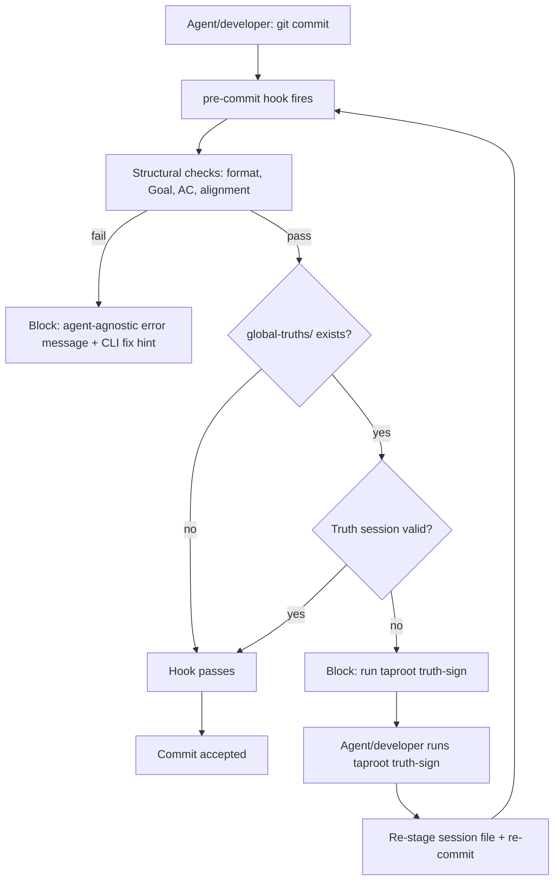

# Behaviour: Multi-Agent Hook Compatibility

## Actor
Developer or AI coding agent (Claude Code, Cursor, Copilot, Aider, or any other agent) committing changes to a taproot project.

## Preconditions
- A taproot project with `taproot/global-truths/` and/or `taproot/specs/` is initialised
- The pre-commit hook (`.git/hooks/pre-commit`) is installed via `taproot init --with-hooks`
- The developer or agent stages hierarchy files (`intent.md`, `usecase.md`) or implementation files for commit

## Main Flow

1. Developer (or agent) stages files and runs `git commit`
2. Git fires `.git/hooks/pre-commit` → `taproot commithook`
3. Hook runs structural checks: spec format validation, Goal/Actor quality rules, behaviour–intent alignment
4. If `taproot/global-truths/` exists and hierarchy docs are staged: hook verifies a truth-check session exists for the staged content
5. Session exists and matches → hook passes → commit proceeds
6. Hook passes all tiers → commit is accepted

## Alternate Flows

### No truth-check session — agent provides CLI guidance
- **Trigger:** Truth session missing; agent's adapter instructions include `taproot truth-sign` guidance
- **Steps:**
  1. Hook reports: "no truth-check session found — run `taproot truth-sign` before committing"
  2. Agent reads its adapter instructions (`CONVENTIONS.md`, `.cursorrules`, etc.), finds the `taproot truth-sign` step
  3. Agent runs `taproot truth-sign`; session file created
  4. Agent re-stages `.taproot/.truth-check-session` and re-commits
  5. Hook passes

### No truth-check session — human committing directly
- **Trigger:** Developer runs `git commit` without an AI agent
- **Steps:**
  1. Hook reports: "no truth-check session found — run `taproot truth-sign` before committing"
  2. Developer runs `taproot truth-sign` from the CLI
  3. Developer stages `.taproot/.truth-check-session` and re-commits
  4. Hook passes

### DoD not resolved for implementation commit
- **Trigger:** Agent stages `impl.md` or its source files; DoD conditions are unresolved
- **Steps:**
  1. Hook reports which DoD conditions failed with correction hints (CLI: `taproot dod <path>`)
  2. Agent or developer resolves conditions via `taproot dod <path> --resolve "<condition>" --note "<reasoning>"`
  3. Re-commits; hook passes

## Postconditions
- The commit is accepted by the hook
- Error messages from the hook reference CLI commands (`taproot truth-sign`, `taproot dod`) — not agent-specific slash commands
- Any supported agent (Claude Code, Cursor, Aider, Copilot, plain git) can complete a commit without agent-specific knowledge baked into the hook itself

## Error Conditions
- **Truth session missing, no adapter guidance**: Hook blocks with: "no truth-check session found — run `taproot truth-sign` before committing". Agent or developer must run the CLI command manually.
- **Truth session stale (files changed since signing)**: Hook blocks with: "staged files or truths have changed since the last truth check — run `taproot truth-sign` again". Agent must re-sign and re-add the session file.
- **Truth session malformed**: Hook blocks with: "truth-check session file is malformed — run `taproot truth-sign`". Agent must regenerate.
- **DoD unresolved**: Hook blocks with the failing condition name and correction hint. Agent uses `taproot dod` CLI to resolve.
- **Spec format violation**: Hook blocks with the specific rule violated and the correction required (e.g. "Goal must start with a verb").

## Flow

## Related
- `taproot/specs/agent-integration/aider-adapter/usecase.md` — Aider adapter must include `taproot truth-sign` guidance in `CONVENTIONS.md`
- `taproot/specs/agent-integration/generate-agent-adapter/usecase.md` — adapter generator must include commit guidance in all generated adapter instruction files
- `taproot/specs/agent-integration/agent-agnostic-language/usecase.md` — error messages in the hook are a language surface; must use CLI terms, not slash commands
- `taproot/specs/skill-architecture/commit-awareness/commit-skill/usecase.md` — `/tr-commit` is the Claude-specific orchestration layer above the CLI; non-Claude agents use the CLI directly

## Acceptance Criteria

**AC-1: Hook error messages reference CLI commands, not slash commands**
- Given the pre-commit hook blocks due to a missing truth-check session
- When any agent (Claude, Cursor, Aider, or plain git) reads the error output
- Then the error message says `taproot truth-sign` — not `/tr-commit` or any other agent-specific command

**AC-2: Hook error for stale session references CLI**
- Given staged files have changed after the last `taproot truth-sign`
- When the pre-commit hook fires
- Then the error message says "run `taproot truth-sign` again" — not `/tr-commit`

**AC-3: Hook error for malformed session references CLI**
- Given the truth-check session file is malformed or unreadable
- When the pre-commit hook fires
- Then the error message says "run `taproot truth-sign`" — not `/tr-commit`

**AC-4: Aider CONVENTIONS.md includes truth-sign guidance**
- Given a project with `taproot/global-truths/` and the Aider adapter installed
- When Aider is about to commit hierarchy files
- Then `CONVENTIONS.md` instructs Aider to run `taproot truth-sign` and stage the session file before committing

**AC-5: generate-agent-adapter includes commit guidance in all generated adapter files**
- Given a developer runs `taproot init --agent <any-agent>` or `taproot update --agent <any-agent>`
- When the adapter instruction file is generated (CONVENTIONS.md, .cursorrules, etc.)
- Then it includes guidance equivalent to: run `taproot truth-sign`, stage `.taproot/.truth-check-session`, then commit

**AC-6: Human committing via plain git gets a usable error**
- Given a developer stages hierarchy files and runs `git commit` without any AI agent
- When truth-check session is missing
- Then the hook error message names the CLI command to run (`taproot truth-sign`) and the file to stage (`.taproot/.truth-check-session`)

## Implementations <!-- taproot-managed -->
- [CLI Command](./cli-command/impl.md)

## Status
- **State:** implemented
- **Created:** 2026-03-29
- **Last reviewed:** 2026-03-30

## Notes
- The pre-commit hook is intentionally agent-agnostic — it runs the same checks regardless of which agent committed. The gap is in the error messages (currently reference `/tr-commit`) and in the adapter instruction files (currently omit truth-sign guidance).
- Once P10 (taproot commit CLI wrapper) is implemented, the guidance simplifies to "run `taproot commit` instead of `git commit`" — a single cross-agent command that handles truth-sign, staging, and commit in one step.
