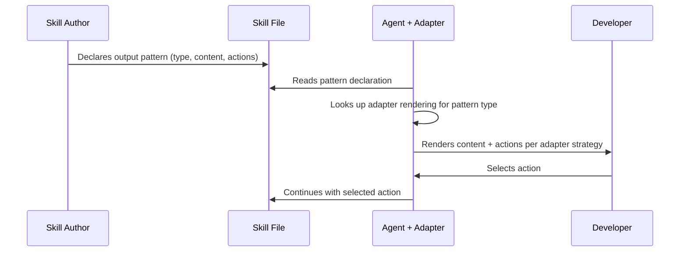

# Behaviour: Portable Skill Output Patterns

## Actor
Skill author writing or maintaining a taproot skill file (`skills/*.md`)

## Preconditions
- At least one agent adapter exists
- The skill needs to present content for user review and/or collect a user decision

## Main Flow
1. Skill author identifies an interaction point — the skill needs to show content and ask the user something
2. Skill author declares the interaction using a named output pattern instead of writing raw presentation instructions
3. The pattern declaration specifies: the content source (file path, inline summary, or structured data), a short summary line, and the available actions with their option letters
4. Agent reads the skill and encounters the pattern declaration
5. Agent consults its adapter's rendering instructions for that pattern type
6. Agent renders the interaction according to its adapter's strategy — presenting content and actions in whatever way works for its UI
7. User sees the content and the action prompt, and responds

## Alternate Flows
### Unknown pattern type
- **Trigger:** Agent encounters a pattern name its adapter doesn't have rendering instructions for
- **Steps:**
  1. Agent falls back to a default rendering: show the summary line, list the available actions, and offer to read the full content on request
- **Outcome:** The interaction still works, though not optimally for the agent's UI

### Skill uses raw output instead of a pattern
- **Trigger:** A skill author writes direct presentation instructions ("print the full spec", "display the file contents") instead of using a declared pattern
- **Steps:**
  1. The agent-agnostic language DoD gate flags the agent-specific rendering instruction during commit
- **Outcome:** Skill author corrects to use a pattern declaration

## Postconditions
- Skills contain no agent-specific rendering instructions — they declare what to present, not how
- Each agent adapter translates patterns to its optimal rendering strategy
- Action prompts are always visible to the user regardless of agent UI limitations
- The option labelling convention from `global-truths/ux-principles_intent.md` is preserved across all renderings

## Error Conditions
- **Content source not found:** Pattern references a file path that doesn't exist — agent reports the missing file and skips the presentation, surfacing the error to the user
- **No actions declared:** Pattern has content but no action options — agent presents the content as informational only, with no prompt

## Flow

## Related
- `../agent-agnostic-language/usecase.md` — governs what shared files say about agents; this spec governs how skills describe output interactions. The DoD gate from agent-agnostic-language can enforce pattern usage.
- `../../human-integration/pause-and-confirm/usecase.md` — defines the one-at-a-time confirmation pattern; this spec provides the rendering abstraction that pause-and-confirm interactions use
- `../../human-integration/contextual-next-steps/usecase.md` — defines What's next menus; those menus are an output pattern rendered per-adapter
- `../cursor-plugin/usecase.md` — the Cursor plugin is a consumer of these patterns; its adapter defines Cursor-specific rendering

## Acceptance Criteria

**AC-1: Artifact review pattern is defined**
- Given a skill needs to present a file for review with actions
- When the skill author writes the interaction
- Then the skill declares: content path, summary, and action options — without specifying how to render

**AC-2: Confirmation prompt pattern is defined**
- Given a skill needs a yes/no or multi-choice decision
- When the skill author writes the interaction
- Then the skill declares: the question, context summary, and action options

**AC-3: Claude adapter renders artifact review inline**
- Given a skill declares an artifact-review pattern
- When the Claude Code adapter processes it
- Then the agent shows the full artifact content inline followed by the action prompt

**AC-4: Gemini adapter renders artifact review as summary**
- Given a skill declares an artifact-review pattern
- When the Gemini adapter processes it
- Then the agent writes the artifact to disk, shows a short summary with key metrics, and presents the action prompt with a Review option to load the full file

**AC-5: Unknown pattern falls back gracefully**
- Given an adapter encounters a pattern type it doesn't recognize
- When the agent processes the skill
- Then the agent shows the summary line and action options, offering to read full content on request

**AC-6: Action prompts are always visible**
- Given any output pattern rendered by any adapter
- When the user sees the output
- Then the action options are visible without scrolling, expanding, or uncollapsing hidden content

**AC-7: Option labelling follows global convention**
- Given any pattern declaration with action options
- When the options use letter labels
- Then the letters follow the convention in `global-truths/ux-principles_intent.md`

**AC-8: Raw rendering instructions are flagged**
- Given a skill contains direct presentation instructions instead of a pattern declaration
- When the skill is committed
- Then the agent-agnostic language DoD gate identifies the agent-specific rendering instruction

## Status
- **State:** specified
- **Created:** 2026-04-05
- **Last reviewed:** 2026-04-05

## Notes
- **Defined pattern types (initial set):** `artifact-review` (present a file for review + actions), `confirmation` (yes/no or multi-choice decision), `progress` (status update, no action required), `next-steps` (What's next menu). New patterns can be added as skills require them.
- The pattern declaration format is part of the skill file conventions — it lives in the skill markdown, not in a separate schema file. The exact syntax is an implementation decision.
- This behaviour is triggered by a concrete bug: Gemini CLI truncates long output at ~8K tokens, hiding action prompts. Research confirmed no cross-agent convention exists.
- The `visibility: primary | supporting` field (backlog item) is metadata about the skill itself, not an output pattern — the two are complementary but independent.
