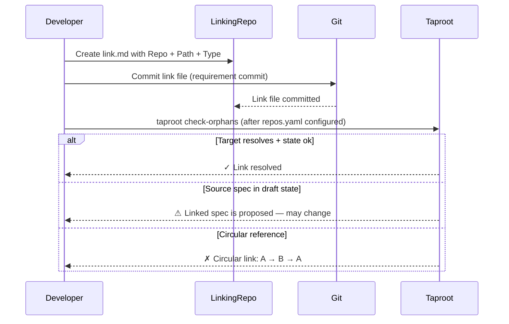

# Behaviour: Define Cross-Repo Link

## Actor
Developer in a linking repo

## Preconditions
- The linking repo has a taproot hierarchy (`taproot/` directory)
- The source repo spec to link to exists (intent.md, usecase.md, or a global truth file)

## Main Flow
1. Developer creates a link file (`link.md`) in the linking repo under the appropriate spec folder (e.g. `taproot/specs/<intent>/<behaviour>/link.md`).
2. Developer populates the link file with the required fields:
   - **Repo:** GitHub URL of the source repo (e.g. `https://github.com/org/platform-repo`)
   - **Path:** relative path to the target spec file within the source repo (e.g. `taproot/specs/authentication/plugin-login/usecase.md`)
   - **Type:** `intent`, `behaviour`, or `truth` — determines how `taproot coverage` treats this link
   - Optional **Description:** free-form note on why this link exists and what the linking repo is responsible for
3. Developer commits the link file to version control as a requirement commit.

## Alternate Flows
### Source spec is in draft or proposed state
- **Trigger:** Developer creates a link file pointing to a source spec whose state is `proposed` (not yet `specified` or beyond).
- **Steps:**
  1. Link file is authored and committed normally — taproot does not block based on the target spec's state.
  2. When developer later runs `taproot check-orphans`, system resolves the link and warns: "Linked spec `<path>` is in `proposed` state — contents may change. Review this link after the source spec is finalised."
  3. Developer may proceed or wait until the source spec is stabilised.

### Circular reference created
- **Trigger:** The link file creates a cycle in the link graph (A → B → A at any depth), detected when `taproot check-orphans` is run after committing.
- **Steps:**
  1. System reports the cycle when check-orphans runs: "Circular link detected: `<chain>`. Links must form a DAG — remove the circular reference."
  2. Developer restructures the link hierarchy to break the cycle and amends or reverts the commit.

## Postconditions
- A link file exists in the linking repo referencing the source repo spec
- The link file is committed to version control
- Running `taproot check-orphans` (with `.taproot/repos.yaml` configured) reports the link as resolved or surfaces specific errors

## Error Conditions
- **Invalid link file format**: `taproot validate-format` rejects the file if required fields (`Repo`, `Path`, `Type`) are missing or malformed; developer must fix the format before committing
- **Circular reference**: detected by `taproot check-orphans` after commit; developer must break the cycle

## Flow


## Related
- `../resolve-linked-coverage/usecase.md` — depends on link files authored here to count coverage
- `../validate-link-targets/usecase.md` — validates link files authored here; run after this behaviour

## Acceptance Criteria

**AC-1: Link file authored with valid format and committed**
- Given a developer creates `link.md` with valid `Repo`, `Path`, and `Type` fields in a behaviour folder
- When the developer commits the file
- Then `taproot validate-format` passes and the link file is accepted by the requirement commit flow

~~**AC-2:** repos.yaml absent — deprecated; moved to validate-link-targets (AC-3)~~

~~**AC-3:** Repo URL not mapped — deprecated; moved to validate-link-targets (AC-4)~~

~~**AC-4:** Target file missing — deprecated; moved to validate-link-targets (AC-2)~~

~~**AC-5:** Circular reference rejected — deprecated; moved to validate-link-targets (AC-5)~~

**AC-6: Source spec in draft state triggers a warning at check time**
- Given a link file points to a source spec whose state is `proposed`
- When the developer runs `taproot check-orphans`
- Then system resolves the link successfully but warns that the linked spec is in `proposed` state and may change

## Implementations <!-- taproot-managed -->
- [validate-format extension](./validate-format-extension/impl.md)
- [agent skill](./agent-skill/impl.md)

## Status
- **State:** specified
- **Created:** 2026-03-31
- **Last reviewed:** 2026-03-31

## Notes
- Link file format (canonical definition):
  ```markdown
  # Link: <descriptive title>

  **Repo:** https://github.com/<org>/<repo-name>
  **Path:** taproot/specs/<intent>/<behaviour>/usecase.md
  **Type:** behaviour

  **Description:** (optional) why this link exists and what this repo is responsible for
  ```
  Required fields: `Repo`, `Path`, `Type`. `Description` is optional.
- The file name is `link.md` by convention. For folders containing multiple links (uncommon), use descriptive names: `platform-auth-link.md`.
- The `Type` field tells `taproot coverage` how to count the link: `behaviour` and `intent` links count toward hierarchy coverage; `truth` links are validated by the truth-check hook.
- Validation (orphan detection, circular reference detection) is a separate behaviour: see `validate-link-targets/usecase.md`.
