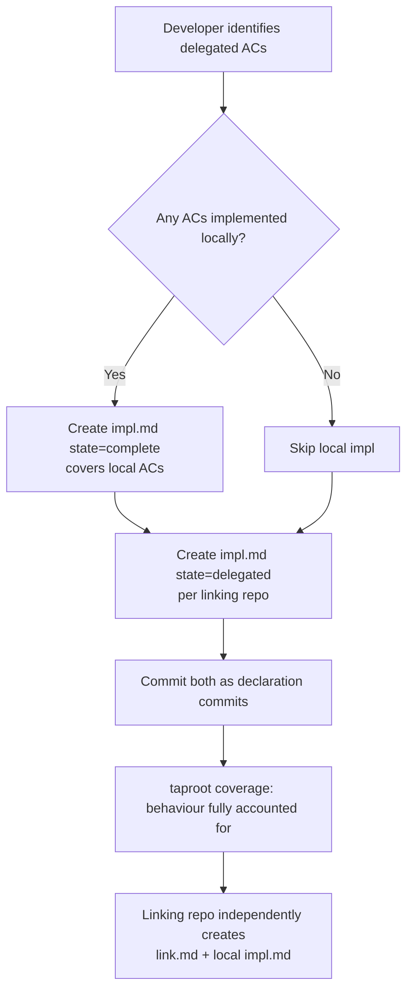

# Behaviour: Delegate Implementation to Linking Repo

## Actor
Developer in the source repo — the repo that owns the shared spec and wants to record that some or all of its ACs are implemented in a separate linking repo.

## Preconditions
- A `usecase.md` exists in the source repo with one or more ACs
- At least one AC is known to be implemented in a linking repo rather than locally
- The source repo developer knows which repo handles the delegated ACs

## Main Flow
1. Developer identifies which ACs are implemented locally and which are delegated to a linking repo.
2. For locally-implemented ACs, developer creates a standard `impl.md` (state: `complete`) covering those ACs — following the normal implementation lifecycle.
3. For delegated ACs, developer creates a separate `impl.md` (state: `delegated`) under the same behaviour folder:
   - `## Design Decisions` names the linking repo and which ACs it covers.
   - `## Source Files` lists `(none)` — the source files live in the linking repo.
   - `## Status` sets `state: delegated`.
4. Developer commits both impl.md files (if applicable) as declaration commits.
5. `taproot coverage` in the source repo counts both `complete` and `delegated` impls as accounted for — the behaviour is not shown as a coverage gap.

## Alternate Flows

### All ACs delegated (no local implementation)
- **Trigger:** The behaviour spec exists in the source repo, but every AC is implemented in one or more linking repos — nothing is implemented locally.
- **Steps:**
  1. Developer creates a single `impl.md` with state `delegated`.
  2. `## Design Decisions` names all linking repos and the ACs each handles.
  3. `## Source Files` lists `(none)`.
  4. Coverage counts the behaviour as fully delegated — not a gap.

### Multiple linking repos each handle some ACs
- **Trigger:** Two or more linking repos each implement a subset of the behaviour's ACs.
- **Steps:**
  1. Developer creates one `impl.md` per linking repo contribution (e.g. `plugin-impl/impl.md`, `mobile-impl/impl.md`), each with state `delegated`.
  2. Each delegated impl names its respective linking repo and the ACs it covers.
  3. All delegated impls are committed as separate declaration commits.

### Delegated ACs later reclaimed locally
- **Trigger:** A linking repo is deprecated or its implementation is pulled back into the source repo.
- **Steps:**
  1. Developer changes the delegated `impl.md` state from `delegated` to `in-progress`.
  2. Developer implements the ACs locally and transitions the impl through the normal lifecycle to `complete`.

## Postconditions
- The source repo's `taproot coverage` shows the behaviour as fully accounted for (no gap)
- It is explicit which ACs are implemented locally and which are delegated, and to which repo
- The linking repo can independently create a `link.md` + local `impl.md` to claim its side of the traceability

## Error Conditions
- **`state: delegated` not in `allowed_impl_states`**: `taproot validate-format` rejects the impl.md — add `delegated` to `allowed_impl_states` in `taproot/settings.yaml`
- **Delegated impl lists source files**: the impl.md has entries in `## Source Files` that are not `(none)` — misleading since the source files live in the linking repo; remove the entries or replace with a reference note

## Flow

## Related
- `../define-cross-repo-link/usecase.md` — linking repo side: creates link.md pointing back to this spec
- `../resolve-linked-coverage/usecase.md` — how coverage counts both sides
- `../../requirements-hierarchy/incremental-behaviour-implementation/usecase.md` — related pattern: AC-scoped impl delivery; delegation is a cross-repo variant of the same idea

## Acceptance Criteria

**AC-1: Delegated impl.md is accepted by validate-format**
- Given an `impl.md` with `state: delegated` in a source repo where `delegated` is in `allowed_impl_states`
- When `taproot validate-format` runs
- Then the impl.md is accepted without errors

**AC-2: Coverage counts delegated impl as accounted for**
- Given a behaviour with one `complete` impl and one `delegated` impl
- When `taproot coverage` runs in the source repo
- Then the behaviour is not listed as a coverage gap

**AC-3: Fully-delegated behaviour is not a coverage gap**
- Given a behaviour with only a `delegated` impl (no local `complete` impl)
- When `taproot coverage` runs in the source repo
- Then the behaviour is listed as accounted for, marked `[delegated]`

**AC-4: Delegated impl names the linking repo and covered ACs**
- Given a `delegated` impl.md whose `## Design Decisions` names the linking repo and which ACs it covers
- When a developer reads the source repo's hierarchy
- Then the traceability is clear: which ACs are handled locally, which are delegated, and to which repo

## Status
- **State:** specified
- **Created:** 2026-04-01
- **Last reviewed:** 2026-04-01
