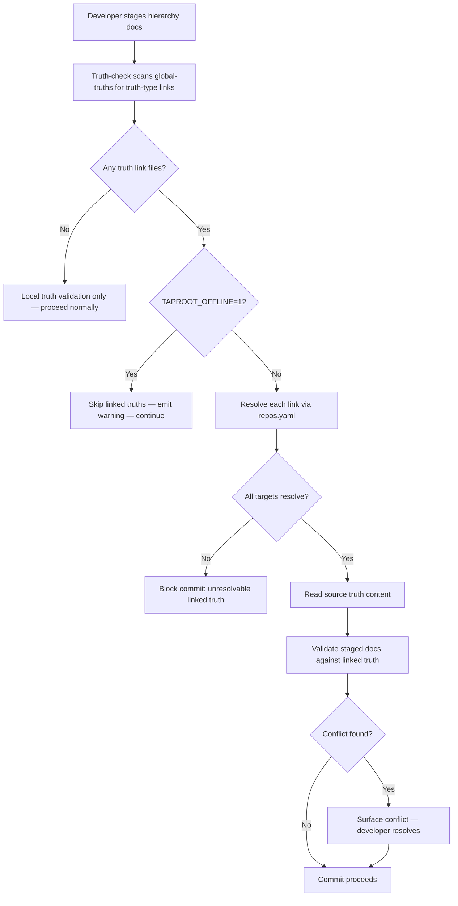

# Behaviour: Enforce Linked Global Truth at Commit

## Actor
Developer in a linking repo committing hierarchy documents (`intent.md` or `usecase.md`) that are subject to a global truth defined in a source repo.

## Preconditions
- A link file with `Type: truth` exists in `taproot/global-truths/` of the linking repo, pointing to a truth file in a source repo
- A local repo mapping is configured that maps the source repo URL to a local filesystem path (or `TAPROOT_OFFLINE=1` is set)
- The developer is staging hierarchy documents for commit

## Main Flow
1. Developer stages `intent.md` or `usecase.md` files and runs `taproot commit` (or `git commit` with the pre-commit hook installed).
2. Truth-check logic scans `taproot/global-truths/` for link files (`*-link.md` or `link.md` with `Type: truth`).
3. For each linked truth file found, system resolves the link target via the local repo mapping to obtain the local path of the source truth file.
4. System reads the source truth file content at the resolved path.
5. System validates the staged hierarchy documents against the linked truth's content, applying the same scope rules as local truths (intent-scoped, behaviour-scoped, or impl-scoped based on the link file's placement or a `Scope:` field).
6. If staged documents are consistent with the linked truth, commit proceeds.

## Alternate Flows

### repos.yaml missing or link target unresolvable
- **Trigger:** System cannot resolve the linked truth target — `.taproot/repos.yaml` is absent, the repo URL is unmapped, or the target file does not exist at the resolved path.
- **Steps:**
  1. System blocks the commit with a clear error: "Linked truth `<link-file>` could not be resolved — configure `.taproot/repos.yaml` or set `TAPROOT_OFFLINE=1` to skip."
  2. Developer either configures repos.yaml, sets `TAPROOT_OFFLINE=1`, or removes/corrects the link file.

### TAPROOT_OFFLINE=1 set
- **Trigger:** `TAPROOT_OFFLINE=1` is set in the environment (typically CI).
- **Steps:**
  1. System skips linked truth resolution entirely.
  2. System emits: "Linked truth validation skipped (TAPROOT_OFFLINE=1) — `<N>` linked truth(s) not checked."
  3. Commit proceeds with local truth validation only.

### Staged document conflicts with linked truth
- **Trigger:** A staged `intent.md` or `usecase.md` uses a term or makes a claim that contradicts the content of the linked truth.
- **Steps:**
  1. System surfaces the conflict before the commit is blocked: "Truth conflict in `<file>`: `<excerpt>` conflicts with linked truth `<link-file>` (resolved from `<source-repo>`): `<truth excerpt>`."
  2. Developer chooses: [A] Fix the staged document | [B] Update the truth in the source repo | [C] Proceed with conflict noted.
  3. If [C]: conflict is recorded and commit proceeds.

### Linked truth has no explicit scope signal
- **Trigger:** The link file has no `Scope:` field and its path provides no scope signal.
- **Steps:**
  1. System treats the linked truth as intent-scoped (broadest — applies at all levels).
  2. System notes inline: "Applied linked truth `<link-file>` as intent-scoped (no explicit scope signal)."

## Postconditions
- All staged hierarchy documents in the linking repo have been validated against both local and linked global truths
- Any conflicts with linked truths are surfaced before the commit completes

## Error Conditions
- **Linked truth unresolvable at commit time**: commit is blocked; developer must configure repos.yaml, correct the link file, or use `TAPROOT_OFFLINE=1`
- **Circular truth links**: link chain resolves back to a previously visited truth file; system reports the cycle and blocks the commit

## Flow

## Related
- `../define-cross-repo-link/usecase.md` — truth-type link files authored there are the input to this behaviour
- `../validate-link-targets/usecase.md` — shares link resolution logic; truth enforcement adds content validation on top of existence checks
- `../../global-truth-store/guide-truth-capture/usecase.md` — local truth authoring; linked truths follow the same scope and validation rules

## Acceptance Criteria

**AC-1: Linked truth enforced at commit — consistent document passes**
- Given a link file with `Type: truth` in `taproot/global-truths/` that resolves to a truth file in a source repo
- When a developer stages a `usecase.md` consistent with the linked truth and commits
- Then the commit proceeds without a truth conflict error

**AC-2: Linked truth enforced at commit — conflicting document is surfaced**
- Given a staged `intent.md` that uses a term contradicting a linked truth's definition
- When the developer commits
- Then the system surfaces the specific conflict with the linked truth's content before blocking

**AC-3: Unresolvable linked truth blocks commit**
- Given a truth-type link file whose repo URL is not in repos.yaml
- When the developer attempts to commit hierarchy documents
- Then the commit is blocked with a message identifying the link file and instructing the developer to configure repos.yaml or set TAPROOT_OFFLINE=1

**AC-4: TAPROOT_OFFLINE=1 skips linked truth validation**
- Given `TAPROOT_OFFLINE=1` is set
- When the developer commits hierarchy documents
- Then linked truth files are not resolved or validated, a warning is emitted noting how many were skipped, and the commit proceeds with local truth validation only

**AC-5: Linked truth with no scope signal defaults to intent-scoped**
- Given a truth-type link file with no `Scope:` field
- When the truth-check runs
- Then the linked truth is treated as intent-scoped and validated against all staged hierarchy documents regardless of level

## Implementations <!-- taproot-managed -->
- [cli-command](cli-command/impl.md)

## Status
- **State:** implemented
- **Created:** 2026-04-01
- **Last reviewed:** 2026-04-03
