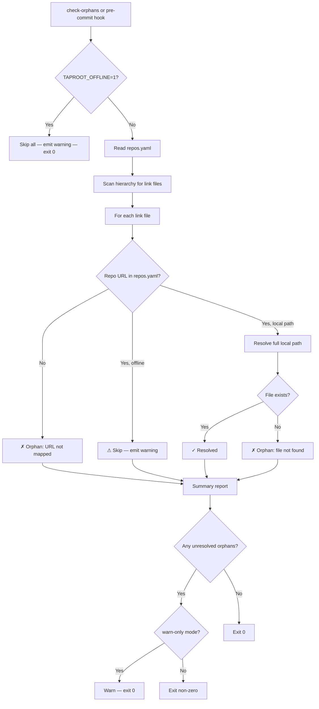

# Behaviour: Per-Repo Offline Mode for Link Validation

## Actor
Developer or CI pipeline running link validation in an environment where one or more external repos are unavailable

## Preconditions
- The linking repo has one or more link files in its taproot hierarchy
- `.taproot/repos.yaml` exists

## Main Flow
1. Developer sets a repo URL to `offline` in the repository mapping configuration.
2. Developer runs `taproot check-orphans` or triggers the pre-commit hook.
3. System reads the repository mapping configuration and identifies repos marked `offline`.
4. System scans the hierarchy for link files.
5. For each link file whose `Repo` field maps to an `offline` entry, system skips resolution and emits: "Link `<file>` skipped — repo `<url>` marked offline in the repository mapping."
6. For each link file whose `Repo` field maps to a local path, system validates the target normally.
7. System produces a report distinguishing: validated links (✓), offline-skipped links (⚠ skipped), and orphaned links (✗).
8. System exits with status 0 if no unresolved links exist (offline-skipped links do not count as failures).

## Alternate Flows
### All repos marked offline
- **Trigger:** Every repo URL in the repository mapping configuration is set to `offline`.
- **Steps:**
  1. System skips all link files and emits a warning for each.
  2. System exits 0 — functionally equivalent to `TAPROOT_OFFLINE=1` but scoped to specific repos.

### TAPROOT_OFFLINE=1 set alongside per-repo offline entries
- **Trigger:** `TAPROOT_OFFLINE=1` is set in the environment, and the repository mapping configuration also has `offline` entries.
- **Steps:**
  1. `TAPROOT_OFFLINE=1` takes precedence — all links are skipped regardless of per-repo entries.
  2. System emits: "Link validation skipped (TAPROOT_OFFLINE=1) — `<N>` link files not checked."

### Link to repo with no mapping entry
- **Trigger:** A link file references a repo URL not present in the repository mapping configuration.
- **Steps:**
  1. System treats this as unresolvable (unchanged from existing behaviour).
  2. System reports the link as an orphan: "Link `<file>`: unresolvable — `<url>` not found in repository mapping."

### warn-only mode active
- **Trigger:** The taproot settings file has `linkValidation: warn-only` configured and some links fail validation.
- **Steps:**
  1. Offline-skipped links are still emitted as warnings.
  2. Orphaned links (non-offline) are demoted to warnings rather than errors.
  3. System exits 0.

## Postconditions
- Links to available repos are validated normally; no false negatives from unavailable repos
- Skipped links are visible in the report — not silently ignored
- Developers can run `taproot check-orphans` and the pre-commit hook in mixed-availability environments without setting the global `TAPROOT_OFFLINE=1`

## Error Conditions
- **Repository mapping has an unrecognised value** (neither a local path nor `offline`): System reports: "Repository mapping: unrecognised value for `<url>` — expected a local path or `offline`." Treats the entry as unresolvable and exits non-zero.

## Flow

## Related
- `../validate-link-targets/usecase.md` — this behaviour extends the offline-skip logic in that spec; `TAPROOT_OFFLINE=1` and `warn-only` modes are defined there
- `../define-cross-repo-link/usecase.md` — link files validated by this behaviour are authored there

## Acceptance Criteria

**AC-1: Link to offline repo skipped with warning**
- Given repos.yaml marks a repo URL as `offline`
- When `taproot check-orphans` runs
- Then all links to that repo are skipped with a per-link warning naming the file and the URL, and the command exits 0

**AC-2: Links to available repos validated normally alongside offline repos**
- Given repos.yaml has one entry set to `offline` and one entry with a local path
- When `taproot check-orphans` runs
- Then links to the local-path repo are validated normally; links to the offline repo are skipped; the report distinguishes ✓, ⚠ skipped, and ✗ orphan results

**AC-3: TAPROOT_OFFLINE=1 overrides per-repo offline entries**
- Given TAPROOT_OFFLINE=1 is set and repos.yaml has both offline and local-path entries
- When `taproot check-orphans` runs
- Then all links are skipped without per-link warnings; a single global skip message is emitted

**AC-4: Unrecognised repository mapping value produces a clear error**
- Given the repository mapping configuration has a value that is neither a valid local path nor `offline`
- When `taproot check-orphans` runs
- Then system reports the unrecognised value with the URL and exits non-zero

**AC-5: Offline-skipped links do not block the pre-commit hook**
- Given a developer has links to an offline-marked repo and attempts to commit
- When the pre-commit hook runs
- Then the hook skips those links with warnings and does not block the commit

## Implementations <!-- taproot-managed -->
- [CLI check-orphans Extension](./cli-check-orphans/impl.md)

## Status
- **State:** specified
- **Created:** 2026-04-09
- **Last reviewed:** 2026-04-09
