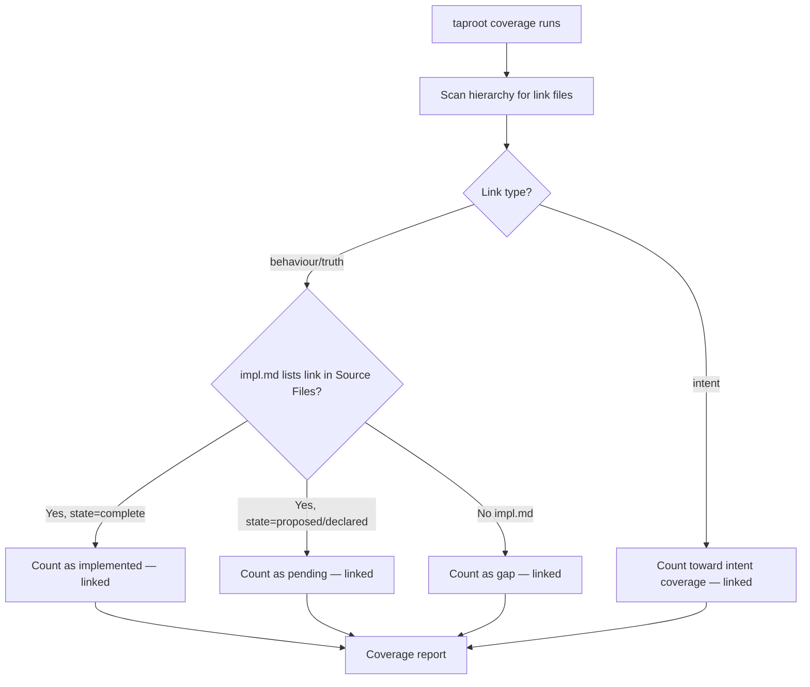

# Behaviour: Resolve Linked Coverage

## Actor
Developer in a linking repo (running `taproot coverage`)

## Preconditions
- The linking repo has a taproot hierarchy (`taproot/` directory)
- At least one link file exists in the hierarchy referencing a behaviour, intent, or truth in a source repo

## Main Flow
1. Developer runs `taproot coverage` in the linking repo.
2. System scans the taproot hierarchy for link files alongside or inside behaviour folders.
3. For each link file found, system checks whether a local `impl.md` in the same behaviour folder lists the link file path in its `## Source Files` section. This is the mechanism by which an impl.md claims responsibility for a linked behaviour.
4. If a local `impl.md` lists the link file in `## Source Files` and has state `complete`, system counts the linked behaviour as implemented for coverage purposes in this repo.
5. System includes linked behaviours in the coverage report with a `[linked]` marker indicating the spec lives in the source repo.
6. System reports overall coverage percentage including linked behaviours alongside locally-authored behaviours.

## Alternate Flows
### impl.md references link but is not complete
- **Trigger:** A local `impl.md` lists the link file in `## Source Files` but has state `proposed` or `declared`.
- **Steps:**
  1. System counts the linked behaviour as not yet implemented (same as any incomplete local impl).
  2. Behaviour appears in coverage report as pending, with `[linked]` marker.

### Link file present but no local impl.md
- **Trigger:** A link file exists in the hierarchy but no `impl.md` in the same folder lists it in `## Source Files`.
- **Steps:**
  1. System counts the linked behaviour as unimplemented.
  2. Coverage report shows the linked behaviour as a gap, with `[linked]` marker.

### Link file points to an intent (not a behaviour)
- **Trigger:** The link file has `Type: intent`.
- **Steps:**
  1. System counts the linked intent toward intent-level coverage (not behaviour-level coverage).
  2. Coverage report shows the linked intent in the intent coverage section with a `[linked]` marker.
  3. Any local behaviours under the same folder are still counted independently.

### Link target unresolvable (repos.yaml missing or unmapped)
- **Trigger:** System attempts to resolve the link target for display purposes but cannot.
- **Steps:**
  1. System reports the linked item in coverage output with a warning: "Link target unresolvable — `<link-file>`. Coverage counted based on local impl.md state only."
  2. Coverage count is not affected — it is based solely on the local `impl.md` state, not link resolution.

## Postconditions
- `taproot coverage` report includes linked behaviours and intents
- Each linked item is marked `[linked]` to distinguish it from locally-authored specs
- Coverage percentage reflects the linking repo's local implementation state

## Error Conditions
- **No local impl.md for a link file**: linked behaviour is listed as a coverage gap; coverage percentage is reduced accordingly. Not an error requiring intervention — developer creates a local impl.md to claim the behaviour.
- **Link target unresolvable**: coverage counting proceeds unaffected; a warning is shown for the unresolvable link. Developer configures `.taproot/repos.yaml` to restore full display fidelity.

## Flow

## Related
- `../define-cross-repo-link/usecase.md` — must precede: link files referenced here are authored there
- `../validate-link-targets/usecase.md` — shares actor; both triggered by taproot commands that traverse link files

## Acceptance Criteria

**AC-1: Linked behaviour counts as implemented when local impl.md is complete**
- Given a link file in a behaviour folder and a local `impl.md` in the same folder that lists the link file path in `## Source Files` with state `complete`
- When the developer runs `taproot coverage`
- Then the linked behaviour is included in the implemented count and marked `[linked]` in the report

**AC-2: Linked behaviour counts as pending when impl.md is not complete**
- Given a link file and a local `impl.md` listing the link in `## Source Files` with state `proposed` or `declared`
- When the developer runs `taproot coverage`
- Then the linked behaviour appears as pending in the coverage report with a `[linked]` marker

**AC-3: No impl.md means linked behaviour is a coverage gap**
- Given a link file exists but no local `impl.md` in the same folder lists it in `## Source Files`
- When the developer runs `taproot coverage`
- Then the linked behaviour is listed as a gap in the coverage report with a `[linked]` marker

**AC-4: Unresolvable link target does not break coverage count**
- Given a link file whose target cannot be resolved via repos.yaml
- When the developer runs `taproot coverage`
- Then coverage is counted based on local impl.md state only, and a warning is shown for the unresolvable link; no error is thrown

**AC-5: Intent-level link counts toward intent coverage**
- Given a link file with `Type: intent`
- When the developer runs `taproot coverage`
- Then the linked intent is counted in intent-level coverage (not behaviour-level) and marked `[linked]`

## Status
- **State:** specified
- **Created:** 2026-03-31
- **Last reviewed:** 2026-03-31
