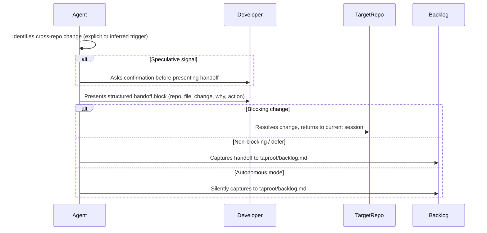

# Behaviour: Signal Cross-Repo Change Needed

## Actor
Developer

## Preconditions
- The current session involves a task that reveals a required change in a target repository
- The target repository is identifiable — by URL or name; a formal `link.md` is not required

## Main Flow
1. Agent identifies, during the current session, that completing the task correctly requires a change in a target repository. The trigger must be **explicit** (developer or agent states directly that a change is needed) or **inferred** (agent detects a concrete conflict — for example, a local change now contradicts a linked truth file). Speculative signals ("this might need changing") must not trigger a handoff; the agent must first ask the developer to confirm the change is actually required.
2. Agent gathers the required information: target repo URL or name, target file path within that repo, a specific description of the required change, and the rationale (why the change is needed and what breaks without it).
3. Agent presents a structured handoff block to the developer. The **Action** field is derived from the relationship type:
   - Truth link target → `Run taproot validate-format in the source repo; linking repos re-validate at next commit`
   - Behaviour/intent link target → `Update spec and notify linking repos of the change`
   - No formal link → `Open target repo, apply change, verify with target repo maintainer`

   ```
   Cross-repo change needed
   ─────────────────────────────────────────────
   Repo:    https://github.com/org/target-repo
   File:    taproot/global-truths/api-contract_impl.md
   Change:  Add `base_ref` field to the scan submission payload — required by vibescanner's new diff-scan feature
   Why:     vibescanner/src/scan/submit.go now sends base_ref; vibeseller's contract must document it or truth-check will block commits
   Action:  Run taproot validate-format in the source repo; linking repos re-validate at next commit
   ```

4. Developer carries the handoff to the target repository — either manually or by opening a new agent session there with the handoff block as input.

## Alternate Flows

### Multiple changes needed in the same repo
- **Trigger:** Agent identifies more than one change required in the same target repo
- **Steps:**
  1. Agent combines all changes into a single handoff block with numbered items under **Change**
  2. Developer handles them in a single session in the target repo

### Changes needed in multiple repos
- **Trigger:** Task requires changes in more than one target repo
- **Steps:**
  1. Agent presents one handoff block per repo, clearly separated
  2. Developer handles each repo independently

### Change is blocking current task
- **Trigger:** Agent determines the cross-repo change must happen before the current task can proceed (e.g. local implementation would fail truth-check without the upstream update)
- **Steps:**
  1. Agent marks the handoff block with `Blocking: yes` and states: "The current task cannot proceed until this change is made in the target repo."
  2. Developer resolves the change in the target repo, then returns — or explicitly overrides ("proceed anyway")
  3. On override: agent captures a known-gap note to `taproot/backlog.md` and continues

### Developer wants to defer
- **Trigger:** Developer indicates the cross-repo change is not blocking or not in scope now
- **Steps:**
  1. Agent offers to capture the handoff to `taproot/backlog.md`
  2. If accepted, agent writes a backlog entry with the full handoff content and notes the current task is proceeding with a known gap

### Session is in autonomous mode
- **Trigger:** `TAPROOT_AUTONOMOUS=1` is set or autonomous mode is active in `taproot/settings.yaml`
- **Steps:**
  1. Agent captures the handoff to `taproot/backlog.md` instead of presenting it interactively
  2. Agent records in the current impl.md under `## Notes`: "Autonomous session — cross-repo change captured to backlog: [summary]"
  3. Session continues without pausing

## Postconditions
- Developer has received a complete, actionable description of what needs to change in the target repo and why
- If the change is **non-blocking**: the current session continues normally
- If the change is **blocking**: the session is paused until the developer resolves it or explicitly overrides with a known-gap note

## Error Conditions
- **Change description is vague**: Agent must not present a handoff without a specific, actionable change description. If the agent cannot determine exactly what needs changing, it must ask the developer before presenting the block.
- **Target repo not identifiable**: Agent asks the developer to supply the repo URL or name before presenting the handoff.
- **Target file path unverifiable**: If the agent cannot confirm the target file exists (e.g. no `repos.yaml` mapping or `TAPROOT_OFFLINE=1`), agent includes a `Path unverified` note in the handoff and proceeds — the developer confirms the path on arrival in the target repo.
- **Speculative signal**: If the agent is not certain a change is required, it must ask "Is it clear that [target repo] needs to change?" before presenting a handoff. A speculative handoff adds noise and must be blocked.

## Flow


## Related
- `../define-cross-repo-link/usecase.md` — links establish the repo relationship that makes change signals traceable
- `../enforce-linked-truth/usecase.md` — truth enforcement is a common inferred trigger: local changes that conflict with a linked truth signal a change is needed in the source repo

## Acceptance Criteria

**AC-1: Agent surfaces a complete handoff block**
- Given the agent identifies a required change in a target repo during the current session via an explicit or inferred trigger
- When the agent has the repo URL, target file path, specific change, and rationale
- Then the agent presents a structured handoff block containing all four fields plus a derived Action step

**AC-2: Multiple changes in the same repo are batched**
- Given the agent identifies two or more required changes in the same target repo
- When presenting the handoff
- Then the agent presents a single handoff block with all changes listed — not one block per change

**AC-3: Developer defer captured to backlog**
- Given the developer indicates the cross-repo change is not blocking
- When the agent offers to defer
- Then the agent writes the full handoff content to `taproot/backlog.md` and the current session continues

**AC-4: Vague change description blocked**
- Given the agent cannot determine a specific, actionable change description
- When the agent would otherwise present a handoff
- Then the agent asks the developer to clarify what specifically needs changing before presenting the block

**AC-5: Multiple repos presented as separate blocks**
- Given the agent identifies changes needed in two or more different target repos
- When presenting handoffs
- Then the agent presents one clearly separated handoff block per repo

**AC-6: Speculative signal requires developer confirmation**
- Given the agent is uncertain whether a change in the target repo is actually required
- When the agent detects a potential cross-repo concern
- Then the agent asks the developer to confirm before presenting a handoff block

**AC-7: Autonomous mode captures to backlog silently**
- Given `TAPROOT_AUTONOMOUS=1` is active
- When a cross-repo change is identified
- Then the agent writes the handoff to `taproot/backlog.md` without interrupting the session and records a note in the current impl.md

## Implementations <!-- taproot-managed -->
- [docs pattern](./docs-pattern/impl.md)

## Status
- **State:** specified
- **Created:** 2026-04-01
- **Last reviewed:** 2026-04-01
