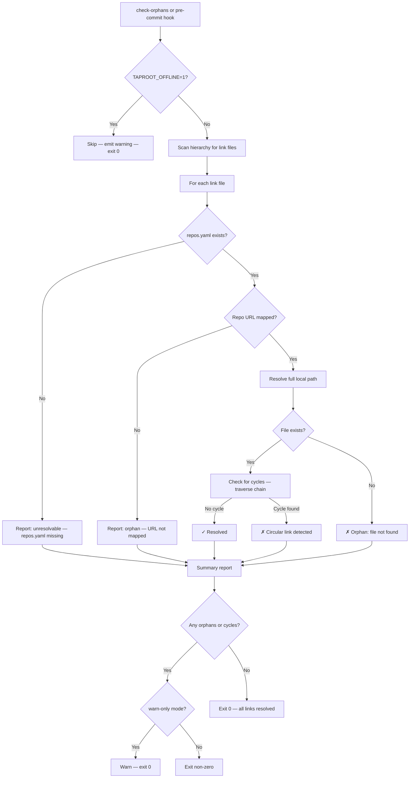

# Behaviour: Validate Link Targets

## Actor
Developer in a linking repo (running `taproot check-orphans` or triggering a pre-commit hook)

## Preconditions
- The linking repo has one or more link files in its taproot hierarchy
- `.taproot/repos.yaml` may or may not exist (validation proceeds either way, with warnings for unresolvable links)

## Main Flow
1. Developer runs `taproot check-orphans` in the linking repo.
2. System scans the entire taproot hierarchy for link files.
3. For each link file, system extracts the `Repo` URL and `Path` fields.
4. System looks up the `Repo` URL in `.taproot/repos.yaml` to obtain the local filesystem path for that repo.
5. System constructs the full local path by joining the mapped repo root with the relative `Path` value.
6. System checks whether the file exists at the resolved path.
7. System traverses any link chains transitively (a link file in the source repo may itself link further) and checks each node, detecting cycles.
8. If all link targets resolve and exist on disk, system reports: "✓ All link targets resolved — no orphans." and exits with status 0.
9. If any link target cannot be resolved or the file is missing, system reports each as an orphan with the full path that was checked, and exits with non-zero status.

## Alternate Flows
### repos.yaml missing entirely
- **Trigger:** `taproot check-orphans` runs but `.taproot/repos.yaml` does not exist.
- **Steps:**
  1. System reports each link file as unresolvable: "Link `<file>`: unresolvable — `.taproot/repos.yaml` not found."
  2. System exits with non-zero status.

### Mixed — some links resolve, some do not
- **Trigger:** Some repos are mapped in repos.yaml and some are not.
- **Steps:**
  1. System resolves and validates all mapped links.
  2. System flags each unmapped or unresolvable link as an orphan.
  3. Report lists resolved links (✓) and orphaned links (✗) separately.
  4. System exits with non-zero status if any orphans are present.

### Circular reference detected during traversal
- **Trigger:** Following a chain of link files leads back to a previously visited node.
- **Steps:**
  1. System halts traversal of that chain.
  2. System reports the circular path: "Circular link: `<A>` → `<B>` → `<A>`."
  3. Remaining independent links continue to be validated.
  4. System exits non-zero.

### Pre-commit hook validation
- **Trigger:** Developer commits files to a repo that has link files in its taproot hierarchy; the taproot pre-commit hook runs automatically.
- **Steps:**
  1. Hook invokes the same resolution logic as `taproot check-orphans`.
  2. If any orphans are found: hook blocks the commit and reports each orphan with its expected local path.
  3. If `taproot/settings.yaml` contains `linkValidation: warn-only`: hook prints orphan warnings but does not block the commit.
  4. If `TAPROOT_OFFLINE=1` is set in the environment: hook skips link resolution entirely and emits: "Link validation skipped (TAPROOT_OFFLINE=1)."
  5. If all links resolve (or validation is skipped/warn-only): commit proceeds.

### CI environment (no repos.yaml available)
- **Trigger:** `taproot check-orphans` runs in a CI environment where `.taproot/repos.yaml` cannot exist (it is gitignored and local-only).
- **Steps:**
  1. If `TAPROOT_OFFLINE=1` is set: system skips link resolution and reports: "Link validation skipped (TAPROOT_OFFLINE=1) — `<N>` link files not checked." Exits with status 0.
  2. If `TAPROOT_OFFLINE` is not set: system reports all links as unresolvable (repos.yaml not found) and exits non-zero.
  3. CI pipelines that want to skip link validation must explicitly set `TAPROOT_OFFLINE=1`.

## Postconditions
- Developer has a complete list of resolved and orphaned link targets
- Any orphaned links are clearly identified with their expected local path
- Exit status is non-zero if any orphans or unresolvable links exist (unless warn-only or offline)

## Error Conditions
- **repos.yaml missing**: all link targets reported as unresolvable; non-zero exit status (unless `TAPROOT_OFFLINE=1`)
- **Circular reference**: cycle chain reported; validation continues for unaffected links; non-zero exit status

## Flow

## Related
- `../define-cross-repo-link/usecase.md` — validates link files authored there; must follow that behaviour
- `../resolve-linked-coverage/usecase.md` — shares dependency on link resolution; both traverse link files

## Acceptance Criteria

**AC-1: All links resolve — no orphans reported**
- Given all link files in the hierarchy have their repo URLs mapped in repos.yaml and their target files exist at the resolved paths
- When the developer runs `taproot check-orphans`
- Then system reports "✓ All link targets resolved — no orphans" and exits with status 0

**AC-2: Orphan flagged when target file is missing at resolved path**
- Given a link file's repo is mapped in repos.yaml but the target spec file does not exist at the resolved local path
- When `taproot check-orphans` runs
- Then system reports the link as an orphan with the full path that was checked and exits non-zero

**AC-3: repos.yaml missing causes all links to be reported as unresolvable**
- Given link files exist but `.taproot/repos.yaml` does not exist
- When `taproot check-orphans` runs
- Then all link files are reported as unresolvable with a clear message and the command exits non-zero

**AC-4: Repo URL not mapped causes specific link to be flagged as orphan**
- Given repos.yaml exists but does not contain an entry for a link file's `Repo` URL
- When `taproot check-orphans` runs
- Then the specific link is flagged as an orphan naming the unmapped URL; other resolvable links are reported as resolved

**AC-5: Circular reference detected and reported**
- Given link files form a cycle (directly or transitively: A → B → A at any depth)
- When `taproot check-orphans` runs
- Then system reports the cycle chain and exits non-zero; validation of other non-circular links continues

**AC-6: Pre-commit hook blocks commit when orphans exist**
- Given a linking repo has an orphaned link file (target unresolvable or missing)
- When the developer attempts to commit
- Then the pre-commit hook blocks the commit and reports the orphaned link(s) with their expected local paths

**AC-7: TAPROOT_OFFLINE=1 skips link validation**
- Given `TAPROOT_OFFLINE=1` is set in the environment
- When `taproot check-orphans` runs or the pre-commit hook fires
- Then link resolution is skipped entirely, a warning is emitted noting how many link files were not checked, and the command exits with status 0

## Status
- **State:** specified
- **Created:** 2026-03-31
- **Last reviewed:** 2026-03-31
