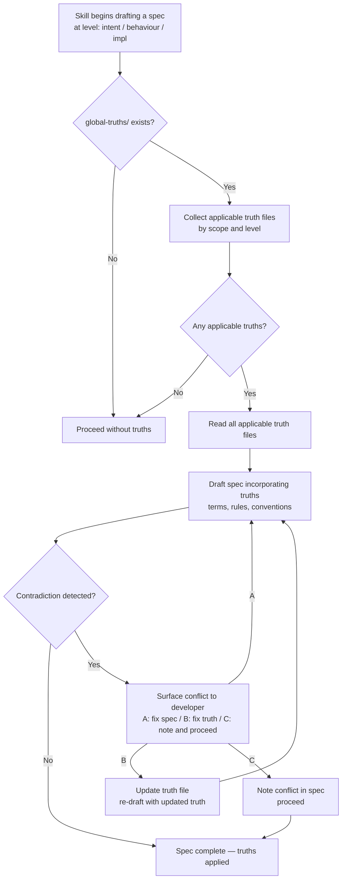

# Behaviour: Apply Truths When Authoring

## Actor
Agent — authoring or reviewing a spec (intent.md, usecase.md, or impl.md) via any taproot skill (`/tr-intent`, `/tr-behaviour`, `/tr-implement`, `/tr-refine`, `/tr-ineed`)

## Preconditions
- `taproot/global-truths/` exists and contains at least one truth file
- A taproot skill is in the process of drafting or reviewing a hierarchy document
- The target document level (intent, behaviour, or implementation) is known
- The current working path (parent intent or behaviour folder) is known, or absent when creating a top-level intent

## Main Flow

1. Before drafting the spec, agent reads `taproot/global-truths/` and collects all truth files applicable to the target document level:
   - **Intent-scoped truths** (`_intent` suffix or `intent/` sub-folder): apply to intent, behaviour, and impl
   - **Behaviour-scoped truths** (`_behaviour` suffix or `behaviour/` sub-folder): apply to behaviour and impl
   - **Impl-scoped truths** (`_impl` suffix or `impl/` sub-folder): apply to impl only
   - **Unscoped files** (no suffix, not in sub-folder): treated as intent-scoped

   After collecting by level scope, apply **path-prefix filtering**: if a filename contains a path-prefix slug before the scope suffix (pattern: `<topic>-<intent-slug>_<scope>.md`, e.g. `ux-manage-organization_behaviour.md` → slug `manage-organization`), only load it when the current working path contains a directory matching that slug. If no working path is known (creating a new top-level intent), skip all path-prefixed truths. Truths without a path prefix load for all paths as before.
2. Agent reads the content of each applicable truth file
3. Agent drafts the spec, incorporating applicable truths:
   - Uses defined terms and their exact definitions from the glossary
   - Applies stated business rules to the acceptance criteria and main flow
   - Respects entity definitions and project conventions in design decisions
   - Treats constraint truths (e.g. "no technical vocabulary in specs") as compliance rules to verify against — does not adopt implementation vocabulary from those truths into the spec language
4. If the draft spec contradicts an applicable truth, agent surfaces the conflict before saving:
   > "This spec uses `<term>` in a way that conflicts with the truth in `global-truths/<file>`: `<truth excerpt>`. Do you want to [A] update the spec to align, [B] update the truth, or [C] proceed with the conflict noted?"
5. Agent completes the spec with truths applied

## Alternate Flows

### No applicable truths for this level
- **Trigger:** `global-truths/` exists but contains no files scoped to the target document level
- **Steps:**
  1. Agent proceeds with authoring without loading any truths
  2. No warning or interruption — this is a normal state

### global-truths/ does not exist
- **Trigger:** The project has no `taproot/global-truths/` folder
- **Steps:**
  1. Agent proceeds with authoring normally
  2. No warning — truths are optional

### Path-prefixed truth outside its intent scope
- **Trigger:** A truth file has a path-prefix slug (e.g. `ux-manage-organization_behaviour.md`) but the current working path is under a different intent (e.g. `manage-billing/`)
- **Steps:**
  1. Agent skips the truth silently — no warning or interruption
  2. Authoring proceeds with globally-scoped truths only

### Truth file is ambiguously scoped (no scope signal)
- **Trigger:** A file like `glossary.md` exists directly in `global-truths/` without a scope suffix
- **Steps:**
  1. Agent treats it as intent-scoped (broadest scope)
  2. Agent notes the ambiguity inline: "Applied `global-truths/glossary.md` as intent-scoped (no explicit scope signal)"

### Contradiction detected — developer chooses to update the truth
- **Trigger:** Agent surfaces a conflict and developer chooses [B] update the truth
- **Steps:**
  1. Agent opens the truth file and proposes the updated wording
  2. Developer confirms; truth is updated
  3. Spec is drafted using the updated truth

## Postconditions
- The drafted spec reflects all applicable truths: uses defined terms correctly, respects business rules, follows project conventions
- Any contradiction between the draft spec and an applicable truth has been explicitly resolved or noted
- No truth is silently ignored

## Error Conditions
- **Truth file is malformed or unreadable**: agent notes the file path and skips it; proceeds with other truths; surfaces: "`global-truths/<file>` could not be read — skipping. Fix the file to apply this truth."

## Flow

## Related
- `../define-truth/usecase.md` — truths read by this behaviour are defined there; must exist before they can be applied
- `../enforce-truths-at-commit/usecase.md` — commit-time complement; catches drift that write-time authoring missed

## Acceptance Criteria

**AC-1: Agent applies intent-scoped truth when authoring a behaviour spec**
- Given `taproot/global-truths/glossary_intent.md` defines "booking" with a specific meaning
- When an agent authors a `usecase.md` that references "booking"
- Then the spec uses the term consistent with the definition in `glossary_intent.md`

**AC-2: Agent applies only applicable truths for the target level**
- Given `taproot/global-truths/` contains `glossary_intent.md` and `tech-choices_impl.md`
- When an agent authors a `usecase.md` (behaviour level)
- Then `glossary_intent.md` is applied and `tech-choices_impl.md` is not

**AC-3: Agent surfaces contradiction before saving**
- Given `taproot/global-truths/business-rules_behaviour.md` states "prices are always exclusive of VAT"
- When an agent drafts a spec that includes a price as VAT-inclusive
- Then the agent surfaces the conflict and offers options before saving the spec

**AC-4: No truths — authoring proceeds normally**
- Given `taproot/global-truths/` does not exist or contains no applicable truths
- When an agent authors any spec
- Then authoring proceeds without interruption

**AC-6: Path-prefixed truth is not loaded outside its intent path**
- Given `taproot/global-truths/ux-manage-organization_behaviour.md` exists
- When an agent authors a spec under `manage-billing/` (a different intent)
- Then `ux-manage-organization_behaviour.md` is not loaded — the slug `manage-organization` does not match the current working path

**AC-7: Path-prefixed truth is loaded within its intent path**
- Given `taproot/global-truths/ux-manage-organization_behaviour.md` exists
- When an agent authors a spec under `manage-organization/invite-member/`
- Then `ux-manage-organization_behaviour.md` is loaded alongside globally-scoped behaviour truths

**AC-5: Unscoped truth file treated as intent-scoped with note**
- Given `taproot/global-truths/glossary.md` exists with no scope signal
- When an agent collects applicable truths for any level
- Then `glossary.md` is included and the agent notes it was treated as intent-scoped

## Implementations <!-- taproot-managed -->
- [Agent Skill](./agent-skill/impl.md)

## Status
- **State:** implemented
- **Created:** 2026-03-26
- **Last reviewed:** 2026-04-10
