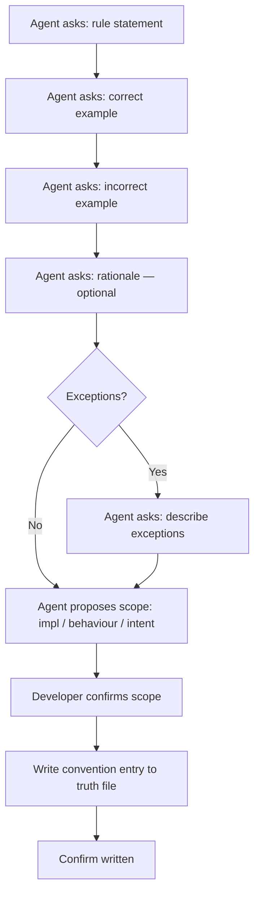

# Behaviour: Define Convention

## Actor
Developer or tech lead recording a specific rule or convention that must be followed consistently across the project

## Preconditions
- A `taproot/` hierarchy exists in the project
- Developer has a convention to record — a specific rule with clear right/wrong application (naming, coding style, data handling, security rules, API patterns, etc.)

## Main Flow

1. Agent asks: "Describe the rule — what must always (or never) be done?"
2. Agent asks: "Give a correct example — what does following this convention look like?"
3. Agent asks: "Give an incorrect example — what does violating this convention look like?"
4. Agent asks: "Is there a rationale worth recording — why does this rule exist?" (optional)
5. Agent proposes scope:
   - **impl** (default) — a coding or technical convention
   - **behaviour** — a rule that shapes how features must behave
   - **intent** — a project-wide naming or structural rule visible at all levels
6. Developer confirms or adjusts the scope
7. Agent writes a structured convention entry to an appropriately scoped truth file in `taproot/global-truths/`, appending if the file already exists
8. Agent confirms: "Written — [rule summary] recorded in `<path>`"

## Alternate Flows

### Rule has exceptions
- **Trigger:** Developer notes that the convention applies in most but not all cases
- **Steps:**
  1. After step 3, agent asks: "Are there known exceptions?"
  2. Developer describes the exceptions
  3. Agent includes an Exceptions section in the entry

### Invoked from author-design-constraints session
- **Trigger:** Developer selected Rule / Convention format in a parent session
- **Steps:**
  1. Agent runs steps 1–8 as normal
  2. On completion, control returns to the parent session ("Another constraint, or done?")

## Postconditions
- A structured convention entry exists in `taproot/global-truths/` with the rule, correct example, incorrect example, and optional rationale and exceptions
- The entry is scoped to implementation by default

## Error Conditions
- **Rule too broad to be actionable:** Developer states a rule that cannot produce a clear correct/incorrect example (e.g. "write good code") — agent asks: "Can you make this more specific — what would a developer do differently if they followed this rule?"

## Flow

## Related
- `../usecase.md` — parent session that orchestrates this and the other three constraint formats
- `../define-principle/usecase.md` — use instead when the rule is a broad design value rather than a specific do/don't
- `../../define-truth/usecase.md` — use for free-form reference material (style guides, full linting configs) that does not fit a structured entry

## Acceptance Criteria

**AC-1: Naming convention captured with correct and incorrect examples**
- Given a developer wants to record a naming rule for database columns
- When the developer provides the rule, a correct example, and an incorrect example
- Then a truth entry exists with all three fields

**AC-2: Security rule captured using the same format**
- Given a developer wants to record "never log authentication tokens — not in debug, not in error messages"
- When the developer completes the prompts
- Then a truth entry exists — the domain (security) does not affect the format or flow

**AC-3: Convention with exceptions recorded accurately**
- Given a developer notes that the convention has one known exception
- When the agent asks about exceptions and the developer describes it
- Then the truth entry includes both the rule and the exception

**AC-4: Overly broad rule rejected with guidance**
- Given a developer states "write clean code" as the rule
- When the agent evaluates it against the correct/incorrect example test
- Then the agent asks for a more specific rule before proceeding

**AC-5: Scope defaults to impl for coding conventions**
- Given a developer records a coding or technical convention
- When the agent proposes a scope
- Then impl scope is proposed as the default

## Status
- **State:** proposed
- **Created:** 2026-03-29
- **Last reviewed:** 2026-03-29
