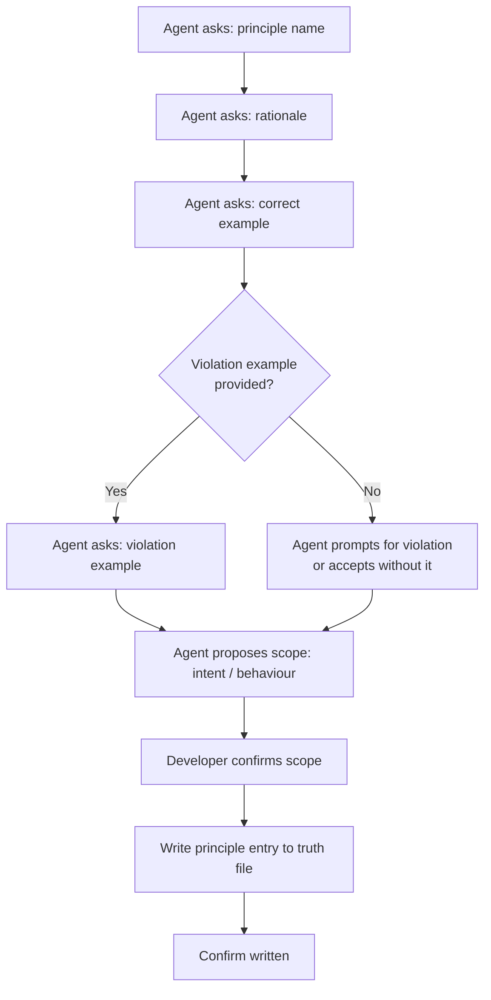

# Behaviour: Define Principle

## Actor
Developer, designer, or tech lead recording a design value that should guide ongoing choices across the project

## Preconditions
- A `taproot/` hierarchy exists in the project
- Developer has a principle to record — a value or guideline that shapes how the team makes decisions, across any domain (UX, accessibility, sustainability, performance philosophy, security posture, etc.)

## Main Flow

1. Agent asks: "Name this principle in 3–5 words — what should it be called?"
2. Agent asks: "What is the rationale — why does this principle exist in your project? What problem does it prevent?"
3. Agent asks: "Give an example of applying this principle correctly."
4. Agent asks: "Give an example of violating this principle — what does it look like when this is ignored?"
5. Agent proposes scope:
   - **intent** (default) — a cross-cutting design value that applies everywhere
   - **behaviour** — applies to feature behaviour but not implementation internals
6. Developer confirms or adjusts the scope
7. Agent writes a structured principle entry to an appropriately scoped truth file in `taproot/global-truths/`, appending if the file already exists
8. Agent confirms: "Written — [principle name] recorded in `<path>`"

## Alternate Flows

### Developer cannot provide a violation example
- **Trigger:** Developer struggles to describe what violating the principle looks like
- **Steps:**
  1. Agent prompts: "Think of a time this principle was ignored — what happened, or what would a developer do if they hadn't read this?"
  2. If still unclear, agent accepts the entry without a violation example and notes: "A violation example would make this principle more testable — consider adding one later"

### Invoked from author-design-constraints session
- **Trigger:** Developer selected Principle format in a parent session
- **Steps:**
  1. Agent runs steps 1–8 as normal
  2. On completion, control returns to the parent session ("Another constraint, or done?")

## Postconditions
- A structured principle entry exists in `taproot/global-truths/` with name, rationale, correct example, and violation example (where provided)
- The entry is intent-scoped by default, applying across all specs unless narrowed

## Error Conditions
- **Name too vague:** Developer provides a one-word name with no distinguishing content (e.g. "quality") — agent asks: "Can you be more specific — what aspect of quality, and in what context?"

## Flow

## Related
- `../usecase.md` — parent session that orchestrates this and the other three constraint formats
- `../record-decision/usecase.md` — use instead when the principle emerged from a specific choice between options
- `../../define-truth/usecase.md` — use for free-form guidelines that do not need structured prompting

## Acceptance Criteria

**AC-1: UX principle captured with all fields**
- Given a developer wants to record "fail early — surface failures before long operations start"
- When the developer completes the prompts
- Then a truth entry exists with the principle name, rationale, a correct example, and a violation example

**AC-2: Accessibility principle captured using the same format**
- Given a developer wants to record "keyboard first — all interactions must be completable without a pointer"
- When the developer completes the prompts
- Then a truth entry exists — the domain (accessibility) does not affect the format or flow

**AC-3: Sustainability principle captured using the same format**
- Given a developer wants to record "prefer async over sync — avoid blocking operations that waste compute while waiting"
- When the developer completes the prompts
- Then a truth entry exists with the principle applied to sustainability / resource efficiency

**AC-4: Violation example optional but prompted**
- Given a developer cannot provide a violation example
- When the agent prompts and the developer still cannot provide one
- Then the entry is written without it, and the agent notes that a violation example would improve testability

**AC-5: Scope defaults to intent for cross-cutting values**
- Given a developer records a principle that applies across all features
- When the agent proposes a scope
- Then intent scope is proposed as the default

## Implementations <!-- taproot-managed -->
- Deprecated — absorbed into [define-truth](../../define-truth/agent-skill/impl.md)

## Status
- **State:** deprecated
- **Created:** 2026-03-29
- **Last reviewed:** 2026-04-02
- **Deprecated:** 2026-04-02 — absorbed into `define-truth` Structured path (Principle format).

## Notes
Deprecated — absorbed into `/tr-define-truth` Structured path. All four formats (Decision, Principle, Convention, External) are handled inline by `skills/define-truth.md`.
