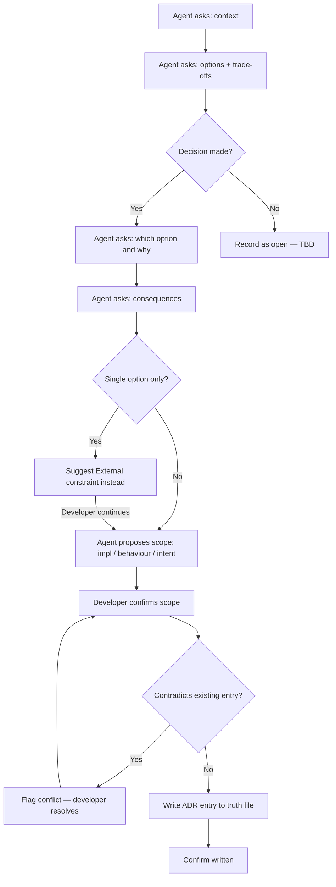

# Behaviour: Record Decision

## Actor
Developer, architect, or tech lead recording a decision that was made — or is still open — about any aspect of the project

## Preconditions
- A `taproot/` hierarchy exists in the project
- Developer has a decision to record: a choice made from options, across any domain (architecture, security, tooling, accessibility library, data storage, third-party service, etc.)

## Main Flow

1. Agent asks: "Describe the situation — what problem or context led to this decision?"
2. Agent asks: "What options did you consider? For each, what was the key trade-off?"
3. Agent asks: "Which option did you choose, and why?"
4. Agent asks: "What consequences follow — benefits you expect and trade-offs you accept?"
5. Agent proposes a scope for the entry:
   - **impl** (default) — a technology or implementation choice
   - **behaviour** — a constraint on how features must behave
   - **intent** — a project-wide principle that shapes all work
6. Developer confirms or adjusts the scope
7. Agent writes a structured ADR entry to an appropriately scoped truth file in `taproot/global-truths/`, appending if the file already exists
8. Agent confirms: "Written — [title of decision] recorded in `<path>`"

## Alternate Flows

### Decision still open
- **Trigger:** Developer has identified options but has not yet chosen
- **Steps:**
  1. Agent completes steps 1–2 as normal
  2. At step 3, developer indicates no decision has been made yet
  3. Agent records the entry with status **open**: context and options documented, decision field left as "TBD"
  4. Agent notes: "Recorded as open — will not constrain specs until a decision is made and the status updated"

### Single option — no real choice
- **Trigger:** Developer has only one option (e.g. mandated by client or platform)
- **Steps:**
  1. Agent notes: "If there was no real choice, this may be better captured as an External constraint rather than a Decision — shall I switch?"
  2. Developer confirms or continues as a Decision with one option listed

### Invoked from author-design-constraints session
- **Trigger:** Developer selected Decision format in a parent session
- **Steps:**
  1. Agent runs steps 1–8 as normal
  2. On completion, control returns to the parent session ("Another constraint, or done?")

## Postconditions
- A structured ADR entry exists in `taproot/global-truths/` with context, options, decision (or "open"), and consequences
- The entry is scoped appropriately and immediately active at commit time
- If the decision is open, it is visible but does not constrain specs until resolved
- To update an existing entry (e.g. to resolve an open decision), edit the truth file directly and commit the change

## Error Conditions
- **Contradictory decision detected:** The new decision conflicts with an existing entry — agent flags: "This appears to contradict an existing decision: [excerpt]. [A] update the existing entry, [B] record both with a distinction note, [C] cancel"
- **Domain unclear after context prompt:** Developer's context does not identify what aspect of the project is being decided — agent asks: "What area does this decision affect — e.g. data storage, authentication, deployment, front-end framework?"

## Flow

## Related
- `../usecase.md` — parent session that orchestrates this and the other three constraint formats
- `../record-external-constraint/usecase.md` — use instead when there was no real choice; the constraint was imposed from outside
- `../../define-truth/usecase.md` — use for free-form decisions that do not need ADR structure

## Acceptance Criteria

**AC-1: Decision recorded with all four ADR fields**
- Given a developer wants to record "we use PostgreSQL over SQLite"
- When the developer provides context, options with trade-offs, the chosen option, and consequences
- Then a truth entry exists with all four fields populated and the developer is shown confirmation

**AC-2: Open decision recorded without blocking specs**
- Given a developer has identified two options but has not yet decided
- When the developer indicates no decision has been made
- Then the entry is recorded with status "open", options listed, and the agent confirms it will not constrain specs

**AC-3: Single-option entry offered redirect to External constraint**
- Given a developer describes a decision where there was only one option (mandated externally)
- When the agent detects only one option
- Then the agent suggests switching to the External constraint format before proceeding

**AC-4: Contradictory decision flagged before saving**
- Given an existing truth entry states "we use PostgreSQL for persistence"
- When the developer tries to record "we use SQLite for all data storage"
- Then the agent flags the conflict and asks the developer to resolve it before writing

**AC-5: Scope defaults to impl for technology choices**
- Given a developer records a technology choice (database engine, framework, language)
- When the agent proposes a scope
- Then impl scope is proposed as the default

**AC-6: Works for any decision domain**
- Given a developer wants to record a security decision ("we use OWASP Top 10 as our baseline for threat modelling")
- When the developer completes the ADR prompts
- Then a truth entry exists with the decision recorded — the domain (security) does not affect the format or flow

## Implementations <!-- taproot-managed -->
- [Agent Skill — design constraints session](../agent-skill/impl.md)

## Status
- **State:** implemented
- **Created:** 2026-03-29
- **Last reviewed:** 2026-03-30

## Notes
Implemented as part of the parent `/tr-design-constraints` session skill alongside the other three constraint formats — see `../agent-skill/impl.md`. All four formats (Decision, Principle, Convention, External) are handled inline by the `design-constraints.md` skill file. No standalone implementation is needed for this sub-behaviour.
