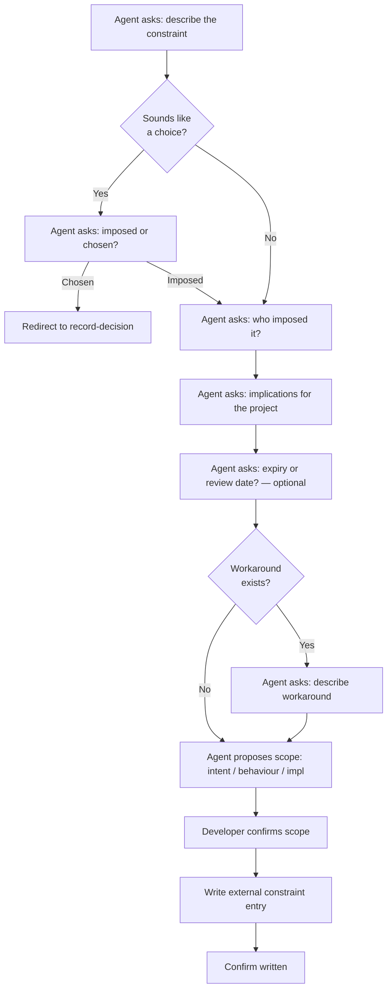

# Behaviour: Record External Constraint

## Actor
Developer or project lead recording a constraint imposed from outside the project — not a choice the team made

## Preconditions
- A `taproot/` hierarchy exists in the project
- Developer has an external constraint to record: a third-party API, regulatory requirement, legacy system dependency, platform limitation, client contractual requirement, or similar imposition

## Main Flow

1. Agent asks: "Describe the constraint — what are you required to do, use, or avoid?"
2. Agent checks: if the description sounds like a choice ("we use X", "we prefer Y") rather than an imposition, agent asks: "Was this imposed on you, or did your team choose it? If you chose it, this is better captured as a Decision." Developer confirms or redirects.
3. Agent asks: "Who or what imposed this? (e.g. client contract, regulator, platform, legacy system, corporate policy)"
4. Agent asks: "What are the implications for the project — what does this constrain or require in practice?"
5. Agent asks: "Is there an expiry or review date? (e.g. API contract ends, regulation under review)" — optional
6. Agent proposes scope:
   - **intent** (default) — applies project-wide, visible to all specs
   - **behaviour** — constrains how specific features behave
   - **impl** — constrains implementation choices only
7. Developer confirms or adjusts the scope
8. Agent writes a structured external constraint entry to an appropriately scoped truth file in `taproot/global-truths/`, appending if the file already exists
9. Agent confirms: "Written — [constraint summary] recorded in `<path>`"

## Alternate Flows

### Workaround or mitigation exists
- **Trigger:** Developer knows of a partial workaround for the constraint
- **Steps:**
  1. After step 3, agent asks: "Is there a known workaround or mitigation?"
  2. Developer describes it
  3. Agent includes a Workaround section in the entry

### Constraint may be lifted in future
- **Trigger:** Developer notes the constraint is temporary or under negotiation
- **Steps:**
  1. Agent records the constraint with a note: "Status: temporary — under review" alongside the context
  2. Agent suggests setting a review date (step 4)

### Invoked from author-design-constraints session
- **Trigger:** Developer selected External constraint format in a parent session
- **Steps:**
  1. Agent runs steps 1–8 as normal
  2. On completion, control returns to the parent session ("Another constraint, or done?")

## Postconditions
- A structured external constraint entry exists in `taproot/global-truths/` recording: what the constraint is, its source, its implications, and optionally its expiry and any workarounds
- The entry is intent-scoped by default — external constraints typically affect the whole project
- Future specs authored against this project will have the constraint surfaced when relevant
- To update an existing entry (e.g. when a constraint expires or its implications change), edit the truth file directly and commit the change

## Error Conditions
- **Constraint sounds like a decision:** Developer describes something they chose (e.g. "we use Stripe") — agent asks: "Was this imposed on you, or did you choose it? If you chose it, this may be better captured as a Decision."

## Flow

## Related
- `../usecase.md` — parent session that orchestrates this and the other three constraint formats
- `../record-decision/usecase.md` — use instead when the team made a real choice between options
- `../../define-truth/usecase.md` — use for free-form reference material (full API specs, regulatory text) that does not need structured prompting

## Acceptance Criteria

**AC-1: External API constraint captured with source and implications**
- Given a developer must integrate with a corporate SAML IdP not of their choosing
- When the developer completes the prompts
- Then a truth entry exists with the constraint, its source (corporate policy), and its implications for the project

**AC-2: Regulatory constraint captured with expiry date**
- Given a developer must comply with a data retention regulation that is under review
- When the developer provides a review date
- Then the truth entry includes the expiry/review date alongside the constraint

**AC-3: Constraint with workaround recorded accurately**
- Given a developer knows of a partial workaround for a legacy API limitation
- When the agent asks about workarounds and the developer describes it
- Then the truth entry includes both the constraint and the workaround

**AC-4: Decision mis-classified as external constraint redirected**
- Given a developer says "we use Stripe" as if it were an imposed constraint
- When the agent asks whether it was imposed or chosen
- Then the agent redirects to the Decision format if the developer confirms it was a choice

**AC-5: Scope defaults to intent for project-wide external constraints**
- Given a developer records a constraint that affects the whole project
- When the agent proposes a scope
- Then intent scope is proposed as the default

**AC-6: Works for any external source**
- Given a developer must use a client-mandated third-party analytics platform
- When the developer completes the prompts
- Then a truth entry exists — the source type (client contract) does not affect the format or flow

## Implementations <!-- taproot-managed -->
- [Agent Skill — design constraints session](../agent-skill/impl.md)

## Status
- **State:** implemented
- **Created:** 2026-03-29
- **Last reviewed:** 2026-03-30

## Notes
Implemented as part of the parent `/tr-design-constraints` session skill alongside the other three constraint formats — see `../agent-skill/impl.md`. All four formats (Decision, Principle, Convention, External) are handled inline by the `design-constraints.md` skill file. No standalone implementation is needed for this sub-behaviour.
