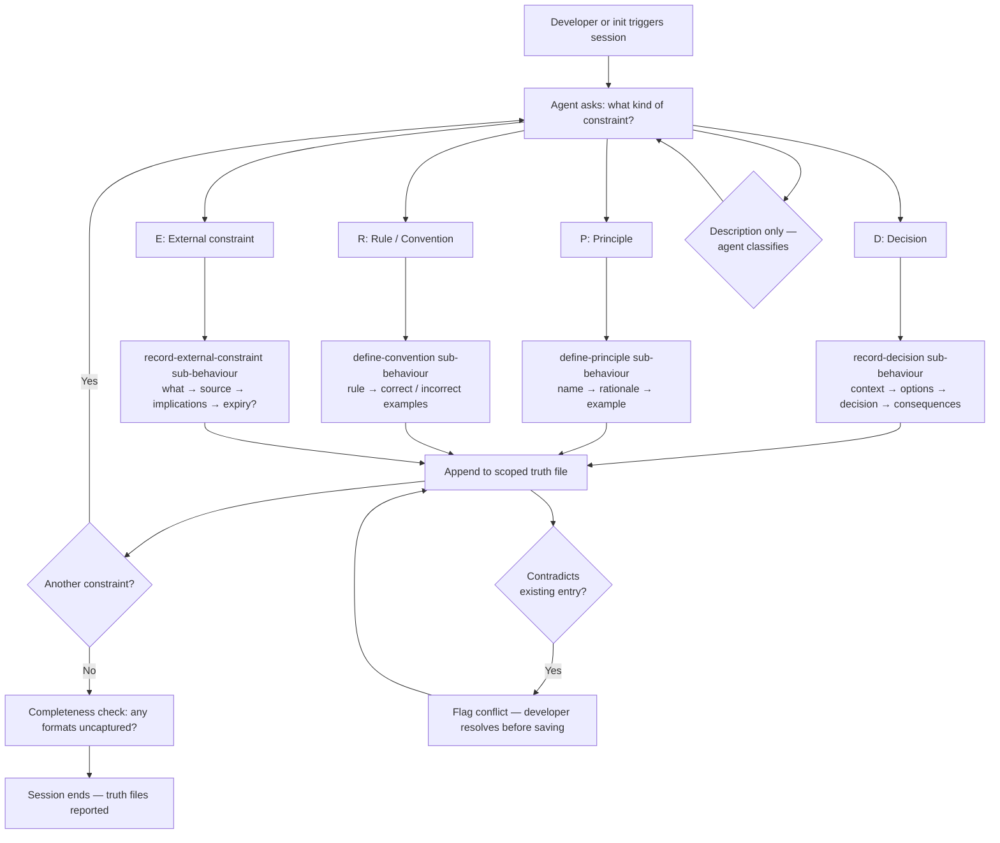

# Behaviour: Author Design Constraints

## Actor
Developer, architect, or tech lead establishing project-wide constraints before or during spec authoring

## Preconditions
- A `taproot/` hierarchy exists in the project
- Developer has constraints to record — architectural decisions, design principles, project conventions, or external impositions not yet formalised in `taproot/global-truths/`

## Main Flow

1. Developer invokes the session explicitly or is prompted during `taproot init`
2. Agent asks: "What kind of constraint do you want to capture?"
   - **[D] Decision** — something you chose from options (architecture, security approach, tooling, accessibility library)
   - **[P] Principle** — a design value that guides ongoing choices (UX, accessibility, sustainability, performance philosophy)
   - **[R] Rule / Convention** — a specific constraint with right/wrong examples (naming, coding style, data handling, security rules)
   - **[E] External constraint** — something imposed from outside; not your choice (third-party API, regulatory requirement, legacy system, platform limit)
3. Agent guides the developer through the appropriate prompts for the selected format (see sub-behaviours)
4. Agent writes the entry to the appropriate scoped truth file, appending if the file already exists
5. Agent confirms: "Written to `<path>`. Another constraint, or done?"
6. Steps 2–5 repeat until the developer ends the session
7. At session end, agent presents a completeness check: lists the four constraint formats and asks if any remain uncaptured — developer may decline

## Alternate Flows

### Single constraint
- **Trigger:** Developer has one specific constraint to record and does not want a full session
- **Steps:**
  1. Developer specifies the format upfront (or describes it and agent classifies)
  2. Agent runs the sub-behaviour for that format directly
  3. Completeness check is offered; developer may skip it

### Agent classifies the format
- **Trigger:** Developer describes a constraint without naming the format ("we have to use the legacy billing API")
- **Steps:**
  1. Agent identifies the format from the description: "That sounds like an external constraint — imposed on you, not a choice you made. Is that right?"
  2. Developer confirms or corrects
  3. Agent proceeds with the confirmed format

### Adding to existing truths
- **Trigger:** A truth file for the target category already exists in `taproot/global-truths/`
- **Steps:**
  1. Agent reads the existing file before writing
  2. Agent appends the new entry rather than replacing the file
  3. Agent confirms what was added

### Prompted during init
- **Trigger:** `taproot init` asks "Would you like to define project constraints now?"
- **Steps:**
  1. Developer selects yes
  2. Full session runs inline; developer may skip any format or end early
  3. On completion, init continues to the next step

## Postconditions
- One or more truth files exist in `taproot/global-truths/` covering the captured constraints, with appropriate scope signals
- Each entry follows the structure for its format (see sub-behaviours)
- All written truths are immediately active at commit time via `enforce-truths-at-commit`

## Error Conditions
- **Format ambiguous after classification attempt:** Developer's description does not clearly map to one format — agent presents the four options and asks the developer to choose directly
- **No content provided:** Developer selects a format but provides no entries — agent skips without creating an empty file
- **Contradictory entry detected:** New entry conflicts with an existing truth — agent flags: "This appears to contradict an existing entry: [excerpt]. [A] update the existing entry, [B] record both with a distinction note, [C] cancel"

## Flow

## Related
- `./guide-truth-capture/usecase.md` — covers what belongs in global truths; this behaviour provides structured authoring once the developer knows they have constraints to record
- `./define-truth/usecase.md` — use this instead for free-form truths (DB schemas, API contracts, data dictionaries, reference tables) that do not benefit from structured prompting
- `./apply-truths-when-authoring/usecase.md` — truths authored here are applied by agents when writing specs
- `./enforce-truths-at-commit/usecase.md` — truths authored here are checked against staged specs at commit time

## Acceptance Criteria

**AC-1: Architectural decision captured in ADR format**
- Given a developer wants to record "we use PostgreSQL over SQLite for persistence"
- When the developer selects Decision and completes the prompts
- Then a truth entry exists in `taproot/global-truths/` with context, options, decision, and consequences — and the developer is shown confirmation of what was written

**AC-2: Security principle captured using Principle format**
- Given a developer wants to record "defence in depth — never rely on a single security control"
- When the developer selects Principle and completes the prompts
- Then a truth entry exists in `taproot/global-truths/` with the principle name, rationale, and both a correct and incorrect application example

**AC-3: Accessibility convention captured using Rule format**
- Given a developer wants to record "all interactive elements must have a visible focus indicator"
- When the developer selects Rule and completes the prompts
- Then a truth entry exists in `taproot/global-truths/` with the rule and at least one correct and one incorrect example

**AC-4: External constraint captured with source and implications**
- Given a developer must integrate with a corporate SAML IdP that is not their choice
- When the developer selects External constraint and completes the prompts
- Then a truth entry exists in `taproot/global-truths/` recording what the constraint is, who imposed it, and its implications for the project

**AC-5: Agent classifies format from description**
- Given a developer says "we have to use the legacy billing API — client contract"
- When the agent classifies the description
- Then the agent identifies it as an External constraint, confirms with the developer, and proceeds with the correct prompts

**AC-6: Adding to existing truths appends rather than overwrites**
- Given a truth file already contains one constraint entry
- When the developer adds a second constraint of the same format in a new session
- Then both entries are present and the original is unchanged

**AC-7: Completeness check offered at session end**
- Given a developer completes a session covering only decisions and principles
- When the session ends
- Then the agent notes that Rules and External constraints have not been covered and offers to continue

**AC-8: Contradictory entry flagged before saving**
- Given a truth file already contains "we use PostgreSQL for persistence"
- When the developer tries to add "we use SQLite for all storage"
- Then the agent flags the contradiction and asks the developer to resolve it before saving

**AC-9: Session triggered during taproot init**
- Given a developer is running `taproot init` on a new project
- When init asks "Define project constraints now?" and the developer selects yes
- Then the full session runs inline and produces truth files before init completes

## Sub-behaviours <!-- taproot-managed -->

The following sub-behaviours define the prompting and output format for each constraint type:

- [Record Decision](./record-decision/usecase.md) — ADR format: context, options considered, decision, consequences
- [Define Principle](./define-principle/usecase.md) — Principle format: name, rationale, correct and incorrect examples
- [Define Convention](./define-convention/usecase.md) — Rule format: rule statement, correct example, incorrect example
- [Record External Constraint](./record-external-constraint/usecase.md) — External format: constraint, source, implications, optional expiry

## Implementations <!-- taproot-managed -->
- [Agent Skill — design constraints session](./agent-skill/impl.md)

## Status
- **State:** specified
- **Created:** 2026-03-29
- **Last reviewed:** 2026-03-29
