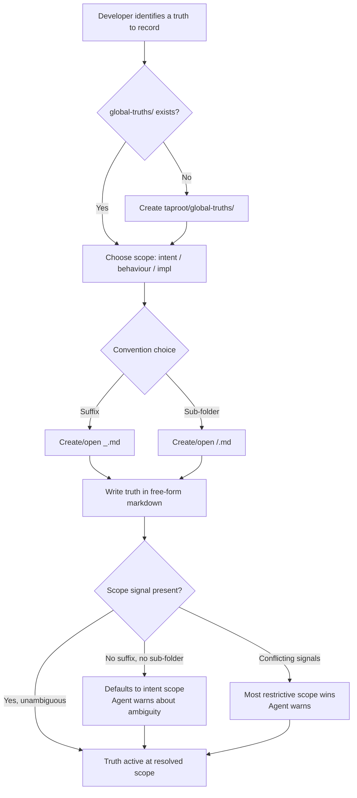

# Behaviour: Define Truth

## Actor
Developer or agent — creating, editing, or removing a truth entry in the project's shared knowledge base

## Preconditions
- A `taproot/` hierarchy exists in the project
- The developer has identified a fact to record (glossary term, business rule, entity definition, project convention, or any other shared truth)

## Main Flow

1. Developer navigates to `taproot/global-truths/` (the folder is created on first use if absent)
2. Developer determines the scope of the truth:
   - **intent** — applies to intent, behaviour, and implementation levels
   - **behaviour** — applies to behaviour and implementation levels only
   - **impl** — applies to implementation level only
3. Developer chooses a storage convention (both are valid and may coexist in the same project):
   - **Suffix convention** (simple, fewer files): create or open `<name>_<scope>.md` — e.g. `glossary_intent.md`, `business-rules_behaviour.md`, `tech-choices_impl.md`
   - **Sub-folder convention** (scales to many truths): create or open `<scope>/<name>.md` — e.g. `intent/glossary.md`, `behaviour/business-rules.md`, `impl/tech-choices.md`
4. Developer writes or updates the truth entry in free-form markdown — prose, tables, bullet lists, and headings are all valid
5. Developer saves the file; the truth is immediately active at its resolved scope

## Alternate Flows

### First truth — global-truths/ does not exist
- **Trigger:** Developer adds the first truth to the project
- **Steps:**
  1. Developer creates `taproot/global-truths/` manually or via agent
  2. Developer adds the truth file using either convention
  3. Flow continues from step 4

### No scope signal — file has no suffix and is not in a scoped sub-folder
- **Trigger:** Developer places a file such as `glossary.md` directly in `taproot/global-truths/` without a `_<scope>` suffix
- **Steps:**
  1. System treats the file as **intent-scoped** (broadest scope — applies everywhere)
  2. Agent flags the ambiguity at next write or commit interaction: "`glossary.md` has no scope signal — it defaults to intent scope (applies everywhere). Add a suffix (`_intent`, `_behaviour`, `_impl`) or move it to a sub-folder to make the scope explicit."
  3. Developer may resolve the warning or leave it; the truth remains active at intent scope

### Conflicting scope signals — suffix and sub-folder disagree
- **Trigger:** A file is named `glossary_intent.md` but placed inside `impl/`
- **Steps:**
  1. System applies the **most restrictive scope** (the sub-folder takes precedence: `impl`)
  2. Agent warns: "`impl/glossary_intent.md` has conflicting scope signals — sub-folder (`impl`) is more restrictive than suffix (`intent`). The restrictive scope (`impl`) applies. Rename or move the file to resolve."

### Removing a truth
- **Trigger:** Developer deletes a truth file or removes entries from it
- **Steps:**
  1. Developer deletes the file or empties the relevant section
  2. If the file is now empty, developer may delete it
  3. If `global-truths/` is now empty, it may be deleted; no cascade effect required

### Both conventions coexist
- **Trigger:** Project contains truths using both suffix and sub-folder conventions
- **Steps:**
  1. Both are valid — system reads all files in `taproot/global-truths/` using scope-resolution rules for each
  2. No migration or normalisation is required

## Postconditions
- A truth entry exists in `taproot/global-truths/` with a determinable scope
- The truth is available for use by `apply-truths-when-authoring` and `enforce-truths-at-commit`
- Any scope ambiguity is flagged but does not block the developer

## Error Conditions
- **`global-truths/` created outside `taproot/`**: agent warns the file will not be discovered; correct location is `taproot/global-truths/`
- **New truth contradicts an existing entry**: agent reads existing truth files before writing and flags: "This appears to contradict an existing entry in `global-truths/<file>`: `<excerpt>`. [A] update the existing entry, [B] record both with a distinction note, [C] cancel"

## Flow

## Related
- `../apply-truths-when-authoring/usecase.md` — reads truths defined here when drafting specs; must resolve cascade and scope
- `../enforce-truths-at-commit/usecase.md` — validates staged specs against truths defined here at commit time

## Acceptance Criteria

**AC-1: Truth created with suffix convention**
- Given `taproot/global-truths/` exists
- When developer creates `glossary_intent.md` and writes a term definition
- Then the truth is stored and resolved as intent-scoped (applies to intent, behaviour, and impl)

**AC-2: Truth created with sub-folder convention**
- Given `taproot/global-truths/` exists
- When developer creates `behaviour/business-rules.md` and writes a rule
- Then the truth is stored and resolved as behaviour-scoped (applies to behaviour and impl)

**AC-3: Developer edits an existing truth**
- Given a truth file exists in `taproot/global-truths/`
- When developer opens the file and modifies its content
- Then the updated content is the active truth from that point forward

**AC-4: Developer removes a truth**
- Given a truth file exists in `taproot/global-truths/`
- When developer deletes the file
- Then the truth is no longer discoverable by authoring or commit checks

**AC-5: Unscopable file defaults to intent scope with warning**
- Given developer places `glossary.md` directly in `taproot/global-truths/` with no suffix
- When the agent next interacts with truths
- Then `glossary.md` is treated as intent-scoped and the agent flags the ambiguity

**AC-6: Conflicting scope signals — most restrictive wins**
- Given a file `glossary_intent.md` exists inside `taproot/global-truths/impl/`
- When the system resolves its scope
- Then `impl` scope applies and the agent warns about the conflict

**AC-7: First truth creates global-truths/ folder**
- Given `taproot/global-truths/` does not exist
- When developer creates the first truth file inside it
- Then `taproot/global-truths/` is created and the truth file is stored correctly

## Implementations <!-- taproot-managed -->
- [Agent Skill](./agent-skill/impl.md)

## Status
- **State:** implemented
- **Created:** 2026-03-26
- **Last reviewed:** 2026-03-26

## Notes
- The `global-truths/` folder is excluded from hierarchy structure validation — it is not an intent, behaviour, or implementation folder
- Both storage conventions may coexist freely in the same project — there is no preference or migration requirement
- Scope resolution rule: sub-folder takes precedence over suffix when they conflict (most restrictive wins)
- Truth content is intentionally free-form — the format is the developer's choice
