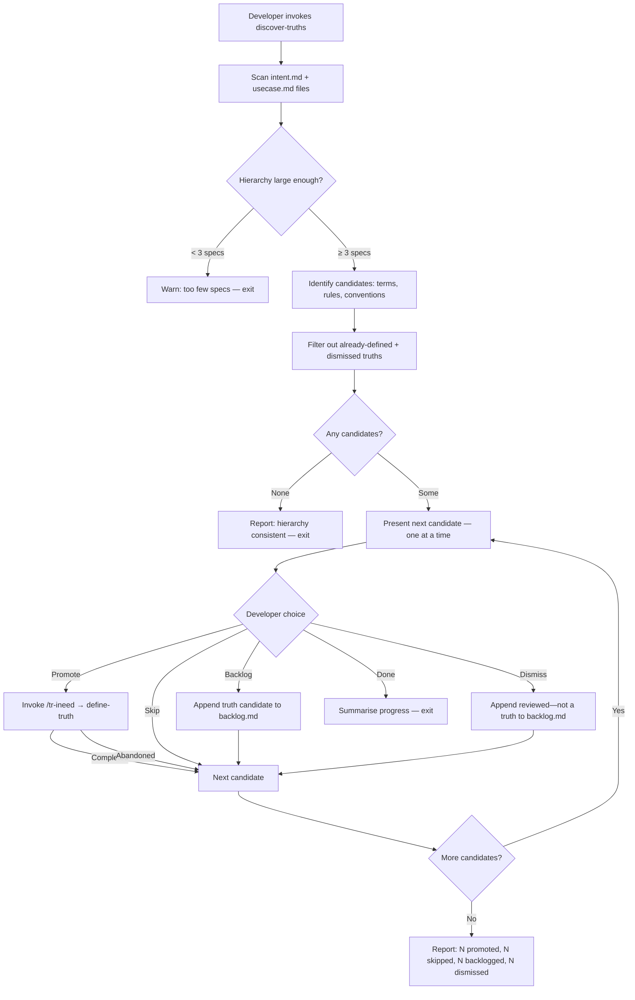

# Behaviour: Discover Truths

## Actor
Developer with an existing `taproot/` hierarchy who wants to identify what project-wide facts, business rules, and conventions are implicit in their specs but not yet captured as global truths

## Preconditions
- `taproot/` hierarchy exists with at least one `intent.md` or `usecase.md` file
- `taproot/global-truths/` exists (created by `taproot init`)

## Main Flow
1. Developer invokes truth discovery — either directly via `/tr-review-all` (as a final pass) or standalone
1a. System checks for `.taproot/sessions/discover-truths-status.md`. If found: *"A previous session exists (N processed, M remaining). [A] Resume  [R] Restart"*. On **[R]**: overwrite status file from scratch. On **[A]**: skip already-processed candidates and resume from the first unprocessed one.
2. System scans all `intent.md` and `usecase.md` files in `taproot/`, excluding `taproot/global-truths/` itself; unreadable files are skipped with a warning
3. System identifies candidate truths across three categories:
   - **Recurring terms** — domain-specific nouns used in 2+ specs without a canonical definition
   - **Business rules** — constraints or invariants stated in acceptance criteria or main flows that appear across multiple specs
   - **Implicit conventions** — patterns using "always", "never", "must not", or similar that recur across specs without being declared
   - Proposed scope: `intent` if the term appears in any `intent.md`; `behaviour` if it appears only in `usecase.md` files; `impl` if it appears only in implementation-adjacent contexts; defaults to `intent` when mixed
4. System filters out terms and rules already defined in `taproot/global-truths/`
5. System presents candidates **one at a time**, each with:
   - Proposed scope and the heuristic that produced it
   - Evidence: which specs reference the candidate and how
6. Developer reviews the candidate and chooses: **promote**, **skip**, **backlog**, or **dismiss**
   - **dismiss** — permanently resolved; recorded as "reviewed — not a truth: `<term>`" in `.taproot/sessions/dismissed-truths.md` and will not resurface on the next run
   After each response, system writes progress to `.taproot/sessions/discover-truths-status.md` before moving to the next candidate.
7. For each **promoted** candidate, system invokes `/tr-ineed` with the candidate as input — developer completes the `/tr-ineed` flow, which routes to `define-truth` to create the truth file; if `/tr-ineed` routes elsewhere, developer is offered the option to redirect to `define-truth` directly
8. System returns to the next unprocessed candidate after each `/tr-ineed` flow completes (or after an abandoned flow, treating it as skipped)
9. After all candidates are processed, system reports: N promoted, N skipped, N backlogged, N dismissed — and deletes `.taproot/sessions/discover-truths-status.md`

## Alternate Flows

### No candidates found
- **Trigger:** All terms and rules in the hierarchy are already defined in `global-truths/`, or the hierarchy is too consistent to surface patterns
- **Steps:**
  1. System reports: "No new truth candidates found — the hierarchy appears consistent with existing global truths"
  2. Developer continues without action

### Developer skips a candidate
- **Trigger:** Developer decides a candidate is too project-specific, too obvious, or not worth formalising right now
- **Steps:**
  1. Developer selects "skip"
  2. System moves to the next candidate without recording anything
  3. Skipped candidate reappears on the next discovery run (use "dismiss" to prevent resurfacing)

### Developer backlogs a candidate
- **Trigger:** Candidate is worth capturing eventually, but not in this session
- **Steps:**
  1. Developer selects "backlog"
  2. System appends the candidate to `taproot/backlog.md` with today's date and a note: "truth candidate: `<term>`"
  3. System moves to the next candidate

### Developer dismisses a candidate
- **Trigger:** Developer has considered the candidate and determined it is not a project-wide truth — permanently
- **Steps:**
  1. Developer selects "dismiss"
  2. System appends to `.taproot/sessions/dismissed-truths.md`: "reviewed — not a truth: `<term>`"
  3. On all future discovery runs, the candidate is suppressed (filtered out alongside already-defined truths)
  4. System moves to the next candidate

### Developer abandons `/tr-ineed` mid-flow
- **Trigger:** Developer closes the agent or exits `/tr-ineed` before completing the define-truth flow
- **Steps:**
  1. Candidate is treated as skipped for the current session — no truth file is created
  2. On the next discovery run, the candidate reappears as unprocessed
  3. Developer may re-promote it, or explicitly skip, backlog, or dismiss it

### Developer ends session before all candidates are processed
- **Trigger:** Developer selects "done" or closes the agent mid-session
- **Steps:**
  1. System saves progress to `.taproot/sessions/discover-truths-status.md` before exiting
  2. System summarises progress: N promoted, N skipped, N backlogged, N dismissed, N remaining
  3. Developer can resume by re-invoking discovery and selecting **[A] Resume** at the startup prompt

### Candidate already partially defined
- **Trigger:** A truth file exists in `global-truths/` for the term, but: (a) it contains fewer than 2 substantive statements, or (b) at least one spec uses the term in a way that contradicts or extends the current definition
- **Steps:**
  1. System flags the candidate as "refinement needed" rather than "new truth"
  2. System invokes `/tr-ineed` with the refinement context — routes to refining the existing truth file rather than creating a new one

### `/tr-ineed` routes to an unexpected location
- **Trigger:** `/tr-ineed` classifies the candidate as something other than a truth (e.g. a new intent or a quality-gates behaviour)
- **Steps:**
  1. System surfaces the routing decision: "This candidate was routed to `<location>`. [A] Accept routing  [B] Override — invoke define-truth directly"
  2. Developer chooses; system proceeds accordingly

### Developer runs discovery as part of `/tr-review-all`
- **Trigger:** `/tr-review-all` completes its spec quality review and triggers the truth discovery pass automatically
- **Steps:**
  1. Discovery runs on the full hierarchy (same scan as standalone)
  2. Candidates are appended to the review-all report under a `## Truth Candidates` section
  3. Developer chooses to process candidates now (inline, via `/tr-ineed`) or defer; if deferred, all unprocessed candidates are appended to `taproot/backlog.md` as "truth candidate: `<term>`" entries

## Postconditions
- Each promoted candidate has a corresponding truth file in `taproot/global-truths/`
- Backlogged candidates are recorded in `taproot/backlog.md` as "truth candidate: `<term>`"
- Dismissed candidates are recorded in `.taproot/sessions/dismissed-truths.md` as "reviewed — not a truth: `<term>`" and will not resurface on the next discovery run
- Skipped candidates have no persistent record (will resurface on next run)
- The system does not modify any `intent.md` or `usecase.md` files — discovery is read-only on the hierarchy
- `.taproot/sessions/discover-truths-status.md` is absent after a clean completed session; present (with remaining candidates noted) if the session was interrupted mid-run

## Error Conditions
- **Hierarchy too small to surface cross-spec patterns:** If fewer than 3 specs exist, cross-spec pattern detection (recurring terms, implicit conventions) is unreliable — system warns "Only N spec(s) found; cross-spec patterns may not surface reliably. Proceeding." Single-spec candidates are still surfaced if signal is clear.
- **`global-truths/` not found:** System prompts: "taproot/global-truths/ does not exist. Run `taproot init` or create it manually." and exits.
- **Spec file unreadable (malformed, permissions, encoding error):** System skips the file, emits a warning listing all skipped paths, and continues scanning the remaining files. Discovery completes on readable files only.
- **All candidates already defined:** System reports clean state and exits — not an error, but surfaced explicitly so the developer knows the scan ran.

## Flow

## Related
- `taproot/global-truth-store/define-truth/usecase.md` — each promoted candidate flows into define-truth via /tr-ineed
- `taproot/global-truth-store/apply-truths-when-authoring/usecase.md` — truths discovered here are applied by agents when the next spec is authored
- `taproot/global-truth-store/enforce-truths-at-commit/usecase.md` — truths discovered here are enforced at commit time once defined
- `taproot/human-integration/hierarchy-sweep/usecase.md` — sweep applies a uniform task to filtered files; discover-truths uses a different lens (cross-spec pattern detection rather than per-file task application)

## Acceptance Criteria

**AC-1: Candidates surfaced from recurring terms**
- Given a hierarchy with a domain term used in 3 or more specs but not defined in `global-truths/`
- When the developer invokes truth discovery
- Then the term appears as a candidate with the specs that reference it listed as evidence

**AC-2: Candidates filtered by existing truths**
- Given a term already defined in `taproot/global-truths/`
- When discovery runs
- Then the term does not appear as a candidate

**AC-3: Promoted candidate routed through /tr-ineed**
- Given the developer selects "promote" on a candidate
- When /tr-ineed is invoked
- Then /tr-ineed is invoked with the candidate pre-populated as context; if /tr-ineed routes to a location other than define-truth, the developer is offered the option to redirect to define-truth directly

**AC-4: Backlogged candidate recorded**
- Given the developer selects "backlog" on a candidate
- When discovery moves to the next candidate
- Then `taproot/backlog.md` contains a new entry: `[YYYY-MM-DD] truth candidate: <term>`

**AC-5: Skipped candidate leaves no record**
- Given the developer selects "skip" on a candidate
- When discovery completes
- Then no record of the skip exists — the candidate reappears on the next discovery run (use "dismiss" to permanently resolve without creating a truth)

**AC-6: Small hierarchy warned but not blocked**
- Given a hierarchy with fewer than 3 intent.md or usecase.md files
- When discovery is invoked
- Then the system warns that cross-spec patterns may not surface reliably but proceeds with scanning

**AC-7: Discovery pass appended to /tr-review-all output**
- Given a developer running `/tr-review-all` on a hierarchy with undefined truth candidates
- When the review completes
- Then a `## Truth Candidates` section appears at the end of the report, and unprocessed candidates are appended to `taproot/backlog.md` if the developer defers

**AC-8: Dismissed candidate suppressed from future runs**
- Given the developer selects "dismiss" on a candidate
- When discovery is run again
- Then the dismissed candidate does not reappear, and `.taproot/sessions/dismissed-truths.md` contains "reviewed — not a truth: `<term>`"

**AC-9: Abandoned /tr-ineed flow treated as skip**
- Given the developer promotes a candidate but abandons the /tr-ineed flow before completing it
- When discovery resumes
- Then no truth file was created, the candidate is treated as skipped for this session, and it reappears on the next discovery run

**AC-10: Progress written to status file after each candidate action**
- Given a discovery session is in progress
- When the developer responds to any candidate (promote, skip, backlog, or dismiss)
- Then `.taproot/sessions/discover-truths-status.md` is updated before the next candidate is presented

**AC-11: Resume offered when status file exists on startup**
- Given `.taproot/sessions/discover-truths-status.md` exists from a previous interrupted session
- When the developer invokes discovery
- Then the system offers [A] Resume or [R] Restart before scanning

**AC-12: Status file deleted on clean completion**
- Given a discovery session processes all candidates
- When the final summary is reported
- Then `.taproot/sessions/discover-truths-status.md` no longer exists

## Implementations <!-- taproot-managed -->
- [Skill](./skill/impl.md)

## Status
- **State:** implemented
- **Created:** 2026-03-26
- **Last reviewed:** 2026-03-27
- **Refined:** 2026-03-27 — one-at-a-time candidate presentation; progress persistence via .taproot/sessions/discover-truths-status.md; AC-10/11/12
