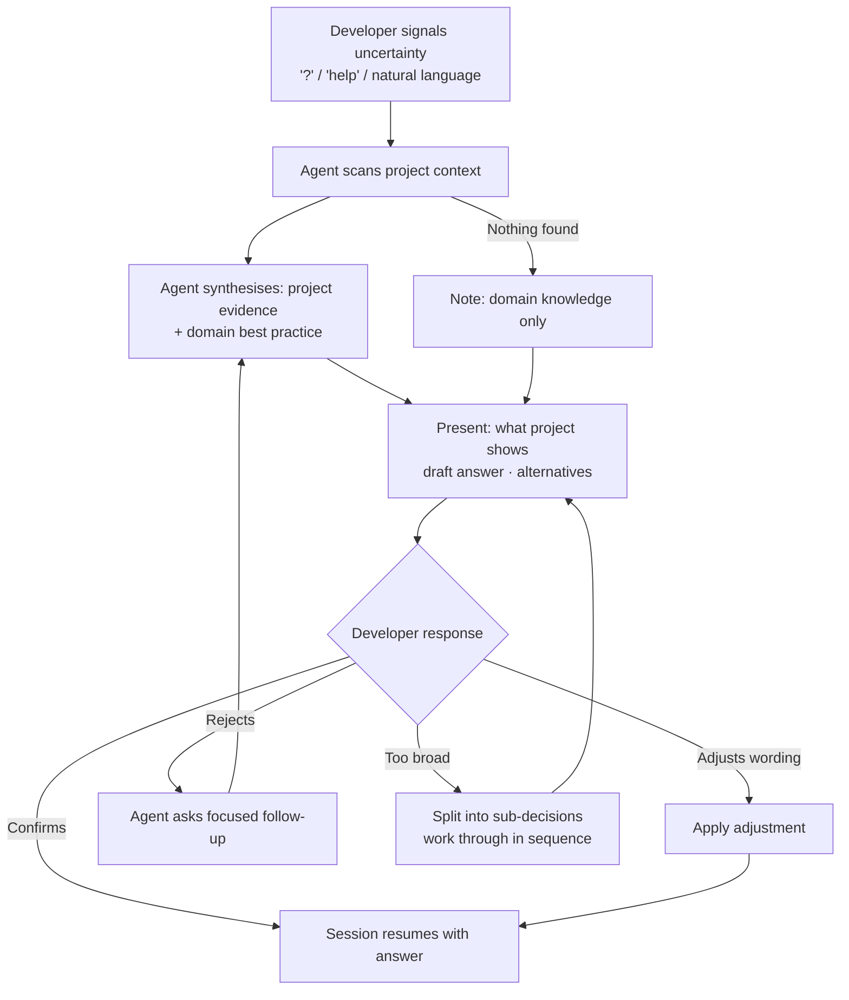

# Behaviour: Agent Expertise Assistance

## Actor
Developer who cannot confidently answer a specific question during a skill session

## Preconditions
- A skill session is in progress and the developer has been asked a question
  requiring domain knowledge they do not have (UX, marketing, security,
  architecture, legal, accessibility, etc.)
- The project codebase and hierarchy are accessible to the agent

## Main Flow
1. Developer signals that they cannot answer the current question — by typing
   `?`, `help`, selecting a `[?] Get help` option, or expressing uncertainty
   in natural language ("I'm not sure", "I don't know enough about this").
2. Agent acknowledges the question and confirms it will investigate before proposing.
3. Agent scans available project context — existing specs, source files, content,
   and global truths — for evidence directly relevant to the question.
4. Agent draws on domain knowledge for the question's subject area and synthesises
   what it found with established best practice.
5. Agent presents a structured proposal:
   - **What the project already shows** — any patterns, conventions, or choices
     already present in the codebase or specs relevant to the question
   - **Draft answer** — a concrete, opinionated recommendation informed by domain
     best practice, with a one-paragraph explanation of the reasoning
   - **Alternatives** — one or two alternative approaches with their trade-offs,
     so the developer can make an informed choice rather than just accepting the default
6. Developer reviews the proposal.
7. Developer confirms the draft answer, adjusts the wording, or rejects it
   and provides their own answer.
8. Session resumes with the confirmed or adjusted answer in place.

## Alternate Flows

### No relevant project context found
- **Trigger:** Agent finds no existing patterns, conventions, or prior decisions
  relevant to the question in the project.
- **Steps:**
  1. Agent notes that nothing relevant was found in the project.
  2. Agent proceeds with domain best practice alone and presents the proposal
     from step 5, omitting the "What the project already shows" section.

### Developer rejects the proposal
- **Trigger:** Developer disagrees with the draft answer and cannot articulate
  their preferred alternative.
- **Steps:**
  1. Agent asks a single focused follow-up question to understand what is wrong
     with the proposal — e.g. "What feels off about this? Is it the tone, the
     scope, or something else?"
  2. Developer explains the objection.
  3. Agent revises the draft answer incorporating the feedback.
  4. Return to step 6 of the main flow.

### Question is too broad to answer directly
- **Trigger:** The question spans multiple independent sub-decisions that cannot
  be collapsed into a single draft answer.
- **Steps:**
  1. Agent identifies the sub-decisions and presents them as a short list.
  2. Agent proposes an order to work through them.
  3. Developer confirms the order or resequences.
  4. Agent runs the main flow for each sub-decision in sequence.

### Domain requires external verification
- **Trigger:** The question involves authoritative external sources the agent
  cannot fully verify — jurisdiction-specific legal requirements, current
  regulatory standards, live third-party pricing, etc.
- **Steps:**
  1. Agent provides its best available answer and clearly flags: "This answer
     is based on general knowledge — authoritative verification is recommended
     before treating this as a firm decision."
  2. Agent names what should be verified and where to look.
  3. Session continues; the answer is marked as provisional.

## Postconditions
- Developer has a confident, reasoned answer to the question, or has explicitly
  deferred it as provisional pending external verification
- The skill session continues with the answer in place — no session restart needed

## Error Conditions
- **Question is outside all available knowledge**: Agent acknowledges it cannot
  propose an answer, explains what knowledge it lacks, and asks the developer to
  provide the answer directly or defer the question.

## Flow

## Related
- `grill-me/usecase.md` — complementary; grill-me stress-tests a known plan;
  this behaviour assists when the developer has no starting point for a specific question
- `requirement-exploration/usecase.md` — complementary; explores vague ideas
  before speccing; this covers specific unanswerable questions mid-session
- `taproot-modules/module-context-discovery/usecase.md` — consumer; module context
  questions are the primary trigger context for this behaviour

## Acceptance Criteria

**AC-1: Agent proposes and developer confirms**
- Given developer signals uncertainty during a skill session question
- When agent scans the project and applies domain knowledge
- Then agent presents project evidence, a draft answer with reasoning, and
  alternatives; developer confirms and session continues

**AC-2: No project context — domain knowledge only**
- Given developer signals uncertainty and no relevant evidence exists in the project
- When agent runs the main flow
- Then agent notes the absence and presents domain-knowledge-only proposal,
  omitting the "What the project already shows" section

**AC-3: Developer rejects proposal — agent revises**
- Given agent has presented a proposal that the developer rejects
- When developer cannot articulate an alternative
- Then agent asks one focused follow-up question, incorporates the feedback,
  and presents a revised proposal

**AC-4: Question too broad — split and sequence**
- Given the question spans multiple independent sub-decisions
- When agent identifies the split
- Then agent presents the sub-decisions as a list, proposes an order, and
  works through each in sequence

**AC-5: External verification required**
- Given the question involves jurisdiction-specific or live-data-dependent facts
- When agent presents its proposal
- Then agent flags the answer as provisional and names what should be verified
  and where to look

## Status
- **State:** specified
- **Created:** 2026-04-11
- **Last reviewed:** 2026-04-11
