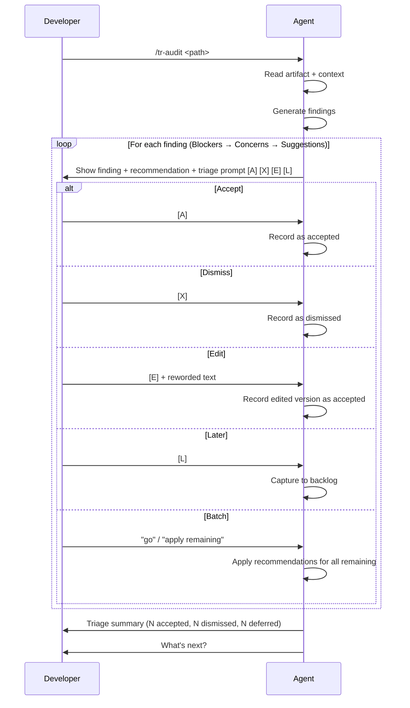

# Behaviour: Interactive Audit Walkthrough

## Actor
Agentic developer or orchestrator running `/tr-audit` on a taproot artifact (intent, behaviour, or implementation spec).

## Preconditions
- The target artifact exists and is readable
- For behaviours and impls: the artifact has a parent context available for cross-checking (intents have no parent)

## Main Flow
1. Developer invokes `/tr-audit <path>`
2. Agent reads the artifact, its parent, and siblings to build context
3. Agent applies the challenge set and generates findings, each categorized as Blocker, Concern, or Suggestion
4. Agent presents findings one at a time, starting with Blockers, then Concerns, then Suggestions
5. For each finding, agent shows:
   - Category (Blocker / Concern / Suggestion)
   - The quoted artifact excerpt being challenged
   - The challenge — why this is a problem
   - A **proposed fix** — the specific wording change, addition, or removal that would resolve the finding
   - A recommended action (accept, dismiss, or defer) with a one-line reason
   Then presents a triage prompt:
   `[A] Accept — apply the proposed fix  [X] Dismiss — not relevant  [E] Edit — change the fix before accepting  [L] Later — capture to backlog`
6. Developer triages the finding (or accepts the recommendation by pressing Enter); agent records the decision and moves to the next finding
7. After all findings are presented, agent shows a triage summary: accepted count, dismissed count, deferred count
8. Agent presents next steps with the accepted findings as explicit context for downstream skills

## Alternate Flows

### Batch remaining findings
- **Trigger:** Developer has seen enough individual findings and wants to speed up
- **Steps:**
  1. Developer types "go" or "apply remaining" during a triage prompt
  2. Agent applies its recommended action for each remaining finding
  3. Agent shows the triage summary with recommendations applied

### No findings
- **Trigger:** The challenge set produces no findings for the artifact
- **Steps:**
  1. Agent reports: "No findings — this artifact looks solid against the challenge set."
  2. Agent presents next steps (implement or browse)

### Edit before accepting
- **Trigger:** Developer selects [E] Edit on a finding
- **Steps:**
  1. Agent asks developer to reword the finding
  2. Agent records the edited version as an accepted finding
  3. Agent moves to the next finding

## Postconditions
- Every finding has been triaged (accepted, dismissed, deferred, or batch-resolved)
- Accepted findings are available as structured input for `/tr-refine`
- Deferred findings have been captured to `taproot/backlog.md` via `/tr-backlog`

## Error Conditions
- **Artifact not found at path**: Agent reports "No artifact found at `<path>` — check the path and try again." Flow stops.
- **Artifact is a stub or placeholder**: Agent reports "This artifact is a placeholder — audit findings would not be meaningful. Write the spec first, then audit." Flow stops.

## Flow

## Related
- `grill-me/usecase.md` — pre-spec elicitation; audit is post-spec challenge. Both stress-test, but grill-me operates before a spec is written
- `browse-hierarchy-item/usecase.md` — human-driven reading of specs; audit adds agent-driven critique layer
- `pause-and-confirm/usecase.md` — defines the one-at-a-time presentation pattern ([Y] [E] [S]) that this spec adapts for finding triage

## Acceptance Criteria

**AC-1: Single-finding presentation with proposed fix**
- Given an artifact with multiple audit findings
- When the agent presents a finding
- Then the finding is shown individually with its category, quoted excerpt, challenge, proposed fix, recommended action, and triage prompt

**AC-2: Triage per finding**
- Given a finding is presented
- When the developer selects [A], [X], [E], or [L]
- Then the decision is recorded and the next finding is presented

**AC-3: Accepted fixes carry to refine**
- Given the developer has accepted N findings with their proposed fixes
- When the developer selects refine from next steps
- Then only the N accepted proposed fixes are applied by `/tr-refine`

**AC-4: Batch triage applies recommendations**
- Given findings remain after the developer has triaged at least one
- When the developer types "go" or "apply remaining"
- Then all remaining findings are resolved using the agent's recommended action for each

**AC-5: Deferred findings captured**
- Given the developer selects [L] Later on a finding
- When the finding is deferred
- Then it is captured to `taproot/backlog.md` via `/tr-backlog`

**AC-6: Triage summary shown**
- Given all findings have been triaged
- When the triage phase completes
- Then the agent shows a summary with counts per category (accepted, dismissed, deferred)

## Implementations <!-- taproot-managed -->
- [Agent Skill — /tr-audit interactive walkthrough](./agent-skill/impl.md)

## Status
- **State:** implemented
- **Created:** 2026-04-05

## Notes
- The current audit skill dumps all findings as a single block. This behaviour replaces that with an interactive walkthrough. The skill file (`audit.md`) must be updated to implement this flow.
- Finding order matters: Blockers first forces the developer to confront the most important issues before fatigue sets in on Suggestions.
- The "go" / "apply rest" batch escape applies the agent's recommendations for remaining findings — the agent has already done the analysis, so the developer only needs to override where they disagree.
- The agent's recommendation per finding is key to reducing cognitive load: instead of evaluating each finding from scratch, the developer reviews a proposal and confirms or overrides.
