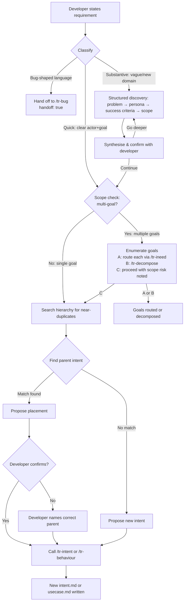

# UseCase: Route a Natural Language Requirement

## Actor
Human orchestrator / developer stating a requirement in natural language — at any level of clarity, from vague instinct to fully-formed specification

## Preconditions
- A taproot hierarchy exists (or can be initialised)
- The developer has a requirement in mind — at any level of detail

## Main Flow
_(Fast path: requirement is clear, concrete, and immediately placeable)_

1. Developer states a requirement in natural language, either:
   - Explicitly: invokes `/tr-ineed` with the requirement as the argument
   - Conversationally: says something the agent detects as a requirement statement ("we also need...", "the system should...", "I want users to be able to...")
2. Agent acknowledges the requirement and classifies it:
   - **Quick** (clear actor, clear goal, unambiguous outcome) → proceed directly to step 3
   - **Substantive** (vague, new domain, significant new capability, or unclear success criteria) → enter structured discovery (see Alternate Flow: Structured Discovery)
3. Agent checks whether the requirement spans multiple distinct business goals — if yes, see Alternate Flow: Scope too large
4. Agent reads the existing hierarchy (`taproot/OVERVIEW.md` or walks the hierarchy directly) and checks for near-duplicates
5. Agent searches for the best-fit parent intent by matching the requirement's domain and goal against existing intents
6. Agent presents proposed placement with reasoning:
   > "This sounds like it belongs under **`<intent-slug>`** (*`<intent goal>`*) as a new behaviour. Does that feel right?"
7. Developer confirms the proposed placement
8. Agent calls the appropriate skill for the confirmed level:
   - **New intent needed**: calls `/tr-intent` to define a new top-level business goal
   - **New behaviour under existing intent**: calls `/tr-behaviour` on the matched intent
   - **New sub-behaviour**: calls `/tr-behaviour` on the matched parent behaviour
9. The skill guides the developer through the full document, and a new `intent.md` or `usecase.md` is written

## Alternate Flows

### Structured discovery (substantive or vague requirement)
- **Trigger:** Requirement is broad, vague, in a new domain, or lacks clear success criteria — or the developer wants to think it through before committing to the hierarchy
- **Steps:**
  1. Agent opens as a facilitator, not a router: "Before I place this, let me make sure I understand it. I'll ask a few questions."

  **Phase 1 — Problem exploration:**
  2. Agent asks (one at a time, building on answers):
     - "What triggered this need right now — is there a specific incident, user complaint, or gap that surfaced it?"
     - "Who is blocked or frustrated without this? What do they do instead today?"
     - "What happens if this is never built — what's the real cost of the status quo?"

  **Phase 2 — Actor and persona:**
  3. Agent grounds the requirement in a specific user:
     - "Walk me through a specific person who would use this. What's their role and what are they trying to accomplish?"
     - "Is there more than one type of user involved, with different needs?"

  **Phase 3 — Success criteria:**
  4. Agent elicits concrete, observable outcomes:
     - "Give me 2–3 scenarios where this requirement is fully satisfied. Walk me through what happens in each."
     - "How would you demonstrate this is solved — what would you show in a demo or test?"
     - "What's the earliest, smallest version that would deliver real value?"

  **Phase 4 — Scope boundary:**
  5. Agent establishes what's explicitly deferred:
     - "What's out of scope for now — what would you push to a later version?"
     - "Are there edge cases you'd consciously defer?"

  **Phase 5 — Synthesis and confirmation:**
  6. Agent synthesises everything into a structured summary:
     > "Here's what I understood:
     > **Actor:** [specific user persona]
     > **Need:** [concrete capability]
     > **So that:** [observable outcome]
     > **Success looks like:** [scenario 1], [scenario 2], [scenario 3]
     > **Out of scope:** [deferred items]
     >
     > Does that capture it? [A] Go deeper — [C] Continue to placement"
  7. If **[A]**: agent applies advanced elicitation — stress-tests assumptions, explores edge cases, challenges scope from MVP perspective, or considers alternative approaches — then returns to synthesis
  8. If **[C]**: agent checks whether the synthesised description spans multiple distinct business goals — if yes, see Alternate Flow: Scope too large. Otherwise proceeds from Main Flow step 4 with the synthesised requirement as context

### Scope too large — greenfield or multi-goal description
- **Trigger:** One or more of: (a) no hierarchy exists yet and the description covers a whole product or system; (b) the synthesised requirement spans multiple distinct business goals with different actors, independent success criteria, or no shared postcondition; (c) the description is a feature list or product vision rather than a single capability
- **Steps:**
  1. Agent identifies the distinct goals embedded in the description and presents them:
     > "This covers more than one independent goal — I can see at least [N]:
     > 1. [goal 1]
     > 2. [goal 2]
     > 3. [goal 3]
     >
     > Each needs its own intent to keep the hierarchy navigable. How would you like to proceed?
     > **[A]** Route each separately — I'll call `/tr-ineed` for each in sequence
     > **[B]** Decompose — write a top-level intent first, then break it into child behaviours via `/tr-decompose`
     > **[C]** Treat as one intent anyway — I'll note the scope risk in Constraints"
  2. If **[A]**: agent lists the goals in order and invokes `/tr-ineed` for each sequentially, waiting for placement confirmation before moving to the next goal
  3. If **[B]**: agent calls `/tr-decompose` with the full description — it creates the parent intent and enumerates child behaviours
  4. If **[C]**: agent proceeds from Main Flow step 4, adding a `## Constraints` note: "Scope risk: this intent may cover multiple independent business goals — consider splitting if it grows beyond 3–4 behaviours"

### No suitable parent intent exists
- **Trigger:** Requirement doesn't map to any existing intent
- **Steps:**
  1. Agent proposes: "This doesn't clearly fit any existing intent — it may need a new one. I'd name it `<proposed-slug>` — *`<proposed goal>`*. Agree?"
  2. Developer confirms or adjusts
  3. Agent calls `/tr-intent` to define the new intent, then `/tr-behaviour` under it

### Near-duplicate detected
- **Trigger:** An existing behaviour or intent closely matches the stated requirement
- **Steps:**
  1. Agent surfaces the existing document: "There's already a behaviour `<path>` that covers `
`. Is your requirement the same, a refinement, or a distinct addition?"
  2. If same → agent links to existing document and stops
  3. If refinement → agent calls `/tr-refine` on the existing usecase
  4. If distinct → agent continues with placement as a new sibling

### Requirement is ambiguous across multiple intents
- **Trigger:** Agent identifies two or more intents that could plausibly own this requirement
- **Steps:**
  1. Agent names the candidates and uses a grill-style question to resolve the ambiguity:
     - "Who is the primary stakeholder — an end user, an operator, or a developer?"
     - "If this was removed, which intent's success criteria would be most affected?"
     - "Is this really one requirement or two that happen to arrive together?"
  2. Developer answers; agent re-proposes placement based on the answer
  3. Proceed from Main Flow step 5

### Developer disagrees with proposed placement
- **Trigger:** Developer says the proposed intent/parent is wrong
- **Steps:**
  1. Agent asks: "Which intent feels like the right home? Or should this be a new intent entirely?"
  2. Developer names or describes the right parent
  3. Agent confirms and proceeds from Main Flow step 7

### Bug-shaped input detected
- **Trigger:** Input contains bug-shaped language — phrases indicating a defect rather than a new requirement: "it's broken", "wrong output", "this crashes", "not working", "regression", "it used to work", "unexpected behaviour", or explicit "bug" / "defect" terminology
- **Steps:**
  1. Agent recognises the input as a bug report, not a new requirement
  2. Agent states: "That sounds like a bug report rather than a new requirement. I'll hand this off to `/tr-bug` to run root cause analysis."
  3. Agent calls `/tr-bug` with `handoff: true` and the original symptom description — does not route to the hierarchy

### Conversational detection
- **Trigger:** Developer mentions a requirement casually without invoking `/tr-ineed`
- **Steps:**
  1. Agent detects the requirement statement and asks: "Should I add that to the taproot hierarchy?"
  2. Developer confirms
  3. Agent proceeds from Main Flow step 2 with the detected statement

## Postconditions
- A new `intent.md`, `usecase.md`, or both exists in the hierarchy at the confirmed location
- The placement was confirmed by the developer before writing
- For substantive requirements: a synthesis summary was confirmed before placement, making the resulting behaviour document richer and more grounded
- The new document is validated by `taproot validate-structure` and `taproot validate-format`

## Error Conditions
- **Requirement spans multiple intents**: See Alternate Flow: Scope too large — agent enumerates the distinct goals and offers to route each separately, decompose, or proceed with scope risk noted
- **No hierarchy exists yet**: Agent offers to run `taproot init` first, then proceeds with placement
- **Discovery reveals contradictory requirements**: Agent surfaces the contradiction and asks the developer to resolve it before placement

## Flow

## Acceptance Criteria

**AC-1: Clear requirement placed without discovery**
- Given a requirement with a clear actor, goal, and outcome
- When the developer invokes `/tr-ineed`
- Then the agent proposes placement directly without entering structured discovery

**AC-2: Vague requirement enters structured discovery**
- Given a vague or broad requirement
- When the developer invokes `/tr-ineed`
- Then the agent opens as a facilitator and runs the four-phase discovery flow before proposing placement

**AC-3: Near-duplicate is surfaced before placement**
- Given a requirement that closely matches an existing behaviour
- When the agent searches the hierarchy
- Then the agent surfaces the existing document and asks whether this is the same, a refinement, or a distinct addition

**AC-4: Placement confirmed before writing**
- Given a proposed parent intent
- When the agent proposes placement
- Then no document is written until the developer explicitly confirms

**AC-5: Conversational requirement detected**
- Given a developer mentions a requirement casually without invoking `/tr-ineed`
- When the agent detects a requirement statement
- Then the agent asks "Should I add that to the taproot hierarchy?" before proceeding

**AC-6: No suitable parent triggers new intent proposal**
- Given a requirement that doesn't map to any existing intent
- When the agent searches the hierarchy
- Then the agent proposes a new intent slug and goal and asks the developer to confirm before calling `/tr-intent`

**AC-7: Bug-shaped input is handed off to /tr-bug**
- Given the developer states something containing bug-shaped language ("it's broken", "this crashes", "wrong output", "not working", "regression")
- When the agent classifies the input
- Then the agent states it is handing off to `/tr-bug` and calls `/tr-bug` with `handoff: true` — it does not route to the requirement hierarchy

**AC-8: Multi-goal description is split before placement**
- Given the developer describes multiple independent goals in one statement (e.g. "I need user auth, a dashboard, and an API") or describes a whole greenfield project
- When the agent checks scope after classification or synthesis
- Then the agent identifies the distinct goals, presents them numbered, and offers to route each separately via `/tr-ineed`, decompose via `/tr-decompose`, or proceed as one with scope risk noted — it does not silently place all goals under a single intent

## Related
- `taproot/human-integration/grill-me/usecase.md` — structured discovery delegates to grill-me for advanced elicitation
- `taproot/human-integration/bug-triage/usecase.md` — bug-shaped inputs are handed off here with `handoff: true`

## Implementations <!-- taproot-managed -->
- [Agent Skill — /tr-ineed](./agent-skill/impl.md)

## Status
- **State:** implemented
- **Created:** 2026-03-19
- **Last reviewed:** 2026-03-29

## Notes
- The fast path (Main Flow) is for requirements that are already clear and concrete — skip discovery when the actor, goal, and success criteria are unambiguous
- The structured discovery flow is inspired by BMAD's product brief elicitation: problem first, persona second, success criteria third, scope boundary fourth, synthesis last
- Advanced elicitation (option [A] in synthesis step) includes: stress-testing assumptions, exploring edge cases, challenging scope from MVP perspective, considering alternative approaches, and pre-mortem analysis ("what would make this fail?")
- The synthesised summary from discovery becomes the input to `/tr-behaviour`, producing richer behaviour specs than a raw one-liner requirement statement
- The conversational detection trigger requires the agent to be watching for requirement language — this is a Claude Code behaviour, not a CLI capability
- `/tr-ineed` is the Claude Code adapter command name for this skill
