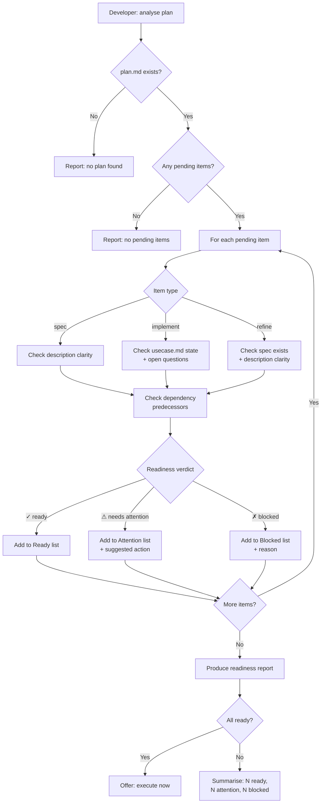

# Behaviour: Analyse Release Plan

## Actor
Developer — reviewing `taproot/plan.md` before execution begins, wanting to identify blockers, ambiguities, and missing prerequisites so that execution runs without unexpected interruptions.

## Preconditions
- `taproot/plan.md` exists

## Main Flow

1. Developer invokes "analyse plan" (or "what needs clarification before we execute?").
2. Agent reads `taproot/plan.md` and collects all `pending` items.
3. For each pending item, agent evaluates readiness:
   - **`spec` items** — Is the description specific enough to write a `usecase.md`? Does it name an actor and a goal? Flag if too vague.
   - **`implement` items** — Does the referenced `usecase.md` exist? Is it in `specified` or `implemented` state? Are there open questions or `proposed` sub-behaviours that would block implementation? Flag if spec is `draft`, `proposed`, or missing.
   - **`refine` items** — Does the spec exist? Is there enough context in the item description to know what to refine?
   - **Dependency check** — For items that depend on earlier plan items, is the predecessor already `done` or `specified`? Flag if the prerequisite is still `pending`.
4. Agent produces a readiness report:
   ```
   Plan Analysis — N pending items

   ✓ Ready (N)
     · [implement] taproot/<intent>/<behaviour>/ — spec specified, no open questions

   ⚠ Needs attention (N)
     · [implement] taproot/<intent>/<behaviour>/ — spec is 'proposed', run /tr-refine first
     · [spec] "add login flow" — description is ambiguous: actor and success criteria unclear

   ✗ Blocked (N)
     · [implement] taproot/<intent>/<behaviour>/ — depends on item 2 which is not yet specified
   ```
5. For each flagged item, agent appends a one-line suggested action (e.g., `/tr-refine <path>`, `/tr-behaviour <path>`, "clarify actor and goal").
6. Agent summarises: *"N items ready, N need attention, N blocked. Suggested: resolve ⚠ and ✗ items before executing."*

## Alternate Flows

### All items ready
- **Trigger:** Every pending item passes all readiness checks.
- **Steps:**
  1. Agent reports: *"All N pending items are ready — no blockers or ambiguities found."*
  2. Agent offers: *"[A] Execute now → `/tr-plan execute`"*

### Plan is empty or fully complete
- **Trigger:** `taproot/plan.md` has no `pending` items.
- **Steps:**
  1. Agent reports: *"No pending items to analyse."*
  2. Agent suggests: *"Build a new plan with `/tr-plan build`."*

### Referenced spec path not found
- **Trigger:** An `implement` or `refine` item references a path that does not exist in the hierarchy.
- **Steps:**
  1. Agent flags the item as `stale` in the report: *"path `<path>` not found — was this behaviour moved or deleted?"*
  2. Analysis continues for remaining items.

## Postconditions
- Developer has a per-item readiness report classifying each pending item as ready, needs-attention, or blocked.
- No files are modified — this behaviour is read-only.

## Error Conditions
- **`taproot/plan.md` absent:** Agent reports *"No plan found — build one first with `/tr-plan build`."*
- **`taproot coverage` fails during dependency check:** Agent notes the failure inline and marks affected items as `unknown` readiness rather than stopping the entire analysis.

## Flow



## Related
- `../build-plan/usecase.md` — produces the plan file this behaviour analyses; typically run after build-plan to validate before execution
- `../execute-plan/usecase.md` — the natural next step after a clean analysis report; execute-plan should be run when all items are ready
- `../extract-next-slice/usecase.md` — analyses a single item ad-hoc; analyse-plan covers the full plan in one pass

## Acceptance Criteria

**AC-1: Ready items identified correctly**
- Given `taproot/plan.md` contains an `implement` item whose `usecase.md` is in `specified` state with no open questions
- When the developer invokes "analyse plan"
- Then that item appears in the ✓ Ready section of the report

**AC-2: Proposed spec flagged as needs-attention**
- Given `taproot/plan.md` contains an `implement` item whose `usecase.md` is in `proposed` state
- When the developer invokes "analyse plan"
- Then that item appears in the ⚠ Needs Attention section with a suggested `/tr-refine` action

**AC-3: Vague spec item flagged**
- Given `taproot/plan.md` contains a `spec` item with a description that names no actor or success criteria
- When the developer invokes "analyse plan"
- Then that item appears in the ⚠ Needs Attention section with a note about the missing information

**AC-4: Blocked item identified when predecessor is pending**
- Given `taproot/plan.md` contains an `implement` item that depends on a `spec` item still in `pending` state
- When the developer invokes "analyse plan"
- Then the `implement` item appears in the ✗ Blocked section citing the unresolved predecessor

**AC-5: All-ready path offers execute shortcut**
- Given all pending items in `taproot/plan.md` pass readiness checks
- When the developer invokes "analyse plan"
- Then the report states all items are ready and offers to proceed with `/tr-plan execute`

**AC-6: Stale path flagged inline**
- Given `taproot/plan.md` references a path that no longer exists
- When the developer invokes "analyse plan"
- Then that item is flagged as stale with the missing path noted, and analysis continues for remaining items

**AC-7: No plan file exits cleanly**
- Given `taproot/plan.md` does not exist
- When the developer invokes "analyse plan"
- Then the agent reports no plan found and suggests `/tr-plan build`

## Status
- **State:** specified
- **Created:** 2026-03-27
- **Last reviewed:** 2026-03-27

## Notes
- This behaviour is read-only — it never modifies `taproot/plan.md` or any hierarchy document.
- The depth of analysis (e.g. how deeply to scan a spec for open questions) is an implementation concern; the spec only constrains that readiness is classified and reported per item.
- For large plans (>10 items), the implementation may batch the report by readiness category rather than by item order.
