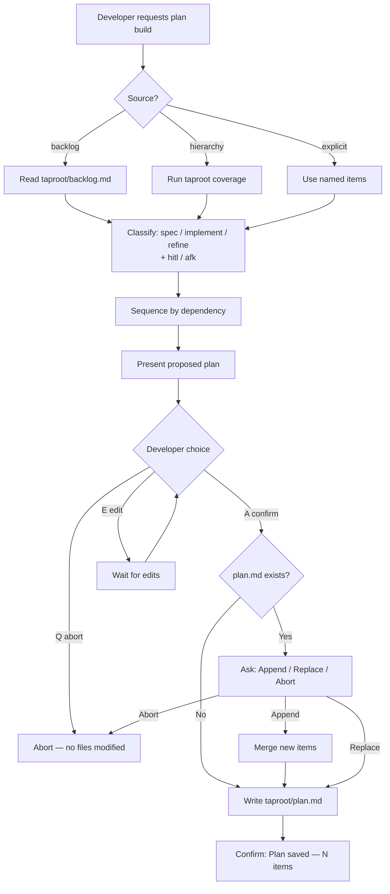

# Behaviour: Build Release Plan

## Actor
Developer — building a multi-item implementation roadmap with agent assistance, to be executed in a future session or delegated to an agent.

## Preconditions
- A taproot project exists
- At least one of: `taproot/backlog.md` contains items, the hierarchy contains unimplemented behaviours, or the developer supplies explicit items

## Main Flow

1. Developer requests plan building with a natural-language prompt — e.g. "plan X", "create a plan for Y", "make a plan for the next release", "add all pending items to plan", "add X to plan", or "analyze backlog, what can we add?" — or requests a vertical slice (e.g. "vertical slice for X", "walking skeleton for Y", "minimal path to Z"), which triggers the Vertical Slice alternate flow.
2. Agent determines which sources to scan based on the request:
   - **backlog** — reads `taproot/backlog.md`; filters items that describe actionable work
   - **hierarchy** — runs `taproot coverage` to find unimplemented or in-progress behaviours
   - **explicit** — uses developer-supplied item(s) directly without scanning
3. Agent collects candidate items from the identified sources.
4. Agent classifies each candidate by **type** and **execution mode**:
   - Type:
     - **`spec`** — a new or vague item that needs a `usecase.md` written first
     - **`implement`** — a specified behaviour ready for coding
     - **`refine`** — an existing spec that needs updating before it can be implemented
   - Execution mode:
     - **`hitl`** (human-in-the-loop) — requires a human decision, design choice, or external action before or during execution (e.g. naming decisions, external account setup, architectural trade-offs, open-ended design)
     - **`afk`** (away-from-keyboard) — agent can execute autonomously without human input; success criteria are unambiguous and fully derivable from the spec
5. Agent sequences the candidates: `spec` items that are prerequisites for `implement` items are ordered first; otherwise, items follow source order.
6. Agent presents the proposed plan for developer review:
   ```
   Proposed plan — N items:
    1. hitl  [spec]      <path or description>
    2. afk   [implement] taproot/<intent>/<behaviour>/
    3. hitl  [refine]    taproot/<intent>/<behaviour>/usecase.md
   ...
   [A] Confirm  [E] Edit directly then reply A  [Q] Abort
   ```
7. Developer confirms.
8. Agent writes `taproot/plan.md` using this format, creating it if absent or replacing it if it already exists (after confirming replacement — see Alternate Flows):
   ```
   # Taproot Plan
   _Built: YYYY-MM-DD — N items_
   _HITL = human decision required · AFK = agent executes autonomously_
   ```
   Each item line: `status  [type]  hitl|afk  path/description`
9. If any plan items were sourced from backlog items, agent removes those items from `taproot/backlog.md` and reports: *"Removed N item(s) from `taproot/backlog.md`."*
10. Agent confirms: *"Plan saved — N items in `taproot/plan.md`."*

## Alternate Flows

### Plan already exists
- **Trigger:** `taproot/plan.md` is present before step 8.
- **Steps:**
  1. Agent reports: *"A plan already exists with N items."* and presents: `[A] Append new items · [R] Replace · [Q] Abort`
  2. Developer chooses.
  3. On **[A]**: agent appends only items not already present in the plan.
  4. On **[R]**: agent replaces the file with the newly proposed plan.
  5. On **[Q]**: agent aborts — no files modified.

### Developer supplies explicit items
- **Trigger:** Developer names specific items directly (e.g. "add login flow and password reset to plan").
- **Steps:**
  1. Agent skips scanning (steps 2–3); uses the named items as candidates.
  2. Agent resolves each item to a hierarchy path if one exists, or marks it as `spec` if it doesn't.
  3. Resumes from step 4 (classify and sequence).

### No items found from any source
- **Trigger:** After scanning, zero candidates remain (backlog empty, all behaviours implemented, no explicit items).
- **Steps:**
  1. Agent reports: *"No actionable items found — backlog is empty and all behaviours are implemented."*
  2. Agent suggests: *"Add ideas with `/tr-backlog <idea>` or define new behaviours with `/tr-behaviour`."*
  3. No file is written.

### Developer modifies an existing plan
- **Trigger:** Developer requests changes to an existing plan — "rework the plan", "change the plan to prioritise X", "move X earlier", "remove X from plan", "reorder the plan", or similar.
- **Steps:**
  1. Agent reads `taproot/plan.md`.
  2. Agent presents the proposed changes: items added, removed, or reordered.
  3. Developer confirms (or edits further).
  4. Agent writes the modified `taproot/plan.md` and reports: *"Plan updated — N items."*

### Developer edits the plan before confirming
- **Trigger:** Developer selects `[E]` at step 6.
- **Steps:**
  1. Agent waits for the developer to edit the proposed plan in the conversation.
  2. Developer replies `A` when done.
  3. Agent uses the edited plan as input to step 8.

### Developer requests a vertical slice
- **Trigger:** Developer uses phrases like "vertical slice", "walking skeleton", "tracer bullet", "thin slice", "minimal path", "just enough to demo X", or similar — signalling they want only minimum critical-path items, not an exhaustive plan.
- **Steps:**
  1. Agent asks for three inputs:
     > "Vertical slice — I need three things: **Actor** (who initiates), **Entry point** (where the flow begins), and **Observable outcome** (what the actor sees when it works)."
  2. Developer supplies the three inputs.
  3. Agent scans the hierarchy and backlog to identify behaviours on the critical path — those whose absence would prevent the actor from reaching the observable outcome via the entry point. Non-critical-path behaviours are excluded.
  4. Agent presents the filtered plan:
     ```
     Vertical slice — actor: <actor> · entry: <entry point> · outcome: <observable outcome>
     N critical-path items:
      1. hitl  [spec]      <path or description>
      2. afk   [implement] taproot/<intent>/<behaviour>/
     ...
     [A] Confirm  [E] Edit directly then reply A  [Q] Abort
     ```
  5. Developer confirms (or edits at `[E]`).
  6. Agent writes `taproot/plan.md` with only the critical-path items and this header:
     ```
     # Taproot Plan
     _Built: YYYY-MM-DD — N items (vertical slice)_
     _Slice: <actor> → <entry point> → <observable outcome>_
     _HITL = human decision required · AFK = agent executes autonomously_
     ```
  7. Non-critical-path behaviours are NOT added to the plan — they remain in the hierarchy as unimplemented. Agent does not suggest or add them.

## Postconditions
- `taproot/plan.md` exists with an ordered list of typed action items (spec / implement / refine), each with a path or description.
- Every item carries a `hitl` or `afk` execution mode label.
- The plan header includes a legend defining `hitl` and `afk`.
- Items that are prerequisites for others appear earlier in the list.
- Backlog items that were added to the plan are removed from `taproot/backlog.md`.

## Error Conditions
- **`taproot/backlog.md` absent when backlog source requested:** Treat as empty backlog — note *"backlog.md not found, treating as empty"* and continue with other sources.
- **`taproot coverage` fails:** Report the error verbatim and stop — do not produce a partial plan.

## Flow



## Related
- `../extract-next-slice/usecase.md` — surfaces a single next item; build-plan creates the multi-item roadmap that execute-plan works through
- `../../taproot-backlog/manage-backlog/usecase.md` — backlog is a primary source for plan items; items promoted from backlog via `/tr-ineed` become candidates here
- `../execute-plan/usecase.md` — the downstream behaviour that consumes the plan file this behaviour produces

## Acceptance Criteria

**AC-1: Plan built from backlog**
- Given `taproot/backlog.md` contains at least one actionable item
- When the developer requests "add all pending items to plan"
- Then the agent presents a proposed ordered plan including those items with `hitl`/`afk` labels, and on confirmation writes `taproot/plan.md` and removes the consumed items from `taproot/backlog.md`

**AC-2: Plan built from hierarchy gaps**
- Given the hierarchy contains at least one unimplemented behaviour
- When the developer requests "what can we add to the plan?"
- Then the agent includes those behaviours as `implement` candidates in the proposed plan

**AC-3: Spec items ordered before their implement items**
- Given the proposed plan includes a new item needing a spec and a subsequent implement item that depends on it
- When the developer confirms
- Then the `spec` item appears before the `implement` item in `taproot/plan.md`

**AC-4: Existing plan triggers append/replace prompt**
- Given `taproot/plan.md` already exists with N items
- When the developer requests plan building with new items
- Then the agent reports the existing item count and offers Append, Replace, or Abort before writing

**AC-5: No items found exits cleanly**
- Given the backlog is empty and all behaviours are implemented
- When the developer requests plan building
- Then the agent reports no actionable items found and no file is written

**AC-6: Explicit items bypass scanning**
- Given the developer names specific items directly
- When the agent builds the plan
- Then scanning of backlog and hierarchy is skipped and only the named items appear in the proposed plan

**AC-7: Abort leaves no files modified**
- Given the agent has presented a proposed plan
- When the developer selects Q (abort)
- Then `taproot/plan.md` is not created or modified

**AC-8: Backlog items consumed into the plan are removed**
- Given `taproot/backlog.md` contains items that were added to the plan
- When the developer confirms and the plan is written
- Then those items are removed from `taproot/backlog.md` and the agent reports how many were removed

**AC-10: Plan request is routed through this skill, not generated inline**
- Given the developer makes any plan-creation or plan-modification request in natural language
- When the agent receives the request
- Then the agent invokes this skill and writes `taproot/plan.md` — it does not generate a plan as inline chat text

**AC-11: Vertical slice mode limits plan to critical-path items only**
- Given the developer requests a vertical slice with a specified actor, entry point, and observable outcome
- When the agent builds the plan
- Then only minimum critical-path behaviours appear in `taproot/plan.md`; non-critical-path behaviours are excluded entirely and the plan header records the slice context (actor, entry point, outcome)

**AC-9: Each plan item is labelled hitl or afk**
- Given the agent has classified all candidates
- When the plan is written
- Then every item in `taproot/plan.md` carries either `hitl` or `afk` and the plan header includes a legend defining the terms

## Implementations <!-- taproot-managed -->
- [Agent Skill — plan-build](./agent-skill/impl.md)

## Status
- **State:** implemented
- **Created:** 2026-03-27
- **Last reviewed:** 2026-03-30
- **Last refined:** 2026-03-30

## Notes
- The plan file format (`taproot/plan.md`) is an implementation concern — the spec only constrains observable behaviour (ordered typed items, path or description per item).
- Dependency ordering is inferred by the agent (spec-before-implement for the same behaviour), not formally declared in the plan file.
- Autonomous execution of plan items (agent works without confirmation at each step) is explicitly out of scope — see `execute-plan` for confirmed step-by-step execution.
- Backlog removal only applies to items sourced from `taproot/backlog.md` — explicit items and hierarchy items have no backlog entry to remove.
- Vertical slice mode excludes non-critical-path behaviours entirely — they are not added to the plan as post-slice or deferred items. They remain in the hierarchy as unimplemented for future planning sessions.
