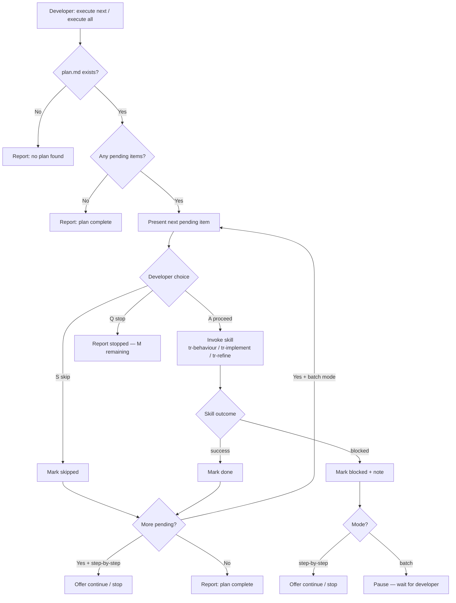

# Behaviour: Execute Release Plan

## Actor
Developer — working through a previously built plan, delegating each item to the agent and confirming at each step boundary.

## Preconditions
- `taproot/plan.md` exists and contains at least one item with status `pending`

## Main Flow

### Step-by-step mode (default)

1. Developer invokes "execute next item in plan" (or "execute plan").
2. Agent reads `taproot/plan.md` and identifies the first `pending` item.
3. Agent presents the item for confirmation:
   ```
   Next: [implement] taproot/<intent>/<behaviour>/ — <description>
   Skill: /tr-implement
   [A] Proceed  [S] Skip  [Q] Stop
   ```
4. Developer confirms with `[A]`.
5. Agent invokes the appropriate skill:
   - `spec` → `/tr-behaviour <path> "<description>"`
   - `implement` → `/tr-implement <path>`
   - `refine` → `/tr-refine <path>`
6. On skill completion, agent marks the item `done` in `taproot/plan.md`.
7. Agent reports:
   ```
   ✓ Done — <description>
   M items remaining.
   [A] Continue to next  [D] Stop for now
   ```
8. If `[A]`: repeat from step 2 with the next pending item.
9. If `[D]` or no items remain: agent reports final status (see Postconditions).

### Batch mode

1. Developer invokes "execute all to next release" (or "execute all").
2. Agent reads `taproot/plan.md` and presents the full pending list:
   ```
   Executing N items:
    1. [spec]      <description>
    2. [implement] taproot/<intent>/<behaviour>/
   ...
   [A] Begin  [Q] Abort
   ```
3. Developer confirms.
4. Agent works through pending items sequentially — presenting each item before invoking its skill (same as step 3–6 of step-by-step mode).
5. After each item completes, agent marks it `done` and proceeds to the next without waiting for confirmation (batch mode — confirmation was given at step 3).
6. When all items are done: *"Plan complete — all N items executed."*

## Alternate Flows

### Developer skips an item
- **Trigger:** Developer selects `[S]` at step 4.
- **Steps:**
  1. Agent marks the item `skipped` in `taproot/plan.md`.
  2. Agent moves to the next pending item and repeats from step 3.

### Item is blocked (skill cannot complete)
- **Trigger:** The invoked skill encounters an unresolvable error or the agent cannot proceed without developer input outside the normal flow.
- **Steps:**
  1. Agent marks the item `blocked` in `taproot/plan.md` with a one-line note.
  2. Agent reports: *"Item blocked: <reason>. Remaining items are unaffected."*
  3. In step-by-step mode: offer `[A] Continue to next · [D] Stop`.
  4. In batch mode: pause and wait for developer to resolve before continuing.

### Plan is empty or fully complete
- **Trigger:** `taproot/plan.md` exists but contains no `pending` items.
- **Steps:**
  1. Agent reports: *"Plan is complete — no pending items. Build a new plan with `/tr-plan build`."*
  2. No skills are invoked.

### Developer stops mid-batch
- **Trigger:** Developer types `done` or interrupts during batch execution.
- **Steps:**
  1. Agent finishes the current item if already in progress.
  2. Remaining items stay `pending` in `taproot/plan.md`.
  3. Agent reports: *"Stopped after N items — M items remaining."*

### Specify mode (spec + refine items only)
- **Trigger:** Developer invokes "bring all to specified", "run spec and refine only", or similar.
- **Steps:**
  1. Agent filters pending items to `spec` and `refine` types only. `implement` items are not presented and remain `pending`.
  2. Agent presents the filtered list and proceeds with step-by-step or batch flow as requested.
  3. When filtered items are exhausted, agent reports: *"Specify pass complete — N items done. M implement items remain pending."*

### Implement mode (implement items only)
- **Trigger:** Developer invokes "implement all specified items", "run implement only", or similar.
- **Steps:**
  1. Agent filters pending items to `implement` type only. `spec` and `refine` items are not presented and remain `pending`.
  2. Agent presents the filtered list and proceeds with step-by-step or batch flow as requested.
  3. When filtered items are exhausted, agent reports: *"Implement pass complete — N items done. M spec/refine items remain pending."*

## Postconditions
- Each executed item is marked `done` in `taproot/plan.md`.
- Skipped items are marked `skipped`; blocked items are marked `blocked` with a note.
- Each `done` item's output exists in the hierarchy (`usecase.md`, `impl.md`, or updated spec as appropriate).
- When all items are done: `taproot/plan.md` contains no `pending` items.

## Error Conditions
- **`taproot/plan.md` absent:** Agent reports *"No plan found — build one first with `/tr-plan build`."* No skills are invoked.
- **Item path invalid (behaviour deleted or moved):** Agent marks the item `stale` in `taproot/plan.md`, reports *"Item N is stale — path `<path>` not found."*, and offers `[S] Skip · [Q] Stop`.

## Flow



## Related
- `../build-plan/usecase.md` — produces the `taproot/plan.md` file this behaviour consumes; must be run first
- `../extract-next-slice/usecase.md` — surfaces a single next item ad-hoc; execute-plan works through a pre-confirmed ordered list
- `../analyse-plan/usecase.md` — surfaces open questions and blockers in the plan before execution begins

## Acceptance Criteria

**AC-1: Next pending item presented before execution**
- Given `taproot/plan.md` contains at least one `pending` item
- When the developer invokes "execute next item"
- Then the agent presents the item type, description, and intended skill, and waits for confirmation before invoking it

**AC-2: Item marked done after skill completes**
- Given the developer confirms execution of a pending item
- When the invoked skill completes successfully
- Then the item is marked `done` in `taproot/plan.md`

**AC-3: Skip marks item and moves to next**
- Given the developer selects skip on a pending item
- When execution continues
- Then the item is marked `skipped` and the agent presents the next pending item

**AC-4: Batch mode executes all without per-item confirmation**
- Given the developer invokes "execute all" and confirms the full list
- When execution begins
- Then the agent works through all pending items sequentially without pausing for per-item confirmation

**AC-5: Blocked item pauses batch and reports**
- Given a skill cannot complete during batch execution
- When the blocker is detected
- Then the item is marked `blocked` with a note, execution pauses, and the developer is asked to resolve before continuing

**AC-6: No plan file exits with clear message**
- Given `taproot/plan.md` does not exist
- When the developer invokes execute-plan
- Then the agent reports no plan found and suggests `/tr-plan build`

**AC-7: All items done reports plan complete**
- Given all items in `taproot/plan.md` are `done`, `skipped`, or `blocked`
- When execute-plan runs
- Then the agent reports the plan is complete with no pending items

**AC-8: Specify mode processes only spec and refine items**
- Given `taproot/plan.md` contains a mix of `spec`, `refine`, and `implement` items
- When the developer invokes "bring all to specified"
- Then only `spec` and `refine` items are presented and executed; `implement` items remain `pending` and are reported as remaining at the end

**AC-9: Implement mode processes only implement items**
- Given `taproot/plan.md` contains a mix of `spec`, `refine`, and `implement` items
- When the developer invokes "implement all specified items"
- Then only `implement` items are presented and executed; `spec` and `refine` items remain `pending` and are reported as remaining at the end

## Implementations <!-- taproot-managed -->
- [Agent Skill — plan-execute](./agent-skill/impl.md)

## Status
- **State:** specified
- **Created:** 2026-03-27
- **Last reviewed:** 2026-03-27

## Notes
- Autonomous execution (agent works through all items without any human confirmation) is explicitly out of scope for this behaviour.
- The plan file format (how `done`/`skipped`/`blocked`/`pending` are encoded) is an implementation concern.
- In batch mode, the agent still presents each item before invoking its skill — the batch confirmation at the start grants permission to proceed through the list, but each item is still shown as it executes.
- Specify and implement modes are filters, not separate modes — they compose with step-by-step or batch. Filtered-out items stay `pending` (not `skipped`) so they can be processed in a subsequent pass with a different filter.
- A typical two-pass workflow: run specify mode first to bring all specs to `specified`, then run implement mode to code them all.
