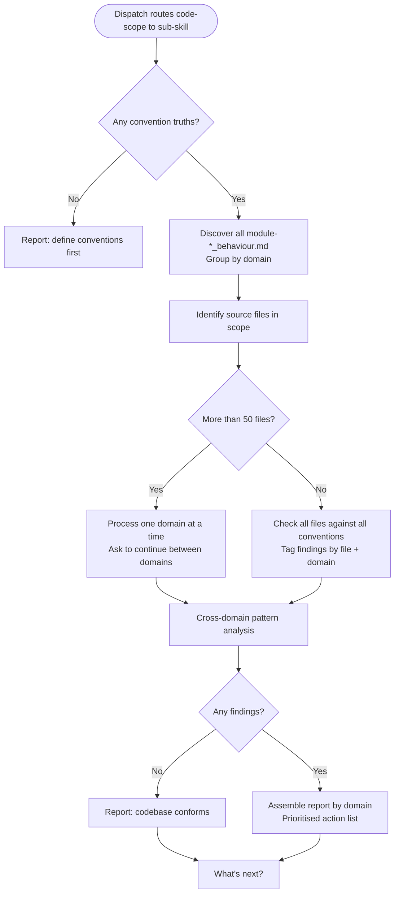

# Behaviour: Audit Codebase Against All Conventions

## Actor
Developer or team lead (routed via `/tr-audit-all` dispatch after input is identified as a code-scope request or when no path is given and a code-wide review is requested)

## Preconditions
- The audit-all dispatch has classified the input as a code-scope request
- At least one behaviour-scoped global truth file exists in `taproot/global-truths/` (files named `<module>-*_behaviour.md`)
- Source files exist in the project

## Main Flow
1. Sub-skill receives the source scope from the dispatch (defaults to the entire codebase if no scope is given)
2. Sub-skill discovers all behaviour-scoped truth files in `taproot/global-truths/` — files named `<module>-*_behaviour.md` — and groups them by convention domain (security, UX, architecture, etc.)
3. Sub-skill identifies the source files in scope
4. For each convention domain, sub-skill reads the truth files and checks each in-scope source file against the defined conventions and agent checklist; records findings tagged by file and convention domain
5. Sub-skill performs cross-domain analysis: flags files that violate conventions in more than one domain, and surfaces patterns (e.g. an entire directory consistently missing a convention)
6. Sub-skill assembles a consolidated report organised by convention domain: per-domain findings with violated convention excerpts, offending code, and proposed fixes; followed by cross-domain patterns
7. Sub-skill presents the report with a prioritised action list — highest-violation files and domains first — and next steps

## Alternate Flows

### No convention truths declared
- **Trigger:** No `<module>-*_behaviour.md` files exist in `taproot/global-truths/`
- **Steps:**
  1. Sub-skill reports: "No convention truths found — run a quality module (e.g. `/tr-security-define`, `/tr-ux-define`) to define conventions first."
  2. Flow stops

### Large codebase
- **Trigger:** Source scope contains more than 50 files
- **Steps:**
  1. Sub-skill processes one convention domain at a time and presents interim findings per domain
  2. After each domain, sub-skill asks: "Continue to the next domain?" before proceeding

### Partial conventions — some domains empty
- **Trigger:** A convention domain truth file exists but contains no agent checklist entries
- **Steps:**
  1. Sub-skill notes the domain in the report as "conventions declared but checklist empty — nothing to check"
  2. Sub-skill continues with remaining domains

### No findings
- **Trigger:** All source files conform to all declared conventions
- **Steps:**
  1. Sub-skill reports: "No violations found — the codebase conforms to all declared convention truths."
  2. Sub-skill presents next steps without a findings section

## Postconditions
- A consolidated report is available covering all convention domains and all in-scope source files
- The prioritised action list identifies the highest-impact files and domains for remediation
- The artefact is not modified by the audit

## Error Conditions
- **No source files found in scope**: Sub-skill reports "No source files found in `<scope>` — check the path or file pattern." Flow stops.
- **Truth file found but unreadable**: Sub-skill skips the file, notes the skip in the report, and continues with remaining truth files.

## Flow

## Related
- `quality-audit/audit-all/usecase.md` — parent dispatch: routes code-scope requests here; hierarchy paths route to `audit-all/spec/`
- `quality-audit/audit-all/spec/usecase.md` — sibling sub-behaviour: audits spec artefacts across a hierarchy subtree
- `quality-audit/audit/code/usecase.md` — single-target variant: checks specific files against a named convention subject
- `taproot-modules/security/usecase.md` — defines security conventions written to `global-truths/security-*_behaviour.md`
- `taproot-modules/user-experience/usecase.md` — defines UX conventions written to `global-truths/ux-*_behaviour.md`
- `taproot-modules/architecture/usecase.md` — defines architecture conventions written to `global-truths/arch-*_behaviour.md`

## Acceptance Criteria

**AC-1: All convention truth files discovered and grouped by domain**
- Given multiple `<module>-*_behaviour.md` files exist across security, UX, and architecture domains
- When the sub-skill runs
- Then all truth files are discovered and each finding is tagged with its convention domain

**AC-2: All in-scope source files checked against all conventions**
- Given a source scope and three convention domains
- When the sub-skill checks for violations
- Then every in-scope source file is checked against every applicable convention in every domain

**AC-3: No conventions redirect**
- Given no `<module>-*_behaviour.md` files exist in `taproot/global-truths/`
- When the sub-skill runs
- Then it reports the gap and names the module definition skills to run first

**AC-4: Consolidated report organised by domain**
- Given findings across multiple convention domains
- When the report is assembled
- Then findings are grouped by domain with the highest-violation domains and files listed first

**AC-5: Cross-domain patterns identified**
- Given a directory where files consistently violate conventions from two or more domains
- When cross-domain analysis runs
- Then the pattern is surfaced as a cross-domain finding in the report

**AC-6: Large codebase batched by domain**
- Given a source scope with more than 50 files
- When the sub-skill runs
- Then findings are presented one convention domain at a time with a continue prompt between domains

**AC-7: No findings reported gracefully**
- Given all source files conform to all declared conventions
- When the sub-skill completes
- Then the report notes conformance without an empty findings section

**AC-8: Unreadable truth file skipped with note**
- Given a truth file exists in `taproot/global-truths/` but cannot be read
- When the sub-skill processes that domain
- Then the file is skipped, the skip is noted in the report, and remaining domains continue

## Status
- **State:** specified
- **Created:** 2026-04-12
- **Last reviewed:** 2026-04-12
