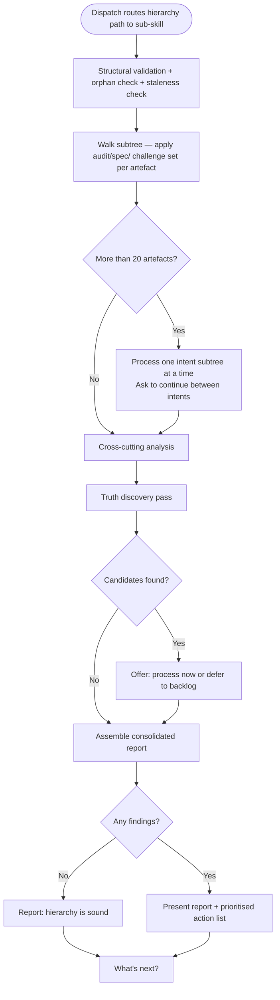

# Behaviour: Audit a Spec Subtree

## Actor
Developer or team lead (routed via `/tr-audit-all` dispatch after input is identified as a hierarchy path)

## Preconditions
- The audit-all dispatch has classified the input as a hierarchy path
- The target path is a valid directory within the hierarchy root
- At least one spec artefact (`intent.md`, `usecase.md`, or `impl.md`) exists under the path

## Main Flow
1. Sub-skill receives the target path from the dispatch (defaults to hierarchy root if none given)
2. Sub-skill checks the subtree for structural issues — missing required sections, malformed documents, and orphaned artefacts with no parent; records results as Structural Issues and Orphan & Coverage Issues
3. Sub-skill checks for staleness — artefacts whose source files have changed since the spec was last reviewed; records results as Staleness Warnings
4. Sub-skill walks the subtree top-down; for each artefact applies the type-specific challenge set from `audit/spec/` and records findings tagged with the artefact path
5. Sub-skill performs cross-cutting analysis across all artefacts: intent–behaviour coverage gaps, contradictions between sibling behaviours, duplicated flows across intents, unimplemented main flow steps
6. Sub-skill assembles a consolidated report: Structural Issues → Orphan & Coverage Issues → Staleness Warnings → Cross-Cutting Issues → Per-Artefact Findings
7. Sub-skill runs a truth discovery pass: scans artefacts for implicit facts not yet captured as global truths; appends candidates to the report
8. Sub-skill presents the report with a prioritised action list and next steps

## Alternate Flows

### Large hierarchy
- **Trigger:** Subtree contains more than 20 artefacts
- **Steps:**
  1. Sub-skill processes and presents one intent subtree at a time
  2. After each intent's findings, sub-skill asks: "Continue to the next intent?" before proceeding

### Truth candidates found
- **Trigger:** The truth discovery pass surfaces candidates not yet in `taproot/global-truths/`
- **Steps:**
  1. Sub-skill appends candidates to the report under `## Truth Candidates`
  2. Sub-skill offers: "[P] Process candidates now via `/tr-discover-truths` · [L] Defer — append all to backlog"

### No findings
- **Trigger:** All structural checks pass, no per-artefact findings, no truth candidates
- **Steps:**
  1. Sub-skill reports: "No findings — hierarchy is structurally sound and consistent with global truths."
  2. Sub-skill presents next steps

## Postconditions
- A consolidated report is available covering all structural, coverage, staleness, cross-cutting, and per-artefact findings
- Truth candidates are either processed or deferred to backlog
- A prioritised action list guides the developer's next steps

## Error Conditions
- **No artefacts at path**: Sub-skill reports "No artefacts found under `<path>` — nothing to audit." Flow stops.
- **Validation tooling unavailable**: Sub-skill reports which check failed and skips it, noting the gap in the report.

## Flow

## Related
- `quality-audit/audit-all/usecase.md` — parent dispatch: routes hierarchy paths here; free-form prompts route to `audit-all/code/`
- `quality-audit/audit-all/code/usecase.md` — sibling sub-behaviour: reviews source files across the codebase against convention truths
- `quality-audit/audit/spec/usecase.md` — single-artefact variant; this sub-behaviour applies the same challenge sets in batch
- `global-truth-store/discover-truths/usecase.md` — truth discovery logic applied in step 7
- `quality-gates/definition-of-done/usecase.md` — enforcement layer; audit-all is advisory, DoD enforcement is separate

## Acceptance Criteria

**AC-1: Structural issues surfaced first**
- Given a hierarchy subtree with structural validation errors
- When the sub-skill runs
- Then structural issues appear at the top of the report before semantic findings

**AC-2: Per-artefact findings with type-specific challenge set**
- Given a subtree containing intents, behaviours, and implementations
- When the sub-skill walks the subtree
- Then each artefact is reviewed with the challenge set from `audit/spec/` appropriate to its type, and findings are tagged with the artefact path

**AC-3: Cross-cutting coverage gaps identified**
- Given an intent whose success criteria have no corresponding behaviour
- When the cross-cutting analysis runs
- Then the uncovered criterion is flagged as a Coverage Gap in the report

**AC-4: Sibling contradictions flagged**
- Given two sibling behaviours with contradictory postconditions
- When the cross-cutting analysis runs
- Then the contradiction is flagged in the Cross-Cutting Issues section

**AC-5: Large hierarchy batched by intent**
- Given a subtree with more than 20 artefacts
- When the sub-skill runs
- Then findings are presented one intent subtree at a time with a continue prompt between each

**AC-6: Truth candidates offered for processing**
- Given the truth discovery pass finds implicit facts not yet in `taproot/global-truths/`
- When the report is assembled
- Then candidates are listed and the developer is offered process-now or defer-to-backlog

**AC-7: Clean hierarchy reported gracefully**
- Given a subtree with no structural issues, no findings, and no truth candidates
- When the sub-skill completes
- Then the system reports the hierarchy is sound without presenting an empty report structure

**AC-8: Prioritised action list closes the report**
- Given the audit has produced findings of varying severity
- When the report is presented
- Then the closing action list orders items: structural issues first, then blockers, then coverage gaps

## Status
- **State:** specified
- **Created:** 2026-04-12
- **Last reviewed:** 2026-04-12
