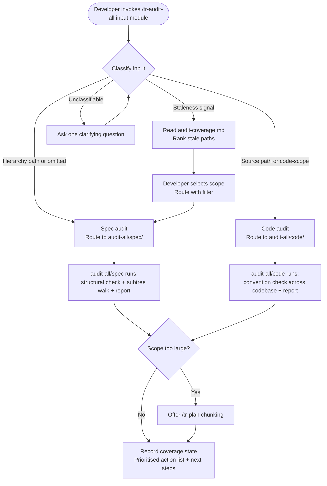

# Behaviour: Audit All

## Actor
Developer or team lead who wants a comprehensive quality review — either a full hierarchy subtree (structural issues, coverage gaps, per-artefact findings) or the entire codebase against all declared convention truths — through a single entry point that routes to the appropriate sub-skill.

## Preconditions
- The developer has a target in mind: either a hierarchy path for a spec subtree audit, a source scope for a codebase convention review, or no input (defaults to spec subtree audit from the hierarchy root)
- An optional module filter may be provided to restrict the review to a single declared module (e.g. user-experience, security, architecture)

## Main Flow
1. Developer invokes `/tr-audit-all [input] [module]` — input is optional; can be a hierarchy path, a source path/glob, or a code-scope keyword (e.g. "code", "src/"). Module is optional; when provided it restricts the review to conventions from that declared module only.
2. System classifies the input:
   - If input is a hierarchy path within the configured root, or omitted: classified as a **spec audit** → routes to `audit-all/spec/`
   - If input is a source path, file glob, or code-scope keyword: classified as a **code audit** → routes to `audit-all/code/`
   - If a module filter is present, it is passed to the routed sub-behaviour, which restricts its convention checks to that module's truth files only
3. Routed sub-behaviour runs — structural checks, subtree walk or convention review, cross-cutting analysis, and consolidated report are handled within the sub-behaviour (see `audit-all/spec/usecase.md` and `audit-all/code/usecase.md`)
4. System records the session in the coverage state: the audited path, module filter (or "all" if none provided), and date — written to `taproot/audit-coverage.md`
5. System surfaces the sub-behaviour's prioritised action list and next steps

## Alternate Flows

### Input unclassifiable
- **Trigger:** Input does not resolve to a hierarchy path and is too vague to derive a source scope
- **Steps:**
  1. System asks one clarifying question: "Should I audit the spec hierarchy (give me a path, or press Enter for the full root) or review source code against all convention truths (say 'code' or give a source path)?"
  2. Developer clarifies; system re-classifies and routes

### No input — default to spec subtree audit
- **Trigger:** Developer invokes `/tr-audit-all` with no argument
- **Steps:**
  1. System classifies as spec audit and routes to `audit-all/spec/` with the hierarchy root as the target path

### Coverage staleness review
- **Trigger:** Developer invokes `/tr-audit-all` with no path but includes a staleness signal (e.g. "what's stale", "what hasn't been reviewed", "what's overdue")
- **Steps:**
  1. System reads `taproot/audit-coverage.md` and identifies paths × modules not audited in the last 30 days, or never audited
  2. System presents a ranked list ordered by oldest or missing audit date
  3. Developer selects a scope; system routes to the appropriate sub-behaviour with that scope and module filter applied

### Scope too large for one session
- **Trigger:** The routed sub-behaviour signals that the scope is too large to complete in a single session
- **Steps:**
  1. System surfaces the signal: "This scope is too large for one session."
  2. System offers: "[P] Build a plan — I'll break this into one audit chunk per session · [C] Continue anyway"
  3. If [P]: system builds a `/tr-plan` with each top-level path segment as a separate audit item, ordered by staleness from `taproot/audit-coverage.md`

## Postconditions
- The routed sub-behaviour has completed its review and assembled a consolidated report
- A prioritised action list is available to guide the developer's next steps
- Deferred findings or truth candidates have been captured to `taproot/backlog.md`
- The coverage state in `taproot/audit-coverage.md` is updated with the audited path, module filter, and date

## Error Conditions
- **Path not found**: System reports "Path `<path>` not found — check the path and try again." Flow stops.
- **Input resolves to a file, not a directory**: System asks: "Did you mean to audit a single artefact? Use `/tr-audit <path>` for a single file."

## Flow

## Related
- `quality-audit/audit-all/spec/usecase.md` — sub-behaviour: structural validation, per-artefact challenge sets, cross-cutting analysis, truth discovery across a hierarchy subtree
- `quality-audit/audit-all/code/usecase.md` — sub-behaviour: checks all source files against all declared behaviour-scoped convention truths
- `quality-audit/audit/usecase.md` — single-target variant: routes to spec or code sub-skill for one artefact or targeted source scope
- `quality-gates/definition-of-done/usecase.md` — enforcement layer; audit-all is advisory, DoD enforcement is separate

## Acceptance Criteria

~~**AC-1: Structural issues surfaced first** — deprecated; moved to `audit-all/spec/` AC-1~~

~~**AC-2: Per-artefact findings with type-specific challenge set** — deprecated; moved to `audit-all/spec/` AC-2~~

~~**AC-3: Cross-cutting coverage gaps identified** — deprecated; moved to `audit-all/spec/` AC-3~~

~~**AC-4: Sibling contradictions flagged** — deprecated; moved to `audit-all/spec/` AC-4~~

~~**AC-5: Large hierarchy batched by intent** — deprecated; moved to `audit-all/spec/` AC-5~~

~~**AC-6: Truth candidates offered for processing** — deprecated; moved to `audit-all/spec/` AC-6~~

~~**AC-7: Clean hierarchy reported gracefully** — deprecated; moved to `audit-all/spec/` AC-7~~

~~**AC-8: Prioritised action list closes the report** — deprecated; moved to `audit-all/spec/` AC-8~~

**AC-9: Hierarchy path routes to spec sub-behaviour**
- Given the developer invokes `/tr-audit-all taproot/specs/my-intent/`
- When the system classifies the input
- Then the input is routed to `audit-all/spec/` and the subtree spec audit runs

**AC-10: Code-scope input routes to code sub-behaviour**
- Given the developer invokes `/tr-audit-all src/`
- When the system classifies the input
- Then the input is routed to `audit-all/code/` and the codebase convention review runs

**AC-11: No input defaults to spec subtree audit from hierarchy root**
- Given the developer invokes `/tr-audit-all` with no argument
- When the system classifies the input
- Then it routes to `audit-all/spec/` with the hierarchy root as the target path

**AC-12: Unclassifiable input resolved by one clarifying question**
- Given the developer invokes `/tr-audit-all` with input that cannot be classified as a hierarchy path or source scope
- When the system cannot classify
- Then the system asks exactly one clarifying question before re-classifying

**AC-13: Single file redirected to /tr-audit**
- Given the developer invokes `/tr-audit-all` with a path that resolves to a single file
- When the system detects a file rather than a directory
- Then the system suggests using `/tr-audit <path>` for single-artefact auditing

**AC-14: Module filter restricts sub-behaviour scope**
- Given the developer invokes `/tr-audit-all taproot/specs/ security`
- When the system classifies the input
- Then the spec sub-behaviour runs restricted to security convention checks only

**AC-15: Coverage state updated after audit**
- Given a sub-behaviour completes an audit session
- When the system returns control
- Then `taproot/audit-coverage.md` records the audited path, module filter (or "all"), and today's date

**AC-16: Staleness review surfaces overdue audit paths**
- Given the developer invokes `/tr-audit-all` with a staleness signal (e.g. "what's stale")
- When the system reads the coverage state
- Then it presents paths × modules ordered by oldest last-audited date, with never-audited entries listed first

**AC-17: Scope-too-large offer triggers plan creation**
- Given a sub-behaviour signals the scope is too large for one session
- When the developer selects [P]
- Then the system creates a `/tr-plan` with one audit chunk per top-level path segment, ordered by staleness from `taproot/audit-coverage.md`

## Behaviours <!-- taproot-managed -->
- [Audit a Spec Subtree](./spec/usecase.md)
- [Audit Codebase Against All Conventions](./code/usecase.md)

## Status
- **State:** specified
- **Created:** 2026-04-12
- **Last reviewed:** 2026-04-15
- **Refined:** 2026-04-12 — rewritten as dispatch: hierarchy path → audit-all/spec/, code scope → audit-all/code/; AC-1–8 deprecated (moved to sub-behaviours); AC-9–13 added for routing
- **Refined:** 2026-04-15 — added scope × module filtering, coverage tracking (taproot/audit-coverage.md), staleness review flow, scope-too-large chunking via /tr-plan; AC-14–17 added
