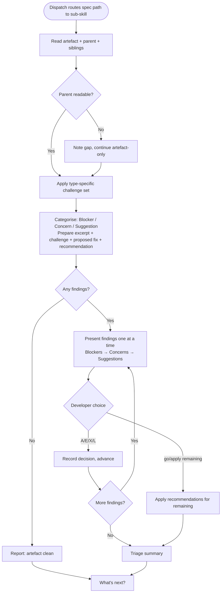

# Behaviour: Audit a Spec Artefact

## Actor
Developer (routed via `/tr-audit` dispatch after input is identified as a spec path)

## Preconditions
- The audit dispatch has classified the input as a spec path — an `intent.md`, `usecase.md`, or `impl.md`
- The artefact at the path is readable and not a stub or placeholder (validated by dispatch before handoff)
- Artefact type (intent / behaviour / implementation) has been resolved by the dispatch

## Main Flow
1. Sub-skill receives the spec path and artefact type from the dispatch
2. Sub-skill reads the artefact content in full
3. Sub-skill reads the parent artefact for cross-context: `intent.md` for behaviours, `usecase.md` for implementations; scans sibling artefacts under the same parent for overlap and consistency; if parent is unreadable, notes the gap and continues with artefact-only context
4. Sub-skill applies the challenge set for the artefact type and generates all findings internally before presenting any
5. Sub-skill categorises each finding as Blocker, Concern, or Suggestion; for each prepares a quoted excerpt, a challenge, a proposed fix, and a recommended action; sorts findings Blockers first, then Concerns, then Suggestions
6. Sub-skill presents findings one at a time:
   - Category + position in sequence (e.g. "Blocker (1 of 2)") + recommended action
   - Quoted artefact excerpt
   - Challenge — why this is a problem
   - Proposed fix — the specific wording change, addition, or removal that resolves the finding
   - Triage prompt: [A] Accept · [E] Edit fix before accepting · [X] Dismiss · [L] Defer to backlog
7. Developer triages each finding; after all are triaged (or batch-resolved), sub-skill shows triage summary: counts of accepted, dismissed, and deferred
8. Sub-skill presents next steps, surfacing accepted findings as structured input for `/tr-refine`

## Alternate Flows

### No findings
- **Trigger:** The challenge set produces no findings for the artefact
- **Steps:**
  1. Sub-skill reports: "No findings — this artefact looks solid against the challenge set."
  2. Sub-skill presents next steps without a triage loop

### Batch triage
- **Trigger:** Developer types "go" or "apply remaining" during the triage loop
- **Steps:**
  1. Sub-skill applies its recommended action (accept, dismiss, or defer) for each remaining finding
  2. Sub-skill shows the triage summary with recommendations applied

### Edit before accepting
- **Trigger:** Developer selects [E] on a finding
- **Steps:**
  1. Sub-skill asks developer to reword the proposed fix
  2. Sub-skill records the edited version as accepted and moves to the next finding

### Parent artefact unreadable
- **Trigger:** The parent artefact exists but cannot be read
- **Steps:**
  1. Sub-skill notes: "Parent artefact at `<path>` not readable — cross-context checks skipped."
  2. Sub-skill proceeds with artefact-only context

## Postconditions
- Every finding has been triaged (accepted, dismissed, deferred, or batch-resolved)
- Accepted findings are available as structured input for `/tr-refine`
- Deferred findings have been captured to `taproot/backlog.md`
- The artefact itself is not modified by the audit

## Error Conditions
- **Proposed fix missing from a finding**: Sub-skill does not advance to the next finding until a concrete proposed fix is prepared — "this is unclear" is not a valid proposed fix; "change X to Y" is.

## Flow

## Related
- `quality-audit/audit/usecase.md` — parent dispatch: routes spec paths here; source paths/prompts route to `audit/code/`
- `quality-audit/audit/code/usecase.md` — sibling sub-behaviour: handles source code auditing
- `quality-audit/audit-all/usecase.md` — uses this sub-behaviour's challenge sets per artefact in the full-subtree walk
- `human-integration/interactive-audit/usecase.md` — defines the one-at-a-time finding presentation and triage model used in step 6

## Acceptance Criteria

**AC-1: Challenge set applied to artefact type**
- Given a spec path resolved as an `intent.md`, `usecase.md`, or `impl.md`
- When the sub-skill runs
- Then the challenge set specific to that artefact type is applied and findings are generated internally

**AC-2: Findings presented one at a time with all required fields**
- Given the sub-skill has generated one or more findings
- When findings are presented
- Then each finding shows its category, position, recommended action, quoted excerpt, challenge, proposed fix, and triage prompt before the next is shown

**AC-3: Proposed fix is mandatory per finding**
- Given a finding has been generated
- When the finding is prepared for presentation
- Then a concrete proposed fix (specific wording change, addition, or removal) is prepared — vague observations without a fix are not presentable

**AC-4: Findings sorted Blockers first**
- Given findings of mixed severity have been generated
- When the triage loop begins
- Then Blockers are presented before Concerns, Concerns before Suggestions

**AC-5: Accepted findings carry to `/tr-refine`**
- Given the developer has accepted N findings with proposed fixes
- When next steps are presented
- Then the option to run `/tr-refine` carries only the N accepted proposed fixes as context

**AC-6: Batch triage applies recommendations for remaining findings**
- Given at least one finding remains in the triage loop
- When the developer types "go" or "apply remaining"
- Then all remaining findings are resolved using the sub-skill's recommended action for each

**AC-7: Deferred findings captured to backlog**
- Given the developer selects [L] on a finding
- When the finding is deferred
- Then it is appended to `taproot/backlog.md` via `/tr-backlog`

**AC-8: Triage summary shown after all findings resolved**
- Given all findings have been triaged (individually or by batch)
- When the triage phase completes
- Then the summary shows counts: N accepted, N dismissed, N deferred

**AC-9: No findings path handled cleanly**
- Given the challenge set produces no findings
- When the sub-skill completes
- Then the artefact is reported as clean and next steps are presented without a triage loop

**AC-10: Parent unreadable — artefact-only context used**
- Given the parent artefact cannot be read
- When cross-context checks would run
- Then sub-skill notes the gap, skips cross-context checks, and continues with artefact-only context

## Notes

Challenge sets by artefact type (applied in step 4 — not exhaustive; agent exercises judgment):

**`intent.md` challenge set:**
- Is the goal measurable? Can it be declared achieved unambiguously?
- Are the success criteria specific, or can they be hit without delivering real value?
- Who is missing from the stakeholders? (security, ops, legal, downstream systems)
- What is the cost of not building this? Is it undersold?
- Is this one intent or multiple intents in a trenchcoat? (signs: "and" in goal, >4 SCs, unrelated stakeholder groups)
- What is the smallest version that delivers value? Is the scope justified?
- Do any success criteria contradict each other or compete for the same finite resource?
- Are the constraints real (regulatory, contractual) or assumed?

**`usecase.md` challenge set:**
- Does every step have a clear actor and a clear observable outcome?
- What happens when each step fails? Map every failure mode — network, invalid state, concurrency, timeout
- What are the performance expectations? Is 100ms acceptable? 10 seconds?
- How does this behave under load? Race conditions on shared state?
- What data does this touch? What if it is malformed, missing, or stale?
- Is this one UseCase or two? (signs: "or" in main flow, alternate flow that rewrites main flow, two distinct actors)
- What happens at the boundaries — first use, Nth use, quota exhaustion, rollback after failure?
- Are the postconditions complete? Does something need to be notified, logged, or cleaned up?
- Do the error conditions cover all failure modes with specific system responses?

**`impl.md` challenge set:**
- Is each design decision justified by usecase requirements, or is it "we always do it this way"?
- What are the failure modes of the chosen approach? Under what conditions does it break?
- Are the tests verifying observable behaviour from the actor's perspective, or implementation details?
- What is NOT covered by the listed tests that should be? (error paths, concurrency, edge inputs, external integration)
- Will this implementation survive the next likely spec change? (new actor, new postcondition)
- Are the source files listed complete? Can the behaviour be satisfied by these files alone?

## Status
- **State:** specified
- **Created:** 2026-04-12
- **Last reviewed:** 2026-04-12
