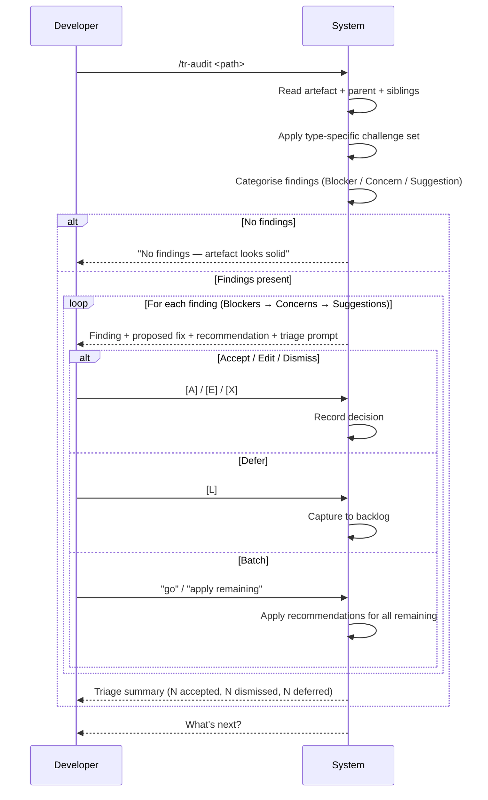

# Behaviour: Audit a Single Artefact

## Actor
Developer who wants to stress-test a taproot artefact — an intent, behaviour, or implementation spec — before shipping, after changes, or as a periodic quality check.

## Preconditions
- The target artefact exists and is not a stub or placeholder
- For behaviours and implementations: the parent artefact is readable for cross-context

## Main Flow
1. Developer invokes `/tr-audit <path>` naming a specific `intent.md`, `usecase.md`, or `impl.md`
2. System reads the target artefact and identifies its type
3. System reads the parent artefact (if any) and sibling artefacts under the same parent to build context
4. System applies the challenge set appropriate to the artefact type and generates categorised findings internally
5. System presents findings to the developer one at a time, starting with Blockers, then Concerns, then Suggestions — each with a quoted excerpt, a challenge, a proposed fix, and a recommended action (per the interactive triage model in `human-integration/interactive-audit`)
6. Developer triages each finding: accept the proposed fix, dismiss it, edit before accepting, or defer to backlog
7. After all findings are triaged, system shows a summary: counts of accepted, dismissed, and deferred findings
8. System presents next steps, surfacing the accepted findings as structured input for `/tr-refine`

## Alternate Flows

### No findings
- **Trigger:** The challenge set produces no findings for the artefact
- **Steps:**
  1. System reports: "No findings — this artefact looks solid against the challenge set."
  2. System presents next steps (implement or browse)

### Batch remaining findings
- **Trigger:** Developer types "go" or "apply remaining" during triage
- **Steps:**
  1. System applies its recommended action for each remaining finding
  2. System shows the triage summary with recommendations applied

### Edit before accepting
- **Trigger:** Developer selects [E] on a finding
- **Steps:**
  1. System asks developer to reword the proposed fix
  2. System records the edited version as an accepted finding and moves to the next

## Postconditions
- Every finding has been triaged (accepted, dismissed, deferred, or batch-resolved)
- Accepted findings are available as structured input for `/tr-refine`
- Deferred findings have been captured to `taproot/backlog.md`

## Error Conditions
- **Artefact not found at path**: System reports "No artefact found at `<path>` — check the path and try again." Flow stops.
- **Artefact is a stub or placeholder**: System reports "This artefact is a placeholder — audit findings would not be meaningful. Write the spec first, then audit." Flow stops.
- **Parent artefact unreadable**: System proceeds with artefact-only context and notes: "Parent artefact not readable — cross-context checks skipped."

## Flow

## Related
- `human-integration/interactive-audit/usecase.md` — defines the interactive one-at-a-time finding presentation and triage pattern this behaviour uses
- `quality-audit/audit-all/usecase.md` — full-subtree variant; applies this behaviour's challenge set to every artefact in a hierarchy
- `quality-audit/code-audit/usecase.md` — source code variant; checks files against behaviour-scoped global truths rather than artefact challenge sets

## Acceptance Criteria

**AC-1: Challenge set applied to artefact type**
- Given a readable artefact of type intent, behaviour, or implementation
- When the developer invokes `/tr-audit <path>`
- Then the system applies the challenge set appropriate to that artefact type and produces categorised findings

**AC-2: Interactive triage — one finding at a time**
- Given the system has generated one or more findings
- When findings are presented
- Then each finding is shown individually with its category, quoted excerpt, challenge, proposed fix, and recommended action before the next is shown

**AC-3: Accepted findings carry to refine**
- Given the developer has accepted N findings with proposed fixes
- When the developer selects refine from next steps
- Then only the N accepted proposed fixes are passed as input to `/tr-refine`

**AC-4: Batch triage applies recommendations**
- Given at least one finding remains after the developer has triaged at least one
- When the developer types "go" or "apply remaining"
- Then all remaining findings are resolved using the system's recommended action for each

**AC-5: Deferred findings captured**
- Given the developer selects [L] Later on a finding
- When the finding is deferred
- Then it is captured to `taproot/backlog.md`

**AC-6: Triage summary shown**
- Given all findings have been triaged
- When the triage phase completes
- Then the system shows a summary with counts per category (accepted, dismissed, deferred)

**AC-7: Stub artefact rejected early**
- Given the target artefact is a stub or placeholder
- When the developer invokes `/tr-audit <path>`
- Then the system stops immediately with a message directing the developer to write the spec first

**AC-8: No findings handled gracefully**
- Given the challenge set produces no findings
- When the audit completes
- Then the system reports the artefact is clean and presents next steps without a triage loop

## Implementations <!-- taproot-managed -->
- [Agent Skill — /tr-audit](./agent-skill/impl.md)

## Status
- **State:** implemented
- **Created:** 2026-04-12
- **Last reviewed:** 2026-04-12
