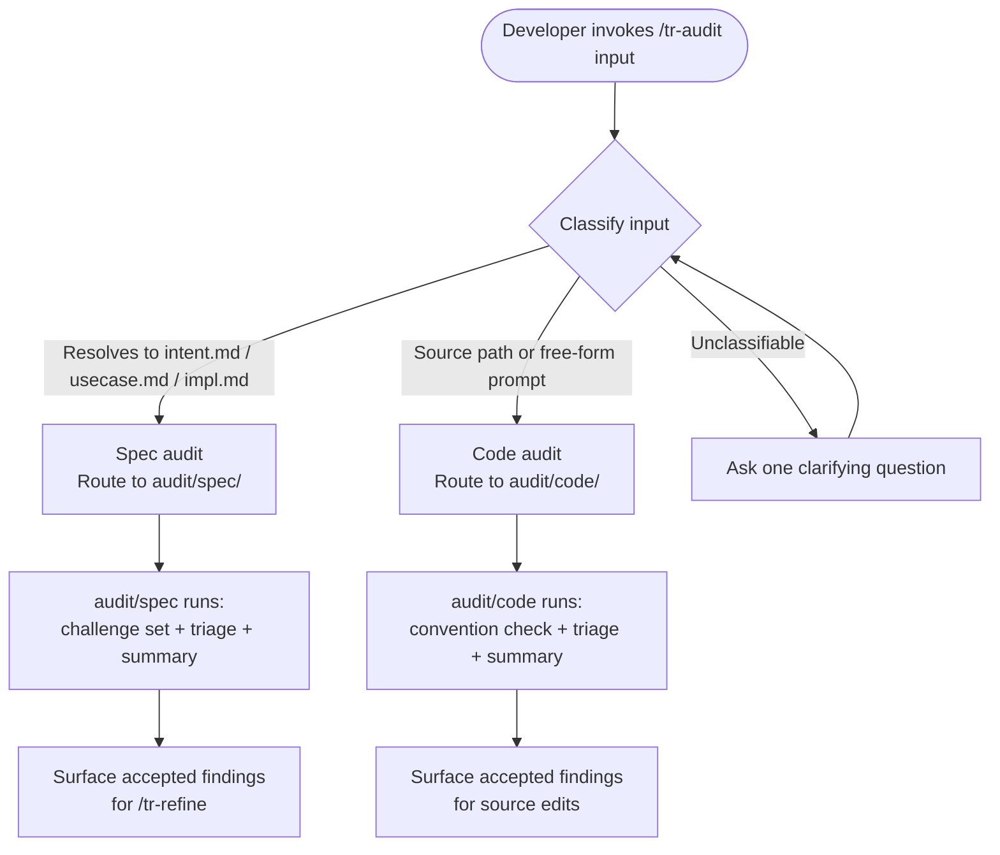

# Behaviour: Audit

## Actor
Developer who wants to review quality at any layer — taproot artefacts (intents, behaviours, implementations) or source code — through a single entry point that routes to the appropriate sub-skill.

## Preconditions
- The developer has a target in mind: either a path to a taproot artefact (`intent.md`, `usecase.md`, or `impl.md`) or a free-form description of source code to review

## Main Flow
1. Developer invokes `/tr-audit <input>` — input is either a path to a taproot artefact or a free-form source-review prompt (e.g. "check the service layer for security issues")
2. System classifies the input:
   - If input resolves to a readable `intent.md`, `usecase.md`, or `impl.md`: classified as a **spec audit** → routes to `audit/spec/`
   - If input is a source path, file glob, or free-form prompt that does not resolve to a spec file: classified as a **code audit** → routes to `audit/code/`
3. Routed sub-behaviour runs — challenge set application, interactive triage loop, and summary are handled within the sub-behaviour (see `audit/spec/usecase.md` and `audit/code/usecase.md`)
4. System surfaces accepted findings as structured input for `/tr-refine` (spec audits) or as direct action items in source files (code audits)

## Alternate Flows

### Input unclassifiable
- **Trigger:** Input does not resolve to a spec path and is too vague to derive a source scope or convention subject
- **Steps:**
  1. System asks one clarifying question: "Should I audit a spec file (give me a path) or review source code against conventions (describe what to check and which files)?"
  2. Developer clarifies; system re-classifies and routes

### Spec path points to stub or placeholder
- **Trigger:** Input resolves to a spec file, but the file is a stub or placeholder
- **Steps:**
  1. System routes to `audit/spec/` which detects the stub and stops early
  2. System reports: "This artefact is a placeholder — write the spec first, then audit."

## Postconditions
- The routed sub-behaviour has completed its audit and triage loop
- Accepted findings are available as structured input for the appropriate next action (`/tr-refine` or source edits)
- Deferred findings have been captured to `taproot/backlog.md`

## Error Conditions
- **Artefact not found at path**: System reports "No artefact found at `<path>` — check the path and try again." Flow stops.
- **Input resolves to a directory, not a file**: System asks: "Did you mean to audit a specific file within `<path>`, or review source code under that directory?"

## Flow

## Related
- `quality-audit/audit/spec/usecase.md` — sub-behaviour: applies type-specific challenge sets to spec artefacts and runs interactive triage
- `quality-audit/audit/code/usecase.md` — sub-behaviour: checks source files against behaviour-scoped global truths
- `quality-audit/audit-all/usecase.md` — full-subtree variant; uses `audit/spec/` challenge sets per artefact
- `human-integration/interactive-audit/usecase.md` — defines the triage presentation model used within the sub-behaviours

## Acceptance Criteria

~~**AC-1: Challenge set applied to artefact type** — deprecated; moved to `audit/spec/` AC-1~~

~~**AC-2: Interactive triage — one finding at a time** — deprecated; moved to `audit/spec/` AC-2~~

~~**AC-3: Accepted findings carry to refine** — deprecated; moved to `audit/spec/` AC-5~~

~~**AC-4: Batch triage applies recommendations** — deprecated; moved to `audit/spec/` AC-6~~

~~**AC-5: Deferred findings captured** — deprecated; moved to `audit/spec/` AC-7~~

~~**AC-6: Triage summary shown** — deprecated; moved to `audit/spec/` AC-8~~

~~**AC-7: Stub artefact rejected early** — deprecated; moved to `audit/spec/` (dispatch surfaces message)~~

~~**AC-8: No findings handled gracefully** — deprecated; moved to `audit/spec/` AC-9~~

**AC-9: Spec path routes to spec sub-behaviour**
- Given the developer invokes `/tr-audit taproot/specs/my-intent/my-behaviour/usecase.md`
- When the system classifies the input
- Then the input is routed to `audit/spec/` and the spec challenge set is applied

**AC-10: Source path or free-form prompt routes to code sub-behaviour**
- Given the developer invokes `/tr-audit "check the service layer for security issues"`
- When the system classifies the input
- Then the input is routed to `audit/code/` and the convention-based review runs

**AC-11: Unclassifiable input resolved by one clarifying question**
- Given the developer invokes `/tr-audit` with input that does not resolve to a spec path and lacks a derivable source scope
- When the system cannot classify the input
- Then the system asks exactly one clarifying question before re-classifying

## Behaviours <!-- taproot-managed -->
- [Audit a Spec Artefact](./spec/usecase.md)
- [Audit Source Code Against Conventions](./code/usecase.md)

## Implementations <!-- taproot-managed -->
- [Agent Skill — /tr-audit](./agent-skill/impl.md)

## Status
- **State:** implemented
- **Created:** 2026-04-12
- **Last reviewed:** 2026-04-15
- **Refined:** 2026-04-12 — rewritten as dispatch: spec path → audit/spec/, source path/prompt → audit/code/; AC-1–8 deprecated (moved to sub-behaviours); AC-9–11 added for routing
