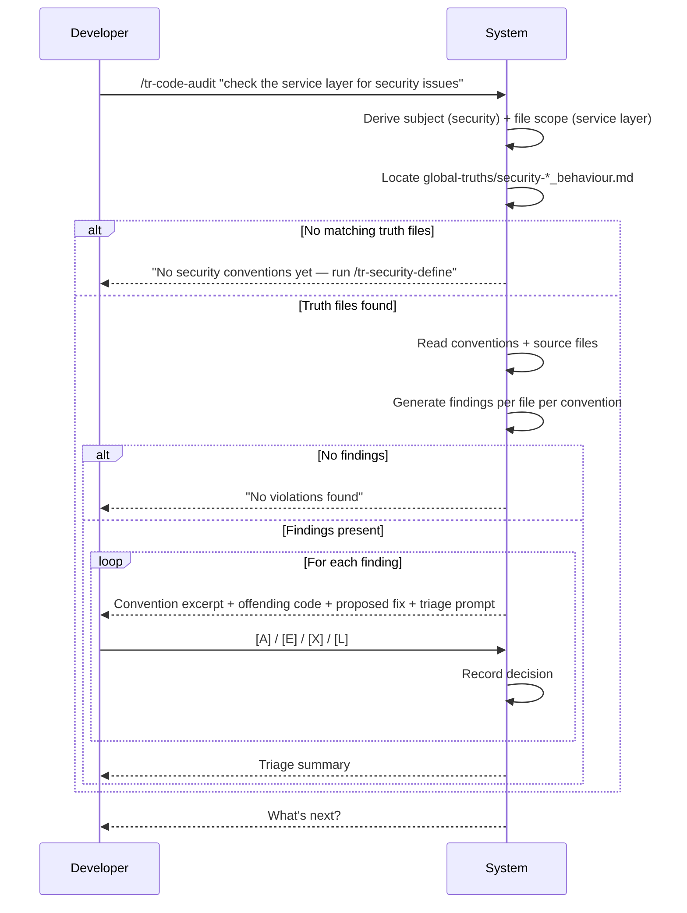

# Behaviour: Audit Source Code Against Conventions

## Actor
Developer who wants to review source files against project-defined conventions — captured as behaviour-scoped global truths — using a natural language description of what to check and which files to target.

## Preconditions
- At least one behaviour-scoped global truth file exists in `taproot/global-truths/` (files named `<module>-*_behaviour.md`)
- Source files exist in the project

## Main Flow
1. Developer invokes `/tr-code-audit` with a free-form prompt describing what to check and which files to target (e.g. "check the service layer for security issues" or "review the frontend components for UX consistency")
2. System interprets the prompt to derive: (a) subject — the convention domain to check against (e.g. security, UX, architecture), and (b) file scope — which source files to review
3. System locates matching truth files in `taproot/global-truths/` by convention: files named `<module>-*_behaviour.md` where the module prefix matches the derived subject
4. System reads the matched truth files and extracts the conventions and agent checklist defined within them
5. System reads the targeted source files
6. System checks each source file against the conventions and generates categorised findings (violations and concerns) tagged by file and convention
7. System presents findings interactively — one at a time with the violated convention excerpt, the offending code, a proposed fix, and a recommended action
8. Developer triages each finding: accept, dismiss, edit before accepting, or defer to backlog
9. System shows triage summary (accepted, dismissed, deferred counts) and presents next steps

## Alternate Flows

### No matching truth files
- **Trigger:** System cannot find any `taproot/global-truths/<module>-*_behaviour.md` files matching the derived subject
- **Steps:**
  1. System reports: "No `<subject>` conventions captured yet — run `/tr-<module>-define` to define them first."
  2. Flow stops; developer is redirected to the appropriate module definition skill

### Multiple subjects detected
- **Trigger:** The prompt implies more than one convention domain (e.g. "check security and UX")
- **Steps:**
  1. System resolves truth files for all matching subjects
  2. System runs the review against the combined convention set, tagging each finding with its source truth file

### File scope ambiguous
- **Trigger:** The prompt does not clearly identify which files to review
- **Steps:**
  1. System asks one clarifying question: "Which files should I check? (e.g. `src/services/**`, `changed files`, `all TypeScript files`)"
  2. Developer answers; system proceeds from step 3 with the clarified scope

### No findings
- **Trigger:** All targeted files conform to all matched conventions
- **Steps:**
  1. System reports: "No violations found — the targeted files conform to the `<subject>` conventions."
  2. System presents next steps without a triage loop

## Postconditions
- Every finding has been triaged (accepted, dismissed, deferred, or batch-resolved)
- Accepted findings are available for the developer to act on directly in source files
- Deferred findings have been captured to `taproot/backlog.md`

## Error Conditions
- **Prompt too vague to derive any subject or file scope**: System asks: "What conventions should I check against, and which files?" before proceeding.
- **Truth file found but unreadable**: System skips the file, notes the skip in the report, and continues with remaining truth files.
- **No source files found matching derived scope**: System reports "No files found matching `<derived scope>` — check the path or file pattern." Flow stops.

## Flow

## Related
- `quality-audit/audit/usecase.md` — artefact variant; checks taproot specs rather than source files
- `quality-audit/audit-all/usecase.md` — full-subtree artefact audit; complements source code review
- `taproot-modules/security/usecase.md` — defines security conventions written to `global-truths/security-*_behaviour.md`
- `taproot-modules/user-experience/usecase.md` — defines UX conventions written to `global-truths/ux-*_behaviour.md`
- `taproot-modules/architecture/usecase.md` — defines architecture conventions written to `global-truths/arch-*_behaviour.md`

## Acceptance Criteria

**AC-1: Subject and file scope derived from prompt**
- Given a clear free-form prompt naming a domain and file area
- When the developer invokes `/tr-code-audit`
- Then the system derives the subject and file scope without asking clarifying questions

**AC-2: Convention-based truth file discovery**
- Given truth files named `security-checklist_behaviour.md` in `taproot/global-truths/`
- When the derived subject is "security"
- Then the system loads those truth files as the convention set for the review

**AC-3: Missing conventions redirect**
- Given no truth files matching the derived subject exist in `taproot/global-truths/`
- When the system searches for matching files
- Then the system reports the gap and names the module definition skill to run first

**AC-4: Interactive finding triage**
- Given the system has generated one or more findings
- When findings are presented
- Then each finding is shown individually with the violated convention, the offending code, a proposed fix, and a triage prompt before the next finding is shown

**AC-5: Multiple subjects reviewed together**
- Given a prompt that implies two convention domains (e.g. security and architecture)
- When the system resolves truth files
- Then it loads truth files for both subjects and tags each finding with its source truth file

**AC-6: Ambiguous file scope resolved by asking**
- Given a prompt that does not identify specific files
- When the system cannot derive a file scope
- Then the system asks exactly one clarifying question before proceeding

**AC-7: No findings handled gracefully**
- Given all targeted files conform to all matched conventions
- When the review completes
- Then the system reports conformance without presenting a triage loop

**AC-8: Deferred findings captured**
- Given the developer selects [L] Later on a finding
- When the finding is deferred
- Then it is captured to `taproot/backlog.md`

## Status
- **State:** specified
- **Created:** 2026-04-12
- **Last reviewed:** 2026-04-12
