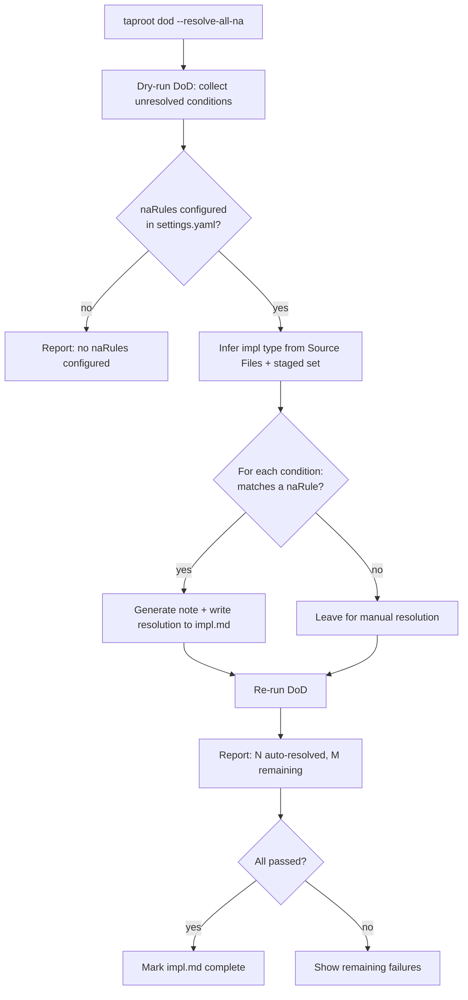

# Behaviour: Batch DoD NA Resolution

## Actor
Developer or AI agent running `taproot dod <impl-path> --resolve-all-na`

## Preconditions
- `impl.md` exists at the given path with unresolved agent-check conditions
- `impl.md` has a non-empty `## Source Files` section (required for heuristic inference)
- The staged file set is accessible via `git diff --cached`

## Main Flow

1. Developer or agent calls `taproot dod <impl-path> --resolve-all-na`
2. System performs a dry-run DoD check and collects all unresolved conditions requiring agent action
3. System reads `naRules` from `taproot/settings.yaml`. If `naRules` is absent or empty, no conditions qualify for auto-resolution (see alternate flow)
4. For each unresolved condition, system evaluates configured `naRules`:
   - Infers the impl type from the `## Source Files` section of `impl.md`
   - Reads the staged file set from `git diff --cached` as a secondary signal
   - Checks each rule: does the condition name match, and does the impl satisfy the `when` predicate?
5. For each condition where a matching rule fires: system generates a resolution note and writes it to `impl.md` (identical format to `taproot dod --resolve`)
6. System reports a summary: `Auto-resolved N conditions as not applicable. M conditions still require manual resolution.`
7. System re-runs DoD and displays remaining failures — manual resolution continues as normal

## Alternate Flows

### No `naRules` configured
- **Trigger:** `naRules` is absent or empty in `taproot/settings.yaml`
- **Steps:**
  1. System reports: "No `naRules` configured in `taproot/settings.yaml` — nothing to auto-resolve."
  2. System exits without modifying `impl.md`

### No conditions qualify for auto-resolution
- **Trigger:** `naRules` is configured but no unresolved condition matches any rule (e.g. TypeScript impl, all rules keyed to `prose-only`)
- **Steps:**
  1. System reports: "No conditions qualify for auto-resolution — all require manual reasoning."
  2. System exits without modifying `impl.md`

### All conditions auto-resolved
- **Trigger:** Every unresolved condition matches a configured `naRules` entry
- **Steps:**
  1. System resolves all conditions and re-runs DoD (step 7 of main flow)
  2. The DoD re-run determines whether `impl.md` is marked complete — `--resolve-all-na` only resolves conditions; it does not mark impl complete directly
  3. If DoD passes: system marks `impl.md` complete and reports success
  4. If DoD still fails on non-agent conditions (e.g. `tests-passing`): system reports remaining failures

### Dry-run mode
- **Trigger:** Developer calls `taproot dod <impl-path> --resolve-all-na --dry-run`
- **Steps:**
  1. `--dry-run` takes precedence — no writes occur regardless of `--resolve-all-na`
  2. System evaluates all rules and reports which conditions would be auto-resolved and which would not, with the matching rule for each candidate
  3. Developer reviews the list before deciding to apply (re-run without `--dry-run`)

### Empty staged set
- **Trigger:** `git diff --cached` returns no files (nothing staged)
- **Steps:**
  1. System falls back to `## Source Files` as the sole signal for heuristic inference
  2. Rules that depend on staged file types are evaluated against Source Files only
  3. System notes "staged set empty; inference from Source Files only" in each auto-resolved condition's note

## Postconditions
- All auto-resolved conditions have a written resolution note in `impl.md` `## DoD Resolutions` (same format as manual `--resolve`)
- Conditions that required reasoning are unchanged — they remain for the agent to resolve manually
- The resolution notes are auditable: each includes the condition name, the `naRules` entry that matched, and a timestamp
- Command exits 0 whether or not conditions remain unresolved; the DoD re-run exit code reflects overall pass/fail

## Error Conditions
- **`impl.md` not found**: System reports the path that was not found and stops.
- **`## Source Files` section absent or empty**: System reports it cannot infer impl type and stops: "Cannot determine impl type — `## Source Files` section is missing or empty in `<path>/impl.md`."
- **Staged file set unreadable** (git not available or no repo): System falls back to Source Files only (same as empty staged set alternate flow).
- **Unknown `when` value in `naRules`**: System warns "Unknown `when` value `<value>` in `naRules` entry for `<condition>` — skipping." and continues with remaining rules.
- **Condition already resolved**: System skips it silently — no duplicate resolution written.

## Flow



## Related
- `taproot/specs/quality-gates/definition-of-done/usecase.md` — defines the individual resolution flow this behaviour extends
- `taproot/specs/quality-gates/scoped-conditions/usecase.md` — scoped conditions share the same resolution format and settings.yaml structure
- `taproot/specs/requirements-hierarchy/configure-hierarchy/usecase.md` — `settings.yaml` schema owner

## Acceptance Criteria

**AC-1: Matching `naRules` entry auto-resolves a condition**
- Given `taproot/settings.yaml` contains `naRules` with `{condition: "check-if-affected: package.json", when: prose-only}`
- And the impl's `## Source Files` contains only `.md` files
- When the developer runs `taproot dod <impl-path> --resolve-all-na`
- Then `check-if-affected: package.json` is auto-resolved with a note referencing the matching rule

**AC-2: Rule does not fire when `when` predicate is not satisfied**
- Given `taproot/settings.yaml` contains `naRules` with `{condition: "check-if-affected: package.json", when: prose-only}`
- And the impl's `## Source Files` includes `.ts` files
- When the developer runs `taproot dod <impl-path> --resolve-all-na`
- Then `check-if-affected: package.json` is NOT auto-resolved

**AC-3: `document-current` is never auto-resolved even if declared in `naRules`**
- Given `taproot/settings.yaml` contains `naRules` with `{condition: "document-current", when: prose-only}`
- And the impl has an unresolved `document-current` condition
- When the developer runs `taproot dod <impl-path> --resolve-all-na`
- Then `document-current` is not touched — protected conditions are never auto-resolved regardless of `naRules`

**AC-4: `check:` free-form conditions are never auto-resolved**
- Given an impl with an unresolved `check: <free-form text>` condition
- When the developer runs `taproot dod <impl-path> --resolve-all-na`
- Then the free-form condition is not touched — it remains unresolved

**AC-5: Dry-run reports without writing**
- Given `naRules` is configured and conditions would qualify for auto-resolution
- When the developer runs `taproot dod <impl-path> --resolve-all-na --dry-run`
- Then the system reports which conditions would be resolved and the matching rule for each, without modifying `impl.md`

**AC-6: Auto-resolution notes are auditable**
- Given `--resolve-all-na` has run and auto-resolved conditions
- When the developer reads `impl.md` `## DoD Resolutions`
- Then each auto-resolved entry includes: the condition name, the `naRules` entry that matched (e.g. "`prose-only` — Source Files contain no TypeScript"), and a timestamp

**AC-7: Already-resolved conditions are skipped**
- Given a condition already present in `## DoD Resolutions`
- When the developer runs `taproot dod <impl-path> --resolve-all-na`
- Then the system does not add a duplicate resolution entry

**AC-8: No `naRules` → no auto-resolution**
- Given `naRules` is absent from `taproot/settings.yaml`
- When the developer runs `taproot dod <impl-path> --resolve-all-na`
- Then the system reports "No `naRules` configured" and exits without modifying `impl.md`

**AC-9: Custom project `naRules` entries are applied identically to built-in defaults**
- Given a project adds `{condition: "check-if-affected-by: my-team/our-pattern", when: no-skill-files}` to `naRules`
- And the impl's `## Source Files` contains no `skills/*.md` files
- When the developer runs `taproot dod <impl-path> --resolve-all-na`
- Then `check-if-affected-by: my-team/our-pattern` is auto-resolved with a generated note

**AC-10: Unknown `when` value produces a warning and is skipped**
- Given `naRules` contains `{condition: "check-if-affected: foo", when: unknown-value}`
- When the developer runs `taproot dod <impl-path> --resolve-all-na`
- Then the system warns about the unknown `when` value and skips that rule without stopping

## Status
- **State:** specified
- **Created:** 2026-03-29
- **Last reviewed:** 2026-03-29

## Notes

**`naRules` configuration format** (in `taproot/settings.yaml`):

```yaml
naRules:
  - condition: "check-if-affected: package.json"
    when: prose-only
  - condition: "check-if-affected: skills/guide.md"
    when: no-skill-files
  - condition: "check-if-affected-by: skill-architecture/context-engineering"
    when: no-skill-files
  - condition: "check-if-affected-by: human-integration/pause-and-confirm"
    when: no-skill-files
  - condition: "check-if-affected-by: human-integration/contextual-next-steps"
    when: no-skill-files
  - condition: "check-if-affected-by: agent-integration/agent-agnostic-language"
    when: no-skill-files
  - condition: "check-if-affected-by: skill-architecture/commit-awareness"
    when: no-skill-files
```

**`when` predicate vocabulary:**

| Value | Meaning |
|-------|---------|
| `prose-only` | Source Files are all `.md` — no `.ts`, `.js`, or other non-markdown files |
| `no-skill-files` | Source Files contain no files matching `skills/*.md` |

`taproot init` ships the above as defaults in `settings.yaml`. Projects may add, remove, or replace entries.

**Protected conditions** (never auto-resolved regardless of `naRules`):
`document-current`, `baseline-*`, `tests-passing`, any `check:` free-form condition.
