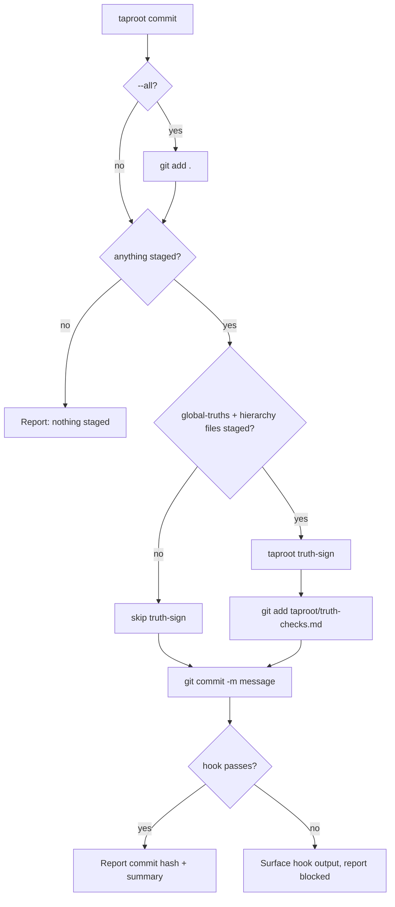

# Behaviour: Commit Workflow Orchestration

## Actor
Developer or AI agent calling `taproot commit` as a one-command replacement for the multi-step commit sequence.

## Preconditions
- `git` is available in the working directory
- The working directory is a git repository
- At least one file is staged (`git diff --cached` is non-empty) — or `--all` is specified

## Main Flow

1. Developer or agent calls `taproot commit [<message>] [--all] [--dry-run]`
2. System runs `git status --short` to show what is staged and unstaged
3. If `--all` is specified: system runs `git add .` to stage all changes
4. **Truth-sign step:** If `taproot/global-truths/` exists and hierarchy files (`intent.md`, `usecase.md`) are staged, system runs `taproot truth-sign` to generate the session marker (`taproot/truth-checks.md`)
5. If `taproot/truth-checks.md` was written, system stages it: `git add taproot/truth-checks.md`
6. System runs `git commit -m "<message>"` with the provided message, or opens the editor if no message is given
7. System reports commit hash and summary

## Alternate Flows

### No message provided
- **Trigger:** `taproot commit` called without a `<message>` argument and `--no-edit` not set
- **Steps:**
  1. System opens `$GIT_EDITOR` (or `$VISUAL` / `$EDITOR`) for the commit message
  2. If editor exits with empty message: system aborts — "Aborting commit due to empty commit message."
  3. If editor exits with a non-empty message: system proceeds from step 4

### Dry-run mode
- **Trigger:** `--dry-run` flag is passed
- **Steps:**
  1. System reports what would be staged, what truth-sign would produce, and what commit message would be used
  2. No `git add`, no `git commit`, no `taproot truth-sign` writes occur
  3. System exits without modifying any files or git state

### No global-truths — skip truth-sign
- **Trigger:** `taproot/global-truths/` does not exist, or no hierarchy files are staged
- **Steps:**
  1. System skips the truth-sign step entirely (steps 4–5 of main flow)
  2. System proceeds directly to `git commit`

### Nothing staged and `--all` not specified
- **Trigger:** `git diff --cached` returns nothing and `--all` was not passed
- **Steps:**
  1. System reports: "Nothing staged. Use `taproot commit --all` to stage all changes, or `git add <files>` first."
  2. System exits without committing

### Pre-commit hook failure
- **Trigger:** `git commit` triggers the pre-commit hook (`taproot commithook`) which exits non-zero
- **Steps:**
  1. System surfaces the hook's output verbatim so the developer can see the failure reason
  2. System reports: "Commit blocked by pre-commit hook. Fix the issues above and re-run `taproot commit`."
  3. No commit is created; staged files remain staged

## Postconditions
- A new git commit exists with the provided or entered message
- `taproot/truth-checks.md` is included in the commit if hierarchy files were staged and global-truths exist
- The working tree reflects the committed state

## Error Conditions
- **`git` not available**: System reports "git not found in PATH" and exits.
- **Not a git repository**: System reports "Not a git repository" and exits.
- **`truth-sign` fails**: System surfaces the truth-sign error and stops before `git commit` — the commit does not proceed with a broken session marker.
- **Commit message contains only whitespace**: System reports "Aborting commit due to empty commit message." and exits without committing.

## Flow

## Related
- `taproot/specs/quality-gates/definition-of-done/usecase.md` — DoD gate is enforced by the pre-commit hook triggered by `git commit`
- `taproot/specs/global-truth-store/truth-consistency-check/usecase.md` — truth-sign writes the session marker this command stages
- `taproot/specs/agent-integration/hook-compatibility/usecase.md` — error messages from the hook must be actionable for all agents

## Acceptance Criteria

**AC-1: Happy path — hierarchy files staged, global-truths present**
- Given hierarchy files are staged and `taproot/global-truths/` exists
- When the developer runs `taproot commit "my message"`
- Then `taproot truth-sign` runs, `taproot/truth-checks.md` is staged, and `git commit -m "my message"` is executed

**AC-2: No hierarchy files staged — truth-sign skipped**
- Given only source files (no `intent.md` / `usecase.md`) are staged
- When the developer runs `taproot commit "my message"`
- Then `taproot truth-sign` is NOT called and `git commit -m "my message"` executes directly

**AC-3: No global-truths directory — truth-sign skipped**
- Given `taproot/global-truths/` does not exist
- When the developer runs `taproot commit "my message"`
- Then `taproot truth-sign` is NOT called and the commit proceeds

**AC-4: `--all` stages all changes before committing**
- Given unstaged modified files exist
- When the developer runs `taproot commit --all "my message"`
- Then `git add .` is run first, then the commit proceeds with all previously-unstaged changes included

**AC-5: Nothing staged and no `--all` — informative error**
- Given `git diff --cached` returns nothing and `--all` is not specified
- When the developer runs `taproot commit "my message"`
- Then the system reports that nothing is staged and suggests `--all` or `git add`, without committing

**AC-6: Pre-commit hook failure surfaces hook output**
- Given staged files trigger a failing pre-commit hook
- When the developer runs `taproot commit "my message"`
- Then the hook's output is shown verbatim and the system reports "Commit blocked by pre-commit hook"

**AC-7: Dry-run makes no changes**
- Given any staged or unstaged changes
- When the developer runs `taproot commit "my message" --dry-run`
- Then the system reports what would happen without modifying git state or writing files

**AC-8: truth-sign failure stops commit**
- Given hierarchy files are staged and `taproot truth-sign` exits non-zero
- When `taproot commit` runs the truth-sign step
- Then `git commit` is NOT called and the truth-sign error is reported

## Implementations <!-- taproot-managed -->
- [CLI Command](./cli-command/impl.md)

## Status
- **State:** implemented
- **Created:** 2026-03-29
- **Last reviewed:** 2026-03-30
