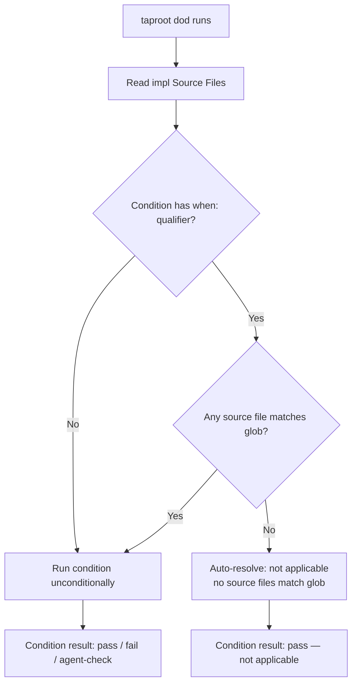

# Behaviour: Scoped DoD/DoR Conditions

## Actor
Developer — configuring `taproot/settings.yaml` to scope DoD/DoR conditions to specific implementation types using source file glob patterns.

## Preconditions
- `taproot/settings.yaml` exists with a `definitionOfDone` or `definitionOfReady` section
- At least one condition in those sections includes a `when: source-matches:` qualifier

## Main Flow

1. Developer adds a `when: source-matches: "<glob>"` qualifier to a condition in `taproot/settings.yaml`:
   ```yaml
   definitionOfDone:
     - check-if-affected-by: skill-architecture/context-engineering
       when: source-matches: "skills/*.md"
     - check-if-affected-by: api-design/rest-conventions
       when: source-matches: "src/api/**/*.ts"
   ```
2. When `taproot dod` runs for an implementation, system reads the `## Source Files` section of `impl.md` to collect the impl's source file paths.
3. For each condition with a `when: source-matches:` qualifier, system checks whether any listed source file matches the glob pattern.
4. If a source file matches: condition runs normally (agent check, shell command, or built-in).
5. If no source file matches: condition is automatically resolved as `not applicable — no source files match \`<glob>\`` and recorded in `## DoD Resolutions`. No agent work is required.
6. Unscoped conditions (no `when:` qualifier) continue to run unconditionally, as before.

## Alternate Flows

### impl.md has no ## Source Files section
- **Trigger:** The impl being checked has no `## Source Files` section.
- **Steps:**
  1. System treats all scoped conditions as non-matching — each is auto-resolved as `not applicable — impl has no ## Source Files section`.
  2. Unscoped conditions run normally.

### Glob matches all source files (overly broad pattern)
- **Trigger:** Developer uses a pattern like `**/*` that matches every file.
- **Steps:**
  1. System runs the condition as normal — matching is not an error.
  2. No warning is emitted; the developer is responsible for glob specificity.

### Multiple conditions with overlapping globs
- **Trigger:** Two conditions both match the same source file.
- **Steps:**
  1. Both conditions run independently — overlap is not an error.
  2. Each is resolved separately.

## Postconditions
- Scoped conditions that do not match are recorded as `not applicable` in `## DoD Resolutions` without requiring agent reasoning.
- Scoped conditions that match run exactly as they would without a `when:` qualifier.
- The total number of conditions requiring agent attention per impl is reduced to only those relevant to the impl's source file types.

## Error Conditions
- **Malformed `when:` qualifier:** `taproot dod` reports a parse error: `"Condition '<name>' has an unrecognised 'when:' value: '<value>'. Expected: 'source-matches: <glob>'"` and skips the condition.
- **`## Source Files` lists a path that does not exist:** System matches against the listed path string regardless — file existence is not checked during glob matching.

## Flow



## Related
- `../definition-of-done/usecase.md` — this behaviour extends DoD condition syntax with the `when:` qualifier
- `../definition-of-ready/usecase.md` — same `when:` qualifier applies to DoR conditions

## Acceptance Criteria

**AC-1: Scoped condition auto-resolves when no source file matches**
- Given a condition with `when: source-matches: "skills/*.md"` and an impl whose `## Source Files` lists only TypeScript files
- When `taproot dod` runs
- Then the condition is recorded as `not applicable — no source files match \`skills/*.md\`` without requiring agent input

**AC-2: Scoped condition runs normally when a source file matches**
- Given a condition with `when: source-matches: "skills/*.md"` and an impl whose `## Source Files` lists `skills/my-skill.md`
- When `taproot dod` runs
- Then the condition runs as if no `when:` qualifier were present

**AC-3: Unscoped conditions are unaffected**
- Given a mix of scoped and unscoped conditions in `settings.yaml`
- When `taproot dod` runs
- Then unscoped conditions run for every impl regardless of source files

**AC-4: impl with no ## Source Files auto-resolves all scoped conditions**
- Given an impl with no `## Source Files` section and one or more scoped conditions
- When `taproot dod` runs
- Then each scoped condition is auto-resolved as `not applicable — impl has no ## Source Files section`

**AC-5: Malformed when: qualifier produces a parse error**
- Given a condition with `when: unknown-qualifier: "*.ts"`
- When `taproot dod` runs
- Then a parse error is reported naming the condition and the unrecognised qualifier, and the condition is skipped

## Implementations <!-- taproot-managed -->

## Status
- **State:** specified
- **Created:** 2026-03-28
- **Last reviewed:** 2026-03-28

## Notes
- The `when: source-matches:` qualifier uses standard glob syntax (same as `.gitignore` patterns). Multi-segment patterns (`**`) are supported.
- The primary use case is conditions that apply only to specific implementation types — e.g. skill files, API handlers, CLI commands — that would otherwise produce repetitive "not applicable" resolutions across all other impls.
- The `when:` qualifier does not change condition priority or ordering — it only controls whether the condition runs.
- Future extensions could support `when: impl-path-matches:` (match on the impl.md path) or `when: intent-matches:` (match on the parent intent), but `source-matches:` covers the primary use case.
