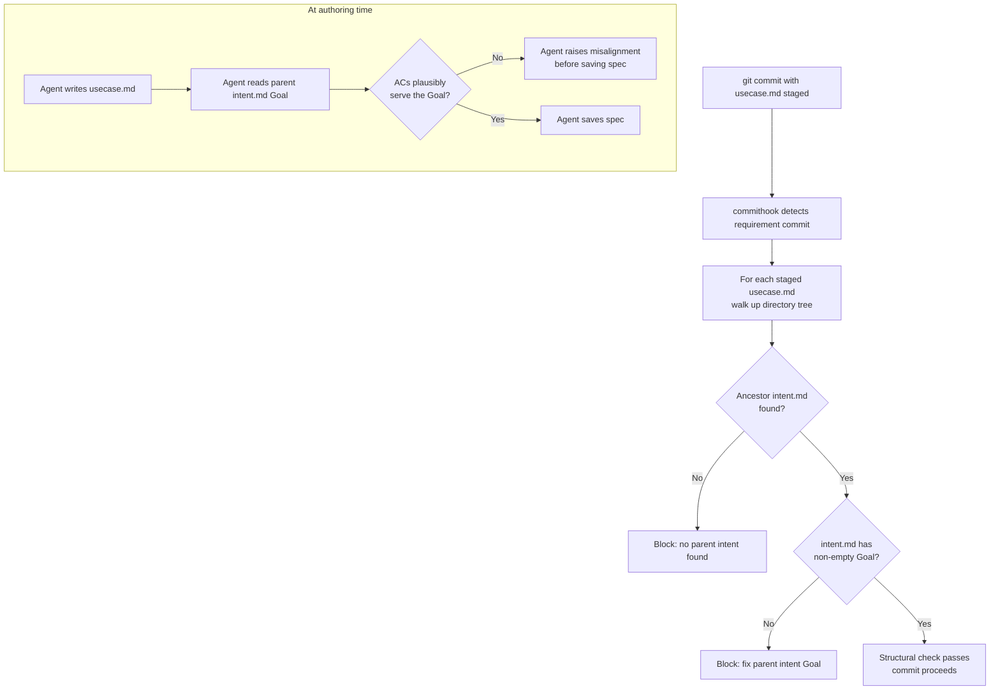

# Behaviour: Validate Behaviour–Intent Alignment at Commit

## Actor
`taproot commithook` (structural check) and agent/developer (semantic check) — triggered when a `usecase.md` is committed

## Preconditions
- A git pre-commit hook invoking `taproot commithook` is installed
- The commit contains at least one `usecase.md` file
- No `impl.md` files are staged (pure requirement commit)

## Main Flow
1. `taproot commithook` detects staged `usecase.md` files — classifies as a requirement commit
2. For each staged `usecase.md`, system walks up the directory tree to locate the nearest ancestor `intent.md`
3. System checks that the located `intent.md` has a `## Goal` section and that it is non-empty
4. If the structural check passes: commit proceeds
5. If the structural check fails: system prints the failure with a correction hint and blocks the commit

Before the commit (at authoring time):

6. Agent reads the parent `intent.md`'s `## Goal` section before writing the spec
7. Agent reviews the draft usecase's Actor, Main Flow, and Acceptance Criteria against the goal
8. If the ACs do not plausibly serve the intent's goal, agent raises the misalignment before saving the spec

## Alternate Flows

### Agent context guidance (soft path)
- **Trigger:** Agent is writing a `usecase.md` — before the commit gate fires
- **Steps:**
  1. Agent is instructed (via CLAUDE.md) to verify that the new behaviour's ACs plausibly serve the parent intent's Goal
  2. Agent reads the parent `intent.md` before writing the spec
  3. Agent writes a usecase whose ACs address the goal — gate passes without rejection

### Sub-behaviour (parent is a usecase, not an intent)
- **Trigger:** The staged `usecase.md` lives under a parent `usecase.md` rather than directly under an `intent.md`
- **Steps:**
  1. System continues traversal up the directory tree past the parent `usecase.md`
  2. System locates the nearest ancestor `intent.md`
  3. Same structural check applies

### No ancestor intent found
- **Trigger:** Traversal reaches the repository root without finding an `intent.md`
- **Steps:**
  1. System blocks with: "No parent `intent.md` found for `<path>` — place this behaviour under an intent folder"
  2. Developer places the usecase under an intent folder or creates the intent before recommitting

## Postconditions
- Every committed `usecase.md` has a reachable parent `intent.md` with a non-empty Goal
- Agents writing usecases verify goal alignment at authoring time, surfacing misalignments before the commit gate fires

## Error Conditions
- **No ancestor `intent.md` found**: "No parent `intent.md` found for `<path>` — place this behaviour under an intent folder or create the intent first"
- **Parent `intent.md` has no `## Goal` section**: "Parent intent at `<path>` is missing a `## Goal` section — add a goal before committing a behaviour under it"
- **Parent `intent.md` has empty Goal**: "Parent intent at `<path>` has an empty `## Goal` — fill in the goal before committing a behaviour under it"

## Flow

## Related
- `../validate-usecase-quality/usecase.md` — sibling: structural quality of the usecase itself (AC presence, actor, postconditions)
- `../validate-intent-quality/usecase.md` — sibling: quality of the intent (verb-first goal, stakeholders, success criteria)
- `../definition-of-ready/usecase.md` — sibling: DoR conditions on impl.md commits
- `../../global-truth-store/enforce-truths-at-commit/usecase.md` — sibling hook that runs alongside this check

## Acceptance Criteria

**AC-1: Orphan usecase blocked**
- Given a `usecase.md` staged with no ancestor `intent.md` in the directory tree
- When `git commit` runs
- Then the hook blocks with: "No parent `intent.md` found for `<path>`"

**AC-2: Parent intent with Goal passes**
- Given a `usecase.md` staged with an ancestor `intent.md` containing a non-empty `## Goal`
- When `git commit` runs
- Then the structural check passes and the commit proceeds

**AC-3: Parent intent with empty Goal is blocked**
- Given a `usecase.md` staged with an ancestor `intent.md` whose `## Goal` section is present but empty
- When `git commit` runs
- Then the hook blocks with: "Parent intent has an empty `## Goal`"

**AC-4: Parent intent missing Goal section is blocked**
- Given a `usecase.md` staged with an ancestor `intent.md` that has no `## Goal` section at all
- When `git commit` runs
- Then the hook blocks with: "Parent intent is missing a `## Goal` section"

**AC-5: Sub-behaviour traverses to root intent**
- Given a `usecase.md` staged under a parent `usecase.md` (sub-behaviour), with a root ancestor `intent.md` that has a valid Goal
- When `git commit` runs
- Then the structural check traverses past the parent `usecase.md` and passes using the root `intent.md`

**AC-6: Agent raises misalignment before saving**
- Given an agent is writing a `usecase.md` whose Acceptance Criteria do not address the parent intent's Goal
- When the agent reviews the draft spec before committing
- Then the agent raises the misalignment and asks to revise the ACs or reframe the intent before proceeding

## Implementations <!-- taproot-managed -->
- [Commithook Extension + CLAUDE.md Guidance](./commithook-extension/impl.md)

## Status
- **State:** implemented
- **Created:** 2026-03-29
- **Last reviewed:** 2026-03-29
