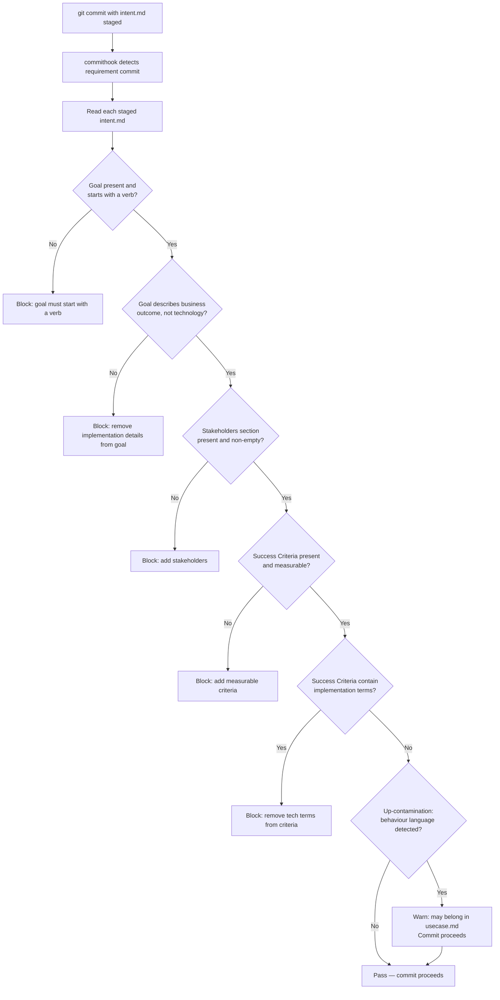

# Behaviour: Validate Intent Quality at Commit

## Actor
`taproot commithook` — triggered automatically when an `intent.md` is committed (requirement commit)

## Preconditions
- A git pre-commit hook invoking `taproot commithook` is installed
- The commit contains at least one `intent.md` file
- No `impl.md` files are staged (pure requirement commit)

## Main Flow
1. `taproot commithook` detects that staged files include `intent.md` — classifies as a requirement commit
2. System reads each staged `intent.md`
3. System checks baseline intent quality conditions:
   a. `## Goal` section is present and starts with a verb (e.g. "Enable", "Allow", "Provide", "Ensure") — goal describes a business outcome, not a technical mechanism
   b. `## Stakeholders` section is present and lists at least one stakeholder with their perspective
   c. `## Success Criteria` section is present and contains at least one measurable criterion (not just restating the goal)
   d. Goal does not describe implementation details (e.g. "Use a REST API to...", "Store data in PostgreSQL so...")
   e. `## Success Criteria` entries do not describe implementation details (same technology term check as Goal — configuration keys, CLI commands, file names, and internal system names are implementation terms)
   f. Goal and Success Criteria do not contain behaviour-level language — observable actor actions, system step descriptions, or interaction sequences that belong in `usecase.md`; if detected: warn without blocking (up-contamination trigger, see Alternate Flow)
4. If all blocking conditions pass: commit proceeds
5. If any blocking conditions fail: system prints each failure with a correction hint and blocks the commit
6. If up-contamination is detected (condition f): system surfaces a non-blocking warning after any blocking checks pass

## Alternate Flows

### Agent context guidance (soft path)
- **Trigger:** Agent is writing an `intent.md` — before the commit gate fires
- **Steps:**
  1. Agent is instructed (via CLAUDE.md / agent context) what makes a valid intent
  2. Agent writes the intent meeting quality criteria on the first attempt
  3. Gate passes without rejection

### Custom quality conditions
- **Trigger:** Project configuration defines `definitionOfIntent` conditions
- **Steps:**
  1. System runs custom conditions alongside baseline checks
  2. Results reported and failures block the commit

### Up-contamination detected — behaviour content in intent
- **Trigger:** Goal or Success Criteria contains behaviour-level language (e.g. "when the user clicks...", "system displays...", "navigates to...", step-by-step action descriptions, interaction sequences)
- **Steps:**
  1. Commit is not blocked — this is a propagation trigger, not a formatting violation
  2. System surfaces: "This intent may contain behaviour-level content: `<excerpt>`. Consider capturing it in a `usecase.md` via `/tr-behaviour` or `/tr-refine` on a related behaviour."
  3. Developer acknowledges; commit proceeds

## Postconditions
- Every committed `intent.md` has a verb-first business goal, at least one stakeholder, and at least one measurable success criterion
- Goal and Success Criteria contain no implementation terms
- Agents writing intents encounter the quality bar at commit time with actionable correction hints
- Up-contamination (behaviour content in intent) is surfaced as a warning — developer is prompted to propagate the content to the right level

## Error Conditions
- **`## Goal` missing or does not start with a verb**: "Goal must start with a verb describing a business outcome — e.g. 'Enable users to...', 'Allow operators to...'. Current: '`<current value>`'"
- **Goal describes implementation mechanism**: "Goal should describe the business outcome, not the technical approach. Remove references to specific implementation technology."
- **`## Stakeholders` missing or empty**: "Add a `## Stakeholders` section with at least one stakeholder and their perspective"
- **`## Success Criteria` missing or restates the goal**: "Add at least one measurable success criterion that is observable and distinct from the goal statement"
- **Success Criteria contain implementation terms** (blocking): "Success Criteria should describe observable stakeholder outcomes. Remove implementation technology references from: `<excerpt>`"
- **Up-contamination detected** (non-blocking warning): "This intent may contain behaviour-level content: `<excerpt>`. Consider capturing it in a `usecase.md` via `/tr-behaviour` or `/tr-refine` on a related behaviour."

## Flow

## Related
- `../validate-usecase-quality/usecase.md` — sibling: usecase quality gate (AC, actor, flow perspective)
- `../definition-of-ready/usecase.md` — sibling: DoR runs on impl.md commits; this gate runs on intent.md commits
- `../../hierarchy-integrity/pre-commit-enforcement/usecase.md` — the hook that runs this gate

## Acceptance Criteria

**AC-1: Missing Goal section blocks commit**
- Given an `intent.md` with no `## Goal` section is staged
- When `git commit` runs
- Then the hook blocks with: "Goal must start with a verb describing a business outcome"

**AC-2: Goal starting with a verb passes**
- Given an `intent.md` whose Goal reads "Enable users to manage their subscriptions"
- When `git commit` runs
- Then the goal check passes

**AC-3: Goal describing technology blocks commit**
- Given an `intent.md` whose Goal reads "Use a REST API to expose subscription data"
- When `git commit` runs
- Then the hook blocks with: "Goal should describe the business outcome, not the technical approach"

**AC-4: Missing Stakeholders blocks commit**
- Given an `intent.md` with no `## Stakeholders` section is staged
- When `git commit` runs
- Then the hook blocks with: "Add a Stakeholders section"

**AC-5: Missing Success Criteria blocks commit**
- Given an `intent.md` with no `## Success Criteria` section is staged
- When `git commit` runs
- Then the hook blocks with: "Add at least one measurable success criterion"

**AC-6: All checks pass — commit proceeds**
- Given an `intent.md` with a verb-first business goal, stakeholders, and measurable success criteria
- When `git commit` runs
- Then all quality checks pass and the commit is not blocked

**AC-7: Success Criteria containing implementation terms blocks commit**
- Given an `intent.md` whose Success Criteria reads "A developer can activate a module by adding it to `settings.yaml`"
- When `git commit` runs
- Then the hook blocks with: "Success Criteria should describe observable stakeholder outcomes. Remove implementation technology references"

**AC-8: Up-contamination surfaces warning without blocking commit**
- Given an `intent.md` whose Goal reads "When the user clicks Activate, the system installs the module files"
- When `git commit` runs
- Then the hook warns "This intent may contain behaviour-level content" and the commit proceeds without blocking

## Implementations <!-- taproot-managed -->
- [Multi-Surface — commithook.ts + CLAUDE.md + tests](./multi-surface/impl.md)

## Status
- **State:** implemented
- **Created:** 2026-03-20
- **Last reviewed:** 2026-04-11
