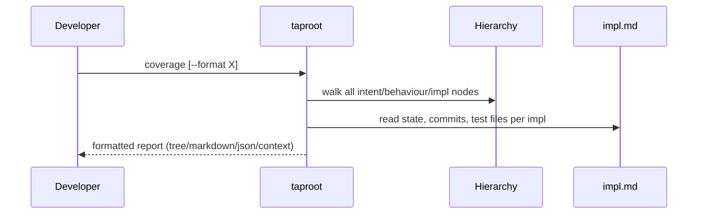

# UseCase: Generate Coverage Report

## Actor
Developer or operator running `taproot coverage`

## Preconditions
- A taproot hierarchy exists with at least one intent

## Main Flow
1. Developer runs `taproot coverage` (optionally with `--format tree|json|markdown|context`)
2. System walks the hierarchy, building a summary of every intent, behaviour, and implementation
3. For each implementation, system reads `impl.md` to extract state, commit count, and test file count
4. System computes totals: intents, behaviours, implementations, complete implementations, tested implementations
5. System renders the report in the requested format:
   - **tree** (default): ASCII tree with progress bars showing complete/total impl per behaviour
   - **markdown**: heading-based report suitable for GitHub or docs sites
   - **json**: machine-readable structured data for tooling integration
   - **context**: generates `taproot/CONTEXT.md` — a navigable summary for AI agents, including a "Needs Attention" section
6. For `--format context`, system writes the file to `taproot/CONTEXT.md` and reports the path; all other formats display the report directly

## Alternate Flows
- **`--format context`**: Side-effect output — writes `CONTEXT.md` rather than displaying it directly; includes a "Needs Attention" section with in-progress, untested, and unimplemented items

## Error Conditions
- **No intents found**: Reports zero counts; no error exit

## Postconditions
- Developer can see at a glance how much of the requirement hierarchy is specified, implemented, and tested
- AI agents can load `CONTEXT.md` for a compact navigable summary without reading every document

## Diagram

## Implementations <!-- taproot-managed -->
- [CLI Command — taproot coverage](./cli-command/impl.md)

## Acceptance Criteria

**AC-1: Returns correct intent, behaviour, and implementation counts**
- Given a hierarchy with 1 intent, 2 behaviours, and 4 implementations
- When the actor runs `taproot coverage`
- Then totals report 1 intent, 2 behaviours, and 4 implementations

**AC-2: Reflects correct complete and tested impl counts**
- Given a hierarchy where 4 impls are complete and 3 have test files
- When the actor runs `taproot coverage`
- Then `completeImpls` is 4 and `testedImpls` is 3

**AC-3: Captures intent state and name**
- Given an intent with `state: active` and name `user-onboarding`
- When the actor runs `taproot coverage`
- Then the intent entry in the report has `state: active` and `name: user-onboarding`

**AC-4: JSON format is valid and has correct structure**
- Given any valid hierarchy
- When the actor runs `taproot coverage --format json`
- Then the output is parseable JSON with `totals` and `intents` properties

**AC-5: Tree format shows intent name, state, and ⚠ for untested impls**
- Given a hierarchy containing an impl with no test files
- When the actor runs `taproot coverage --format tree`
- Then the output contains the intent name, its state in brackets, and a ⚠ symbol

**AC-6: Markdown format contains required headings**
- Given any valid hierarchy
- When the actor runs `taproot coverage --format markdown`
- Then the output contains `# Taproot Coverage Report` and the intent name

## Status
- **State:** implemented
- **Created:** 2026-03-19
