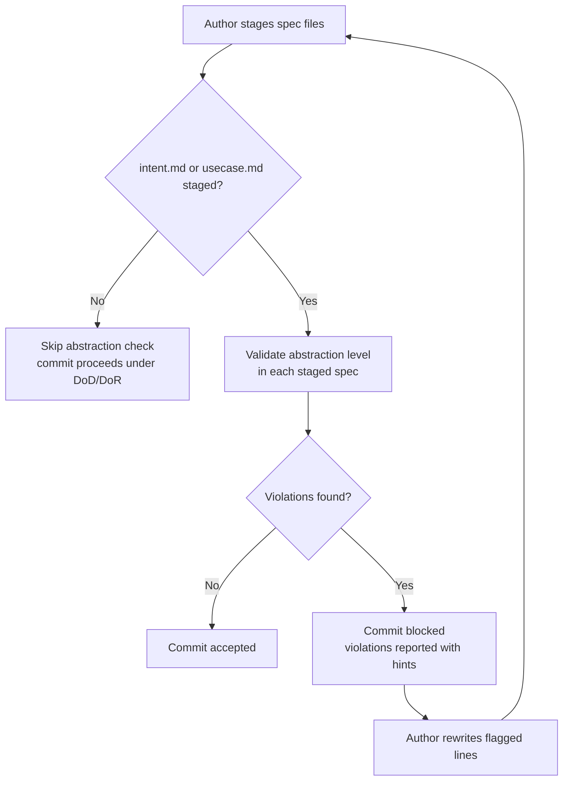

# Behaviour: Enforce Spec Abstraction Level

## Actor
Developer or agent authoring or committing a spec file (`intent.md` or `usecase.md`)

## Preconditions
- A `taproot/` hierarchy exists in the project
- The author is writing or staging a spec file for commit

## Main Flow
1. Author stages an `intent.md` or `usecase.md` and initiates a commit.
2. System checks the staged spec files for abstraction-level compliance.
3. System verifies that each staged spec contains no provably-wrong abstraction patterns:
   - `intent.md` `## Goal` and `## Success Criteria` describe business outcomes, not technologies used to achieve them.
   - `usecase.md` `## Actor` names a human, external system, or service — not an implementation mechanism.
   - `usecase.md` `## Main Flow` steps name actors and their visible actions, not internal systems processing them.
   - `usecase.md` `## Postconditions` state what is true for the actor after success, not what the system did internally.
4. System accepts the commit when all staged specs pass the abstraction check.

## Alternate Flows

### Only impl.md files are staged
- **Trigger:** No `intent.md` or `usecase.md` among the staged files — only `impl.md` or source files.
- **Steps:**
  1. Hook skips the abstraction-level check entirely.
  2. Commit proceeds under the applicable DoD or DoR gate.
  3. `impl.md` files may and should describe internal mechanisms — that is their purpose.

### Spec references a technical term in an NFR criterion
- **Trigger:** An `**NFR-N:**` Gherkin entry in `## Acceptance Criteria` contains measurable thresholds referencing technical units (response time in ms, error rate as a percentage, concurrent users).
- **Steps:**
  1. Hook accepts the NFR criterion without flagging it — measurable thresholds are the required form for NFRs.
  2. Commit proceeds if no other violations exist.

## Postconditions
- All committed `intent.md` and `usecase.md` files describe business goals and observable actor behaviour
- No committed spec contains provably-wrong abstraction patterns (mechanism-as-actor, technology-in-Goal)

## Error Conditions
- **Technology reference in Goal or Success Criteria**: System reports the file and line; suggests describing the business outcome instead (e.g. "Enable teams to … using Supabase" → "Enable teams to authenticate securely")
- **Technology reference in Main Flow, Postconditions, Alternate Flows, or Error Conditions**: System reports the file, section, and line; suggests reformulating as an actor-visible action or outcome (e.g. "System queries the PostgreSQL database" → "System retrieves the matching records")
- **Implementation mechanism named as Actor**: System reports the file; suggests naming a human role, external system, or service instead (e.g. "The API endpoint" → "External service")

## Flow

## Related
- `../configure-hierarchy/usecase.md` — abstraction-level rules are part of framework quality gates configurable via settings.yaml
- `../../quality-gates/definition-of-done/usecase.md` — shares the commit-gate mechanism; both run at commit time
- `../../skill-architecture/commit-awareness/usecase.md` — skills guide authors toward abstraction-level compliance before the commit gate

## Acceptance Criteria

**AC-1: Clean spec passes the abstraction check**
- Given a staged `usecase.md` whose Main Flow, Postconditions, and Alternate Flows describe only actor-visible outcomes with no provably-wrong abstraction patterns
- When the developer commits
- Then the commit is accepted with no abstraction-level violations reported

**AC-2: Technology name in Goal blocks the intent commit**
- Given a staged `intent.md` whose `## Goal` names a specific technology (e.g. "Enable teams to use Auth0 for login")
- When the developer commits
- Then the commit is blocked and the report identifies the Goal section, the offending line, and a remediation hint

**AC-3: Technology name in Main Flow blocks the behaviour commit**
- Given a staged `usecase.md` whose `## Main Flow` steps name an internal system or service (e.g. "System calls the Supabase Auth endpoint")
- When the developer commits
- Then the commit is blocked and the report identifies the file, section, and offending line

**AC-4: Technology name in Postconditions blocks the behaviour commit**
- Given a staged `usecase.md` whose `## Postconditions` describe an internal state rather than an actor-visible outcome (e.g. "A row is inserted into the users table")
- When the developer commits
- Then the commit is blocked and the report identifies the Postconditions section and the offending line

**AC-5: impl.md is exempt from abstraction check**
- Given only `impl.md` files (and no `intent.md` or `usecase.md`) are staged
- When the developer commits
- Then the abstraction-level check is skipped and the commit proceeds under the DoD gate

**AC-6: NFR measurable thresholds are not flagged**
- Given a staged `usecase.md` whose `## Acceptance Criteria` contains an `**NFR-1:**` entry referencing response time in milliseconds
- When the developer commits
- Then the NFR criterion is not treated as an abstraction-level violation

**AC-7: Violation report provides actionable remediation**
- Given a commit blocked for abstraction-level violations
- When the developer reads the error output
- Then the report names the file, section, and line, and provides a one-line reformulation hint for each violation

**AC-8: Technology name in Alternate Flows or Error Conditions is also flagged**
- Given a staged `usecase.md` whose `## Alternate Flows` or `## Error Conditions` sections name an internal technology
- When the developer commits
- Then the commit is blocked and the report identifies the section and the offending line

## Status
- **State:** specified
- **Created:** 2026-03-31
- **Last reviewed:** 2026-04-01
