# Behaviour: Implement a Behaviour Incrementally

## Actor
Developer or agent scoping implementation of a behaviour whose acceptance criteria span more than one delivery iteration

## Preconditions
- A `usecase.md` exists with two or more ACs
- The developer has decided that not all ACs will be delivered in the current iteration
- The ACs not in scope are understood well enough to be explicitly deferred (not simply forgotten)

## Main Flow
_(Pattern A — sub-behaviour decomposition: use when the deferred ACs have meaningfully different flows, actors, or preconditions)_

1. Developer identifies which ACs will be delivered now and which will be deferred
2. Developer runs `/tr-decompose` on the parent behaviour to create one sub-behaviour per distinct deliverable unit
3. Sub-behaviours not in the current iteration are created with state `deferred`
4. In-scope sub-behaviour proceeds through its normal lifecycle: `proposed` → `specified` → `implemented` → `tested`
5. Deferred sub-behaviours appear in `/tr-status` (Parked section) and are surfaced by `/tr-next` for future iterations
6. When a future iteration picks up a deferred sub-behaviour, developer changes its state to `proposed` and runs `/tr-implement`

## Alternate Flows

### Pattern B — single spec, AC-scoped implementation
- **Trigger:** All ACs follow the same actor flow and differ only in mechanism (e.g., multiple authentication methods with identical step shape, multiple export formats with identical UX)
- **Steps:**
  1. Developer creates `impl.md` under the behaviour for the in-scope ACs
  2. In `## Design Decisions`, developer notes which ACs are covered: "Covers AC-1 (password login). AC-2 (MFA), AC-3 (OAuth), AC-4 (passkey) deferred to future iterations."
  3. At DoD time, deferred ACs are explicitly resolved with a deferral note per AC: "AC-2 (MFA): deferred — not in scope for this release; will require a separate impl"
  4. In future iterations, developer adds a new `impl.md` for each deferred AC group, or reworks the existing impl to extend coverage

### Developer is unsure which pattern to use
- **Trigger:** The deferred ACs may or may not share the same flow shape
- **Steps:**
  1. Agent asks: "Do the deferred ACs follow meaningfully different steps, involve different actors, or have different preconditions?"
  2. If yes → Pattern A (sub-behaviours)
  3. If no → Pattern B (AC-scoped impl)
  4. If unsure → default to Pattern A; sub-behaviours are easier to merge later than to split apart

## Postconditions
- It is unambiguous which ACs are covered by the current implementation
- Deferred ACs are explicitly recorded — not silently omitted
- The behaviour's state and its children's states accurately reflect delivery progress
- Future iterations have a clear entry point: a `deferred` sub-behaviour or an unresolved AC deferral note

## Error Conditions
- **Deferred ACs left silent**: An impl that covers only some ACs without explicit deferral notes will fail DoD — the agent cannot pass a DoD condition it has not explicitly reasoned about
- **All ACs deferred at DoD**: An impl marked complete with all ACs deferred and none passing is not acceptable — at least one AC must be covered and its test verified

## Flow

```mermaid
flowchart TD
    A[Developer scopes partial delivery] --> B{Do deferred ACs have\ndifferent flows or actors?}
    B -- Yes --> C[Pattern A: /tr-decompose\ninto sub-behaviours]
    B -- No / same shape --> D[Pattern B: single impl.md\nAC-scoped coverage note]
    B -- Unsure --> C
    C --> E[In-scope sub-behaviour: proposed → implemented]
    C --> F[Deferred sub-behaviours: state = deferred]
    F --> G[Surfaced by /tr-status and /tr-next\nfor future iterations]
    D --> H[DoD: explicit deferral note per skipped AC]
    H --> I[Future iteration: new impl.md\ncovers remaining ACs]
    E --> J[Normal DoD gate — checks only in-scope ACs]
```

## Related
- `./park-hierarchy-item/usecase.md` — parks a whole behaviour or intent; incremental delivery parks individual ACs or sub-behaviours, not the parent
- `./configure-hierarchy/usecase.md` — DoD conditions govern what the agent checks at each impl commit

## Acceptance Criteria

**AC-1: Pattern A — sub-behaviours created for deferred ACs**
- Given a behaviour with 4 ACs where 3 are out of scope for the current iteration
- When the developer chooses Pattern A
- Then sub-behaviours are created for each AC group, deferred ones start at state `deferred`, and only the in-scope sub-behaviour proceeds to implementation

**AC-2: Pattern B — deferred ACs recorded explicitly in impl.md**
- Given a behaviour with 4 ACs that share the same flow shape
- When the developer chooses Pattern B and creates an impl.md covering AC-1 only
- Then the impl.md `## Design Decisions` names which ACs are covered and which are deferred, and DoD resolutions include an explicit deferral note for each uncovered AC

**AC-3: Silent omission blocked at DoD**
- Given an impl.md that covers AC-1 but contains no mention of AC-2, AC-3, or AC-4
- When the DoD gate runs
- Then the agent flags the unresolved ACs and does not mark the impl complete

**AC-4: Deferred sub-behaviour surfaced for future planning**
- Given a sub-behaviour with state `deferred`
- When the developer runs `/tr-status` or `/tr-next`
- Then the deferred sub-behaviour appears in the Parked section and is available for future iteration scoping

**AC-5: Pattern selection guidance when unsure**
- Given a developer who is unsure whether to use Pattern A or Pattern B
- When they ask the agent
- Then the agent asks whether the deferred ACs have different flows or actors, and defaults to Pattern A if the answer is unclear

## Status
- **State:** specified
- **Created:** 2026-03-29
- **Last reviewed:** 2026-03-29
