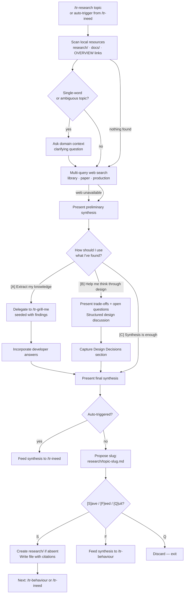

# Behaviour: Research a Subject

## Actor
Developer or AI agent — either invoking `/tr-research <topic>` explicitly, or triggered automatically from within `/tr-ineed` when a knowledge-intensive topic is detected.

## Preconditions
- A topic or domain to research has been identified (stated explicitly or extracted from a requirement)
- At least one research channel is available: local files, web search, or the developer is present as a potential domain expert

## Main Flow
1. Actor invokes `/tr-research <topic>` — or `/tr-ineed` triggers research internally after identifying a knowledge-intensive domain.
2. Skill announces the topic and begins gathering.
3. Skill scans local resources in order: (1) a `research/` folder if present, (2) `docs/` and project root for `.pdf` files, (3) files linked from OVERVIEW.md. Uses the topic as a semantic query against file content — name matching alone is insufficient (`thermal-design.pdf` may be relevant to `"heat dissipation"`).
4. If the topic is a single word or lacks domain context, skill asks one clarifying question before searching: `"What domain or language context should I scope this to?"` Then skill issues multiple targeted queries against the web (`"<topic> library"`, `"<topic> algorithm paper"`, `"<topic> production implementation"`) rather than a single literal search. Sources: existing libraries, papers, GitHub repos, Stack Overflow threads, standards documents — anything that informs implementation or design.
5. Skill presents a preliminary synthesis: what was found locally, what was found on the web, and the key take-aways so far.
6. Skill asks: **"How should I use what I've found?"**
   - **[A] Extract my knowledge** — skill delegates to `/tr-grill-me` seeded with the actual findings (library APIs, paper abstracts, known constraints) as grilling material; incorporates the developer's answers into the synthesis. Grill session terminates when the developer says `[Done]` or when no new information is surfacing (≤3 rounds of diminishing returns).
   - **[B] Help me think through the design** — skill presents the trade-offs, open questions, and competing options surfaced by the research; engages the developer in a structured design discussion; outputs a `## Design Decisions` section alongside the synthesis capturing choices made and rationale.
   - **[C] The synthesis is enough** — skill proceeds to step 7 with the gathered synthesis as-is.
7. Skill presents the final structured research summary (topic, local sources, web sources, expert insights, key conclusions, open questions).
8. Skill derives a kebab-case slug from the topic and proposes the save path: `"I'll save this as research/<topic-slug>.md — is that right?"` Developer confirms or corrects the slug. Then skill asks: **`[S] Save / [F] Feed directly into a spec / [Q] Discard and stop`**
   - **[S]** → creates `research/` directory if absent; writes `research/<topic-slug>.md` (see Postconditions); presents **Next:** `/tr-behaviour` or `/tr-ineed <topic>`
   - **[F]** → feeds synthesis forward as input context for `/tr-behaviour`; no file written
   - **[Q]** → discards the synthesis; skill exits without writing any file or chaining to another skill

## Alternate Flows

### No local resources found
- **Trigger:** Scan in step 3 finds no matching local files
- **Steps:**
  1. Skill notes "No local resources found" and proceeds to web search (step 4)

### Web search unavailable
- **Trigger:** Web search tool is not available in the agent's tool context
- **Steps:**
  1. Skill notes the limitation ("web search unavailable — running on local + expert only")
  2. Proceeds from step 5 with only local findings

### Knowledge extraction mode ([A])
- **Trigger:** Developer selects [A] in step 6
- **Steps:**
  1. Skill loads the preliminary synthesis as grilling material
  2. Delegates to `/tr-grill-me` with the synthesis as seed: questions reference specific libraries found, paper conclusions, known trade-offs — not generic prompts
  3. Developer answers; grill terminates on `[Done]` or ≤3 rounds of diminishing returns
  4. Skill incorporates developer's answers into the synthesis and returns to step 7

### Design assistance mode ([B])
- **Trigger:** Developer selects [B] in step 6
- **Steps:**
  1. Skill presents the key trade-offs and open questions surfaced by research (e.g. library A vs B, approach X vs Y, known constraints)
  2. Skill and developer discuss design options; skill challenges assumptions and surfaces risks using the research as grounding
  3. Skill captures agreed decisions and rationale in a `## Design Decisions` section
  4. Skill incorporates the design decisions into the synthesis and returns to step 7

### Auto-triggered from `/tr-ineed`
- **Trigger:** `/tr-ineed` detects a knowledge-intensive domain and invokes research internally (no explicit `/tr-research` invocation)
- **Steps:**
  1. Steps 2–7 run as normal
  2. Step 8 is skipped — synthesis is always fed forward to `/tr-ineed`; slug confirmation and save/feed/discard prompt are not presented
  3. `/tr-ineed` continues with the enriched synthesis as input context

### Topic already researched
- **Trigger:** A file at `research/<topic-slug>.md` already exists at step 2
- **Steps:**
  1. Skill presents: "Found existing research at `research/<topic-slug>.md` (last updated: `<date>`). [U]se it / [R]efresh it / [S]tart fresh?"
  2. **[U]** → loads existing document as the synthesis; skips to step 8
  3. **[R]** → runs the full flow (steps 3–7); merges new findings with the existing document, updating citations and conclusions; preserves prior expert insights unless superseded
  4. **[S]** → overwrites; runs the full flow

## Postconditions
- **Save path:** `research/<topic-slug>.md` exists with: topic title, local sources (file paths), web sources (URLs + titles), expert insights (if any), key conclusions, open questions, and a `## References` section with full citations
- **Feed path:** A structured synthesis (same structure as above, minus the file) has been passed as input context to the downstream skill
- **Discard path:** No file written; no downstream skill invoked

## Error Conditions
- **All research channels unavailable** (offline, no local files, no expert present): Skill announces "No research sources available" and asks whether to proceed with the spec based on the stated requirement alone or abort
- **Web search returns no relevant results**: Skill announces the null result and continues with local + expert sources; notes the gap in the synthesis

## Flow

## Related
- `../../human-integration/route-requirement/usecase.md` — `/tr-ineed` is the primary auto-trigger for research; shares the discovery-path flow
- `../../human-integration/grill-me/usecase.md` — expert grilling delegates to `/tr-grill-me` seeded with domain-specific findings

## Acceptance Criteria

**AC-1: Full research flow — save path**
- Given a topic has been identified and local resources, web search, and the developer are all available
- When the developer invokes `/tr-research <topic>`, answers "no" to the expert question, confirms the proposed slug, and chooses [S]ave
- Then a `research/<topic-slug>.md` file is written with cited local sources, web sources, key conclusions, and a References section; `research/` directory is created if it did not exist

**AC-2: Knowledge extraction ([A]) — grilling seeded with findings**
- Given the preliminary synthesis includes at least one library or paper
- When the developer selects [A] in step 6
- Then `/tr-grill-me` is invoked with the synthesis as seed material and its questions reference specific findings (library name, paper conclusion, or known trade-off) — not generic topic questions

**AC-2b: Design assistance ([B]) — trade-offs surfaced and decisions captured**
- Given a preliminary synthesis with competing options or open questions
- When the developer selects [B] in step 6
- Then the skill presents the trade-offs from the research, engages in design discussion, and the final synthesis includes a `## Design Decisions` section with choices and rationale

**AC-3: Feed path — synthesis passed to spec**
- Given a topic has been researched
- When the developer chooses [F]eed
- Then the synthesis is passed as input context to `/tr-behaviour` and no research file is written

**AC-4: Auto-trigger from `/tr-ineed`**
- Given `/tr-ineed` identifies a knowledge-intensive domain
- When it invokes research internally
- Then steps 2–7 run, the slug confirmation and save/feed/discard prompt are skipped, and the synthesis is returned to `/tr-ineed` as enriched context

**AC-5: No local resources — graceful skip**
- Given no local files match the topic
- When the scan in step 3 completes
- Then the skill notes the null result and proceeds to web search without blocking

**AC-6: Web search unavailable — graceful degradation**
- Given the agent's tool context has no web search
- When step 4 is reached
- Then the skill notes the limitation and continues with local + expert sources only

**AC-7: Topic already researched — use/refresh/start-fresh**
- Given `research/<topic-slug>.md` already exists
- When `/tr-research <topic>` is invoked
- Then the skill presents the existing file with its last-updated date and offers [U]se / [R]efresh / [S]tart fresh before proceeding

**AC-8: All channels unavailable — graceful fail**
- Given no local files, no web search, and no expert available
- When research is attempted
- Then the skill announces the gap and asks whether to proceed with the raw requirement or abort — it does not silently produce an empty synthesis

**AC-9: Refresh merges findings rather than overwriting**
- Given `research/<topic-slug>.md` exists and developer chooses [R]efresh
- When the full research flow completes
- Then new findings are merged into the existing document (new citations appended, conclusions updated) and prior expert insights are preserved unless explicitly superseded — not silently overwritten

**AC-10: Discard path — no output produced**
- Given a research synthesis has been completed
- When the developer chooses [Q]uit
- Then no file is written, no downstream skill is invoked, and the skill exits cleanly

**AC-11: Topic ambiguity — clarifying question before search**
- Given the topic is a single word or lacks domain context (e.g. `"sort"`, `"auth"`)
- When step 4 is reached
- Then the skill asks one clarifying question about domain or language context before issuing any web search queries

## Implementations <!-- taproot-managed -->
- [Agent Skill — /tr-research](./agent-skill/impl.md)

## Status
- **State:** implemented
- **Created:** 2026-03-20
- **Last reviewed:** 2026-03-27
- **Refined:** 2026-03-27 — step 6 reframed from "are you an expert?" to three-way mode selection: [A] extract knowledge (grill-me), [B] design assistance (trade-offs + Design Decisions section), [C] proceed as-is; AC-2b added
