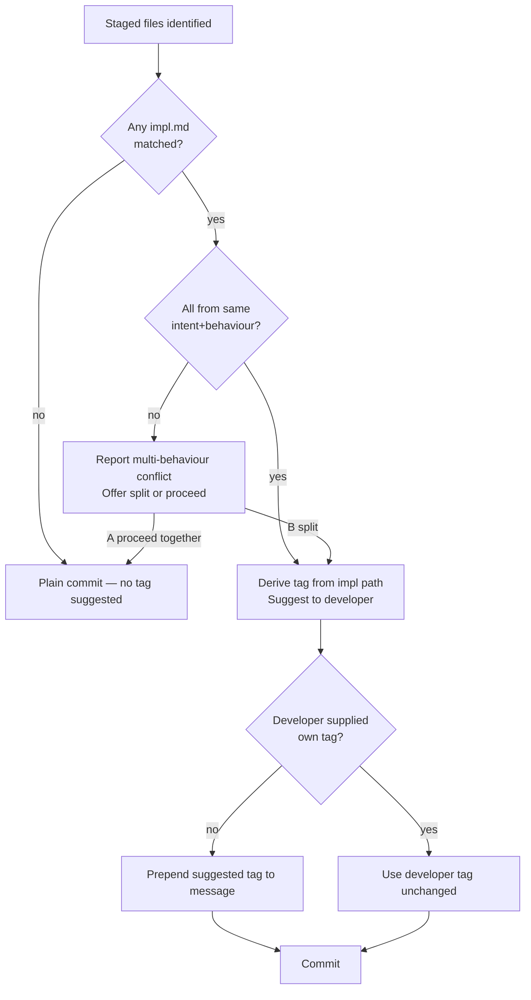

# Behaviour: Suggest Commit Tag from Staged Impl Paths

## Actor
Agent executing `/tr-commit` — determining the commit message prefix when the staged files are implementation files tracked by one or more `impl.md` records.

## Preconditions
- The agent has identified staged source files that are claimed by at least one `impl.md`
- The agent is about to compose the commit message
- The `impl.md` path follows the standard taproot hierarchy layout: `taproot/specs/<intent>/<behaviour>/<impl>/impl.md`

## Main Flow

1. Agent has matched staged source files to one or more `impl.md` files (via the `grep -rl` scan described in the commit skill).
2. For each matched `impl.md`, agent derives the conventional tag components from the file path:
   - Given path `taproot/specs/<intent>/<behaviour>/<impl>/impl.md`
   - Tag: `taproot(<intent>/<behaviour>/<impl>):`
   - Example: `taproot/specs/implementation-planning/execute-plan/agent-skill/impl.md` → `taproot(implementation-planning/execute-plan/agent-skill):`
3. If all matched impl.md files share the same intent+behaviour prefix (different impl folders under the same behaviour), collapse to the behaviour level:
   - Example: two impls under `quality-gates/definition-of-done/` → `taproot(quality-gates/definition-of-done):`
4. Agent presents the suggested tag to the developer:
   ```
   Suggested commit tag: taproot(implementation-planning/execute-plan/agent-skill):
   Commit message: taproot(implementation-planning/execute-plan/agent-skill): <your one-line summary>
   ```
5. Developer provides or confirms the message; agent commits with the suggested prefix prepended.

## Alternate Flows

### Developer already typed a message with a tag
- **Trigger:** The developer supplies a commit message that already starts with a tag (e.g. `fix:`, `feat:`, or `taproot(...):`).
- **Steps:**
  1. Agent does not suggest or override the existing tag.
  2. Agent proceeds to commit with the developer-supplied message unchanged.

### Multiple impls from different intents are staged
- **Trigger:** Staged files are tracked by impl.md files from two or more distinct intent paths (e.g. `quality-gates/definition-of-done/` and `implementation-planning/execute-plan/`).
- **Steps:**
  1. Agent cannot collapse to a single tag cleanly.
  2. Agent reports the conflict: *"Staged files span multiple behaviours: `<path-1>`, `<path-2>`. Suggested: commit them separately, one per behaviour, to keep commit history traceable."*
  3. Agent offers: `[A] Commit all together anyway (no single tag suggested)  [B] Split — commit one at a time`.
  4. If `[A]`: agent proceeds with a plain commit message, no tag inserted.
  5. If `[B]`: agent stages only the first behaviour's files, suggests its tag, and commits; then repeats for subsequent behaviours.

### No impl.md matched — plain commit
- **Trigger:** None of the staged files are tracked by any `impl.md`.
- **Steps:**
  1. No tag is suggested.
  2. Agent proceeds with a plain commit message.

### Impl path does not follow standard layout
- **Trigger:** The matched `impl.md` path is in an unconventional location that cannot be parsed into `<intent>/<behaviour>/<impl>` segments.
- **Steps:**
  1. Agent skips the tag suggestion for that impl.
  2. Agent notes: *"Could not derive tag from `<path>` — path layout unexpected. Commit message not pre-filled."*

## Postconditions
- The commit message starts with `taproot(<intent>/<behaviour>/<impl>):` (or collapsed behaviour-level prefix) when a single behaviour is staged.
- The tag is derived deterministically from the impl.md file path — no free-form input required.
- If the developer supplied their own tag, it is preserved unchanged.

## Error Conditions
- **Matched impl.md path is unreadable:** Agent skips the tag suggestion for that file, logs a warning, and proceeds with the commit.

## Flow



## Related
- `../ad-hoc-commit-prep/usecase.md` — identifies which impl.md files own staged source files; this behaviour runs immediately after, using that match result to derive the commit tag
- `../commit-skill/usecase.md` — the `/tr-commit` skill that orchestrates the full commit flow; this behaviour is a step within that skill
- `../../hierarchy-integrity/pre-commit-enforcement/usecase.md` — defines the commit type classification this tag derives from

## Acceptance Criteria

**AC-1: Tag derived from single impl path**
- Given staged files tracked by `taproot/specs/quality-gates/definition-of-done/cli-command/impl.md`
- When the agent suggests a commit tag
- Then the suggested tag is `taproot(quality-gates/definition-of-done/cli-command):`

**AC-2: Tag collapsed to behaviour level for multiple impls under same behaviour**
- Given staged files tracked by two impl.md files both under `taproot/specs/quality-gates/definition-of-done/`
- When the agent suggests a commit tag
- Then the suggested tag is `taproot(quality-gates/definition-of-done):`

**AC-3: Developer-supplied tag is preserved**
- Given the developer provides a commit message starting with `fix: correct DoD baseline check`
- When the agent detects an existing tag
- Then the agent does not prepend or modify the tag; message is committed as-is

**AC-4: Multi-intent staged files trigger split offer**
- Given staged files tracked by impl.md files from both `quality-gates/definition-of-done/` and `implementation-planning/execute-plan/`
- When the agent attempts to suggest a tag
- Then the agent reports a multi-behaviour conflict and offers `[A] Proceed together` or `[B] Split commits`

**AC-5: No tag suggested for plain commit**
- Given staged files not tracked by any impl.md
- When the commit message is composed
- Then no tag is suggested and the developer supplies the full message

## Implementations <!-- taproot-managed -->
- [Agent Skill — suggest-commit-tag](./agent-skill/impl.md)

## Status
- **State:** specified
- **Created:** 2026-03-28
- **Last reviewed:** 2026-03-28

## Notes
- The tag format `taproot(<intent>/<behaviour>/<impl>):` is the conventional prefix for implementation commits. It enables `git log --grep='taproot('` to surface all taproot-managed commits across the history.
- Collapsing to behaviour level (when multiple impls under the same behaviour are staged together) is an intentional trade-off: the behaviour path is still traceable, and keeping one logical change per commit is more important than maximum granularity.
- This behaviour covers tag *suggestion* — it does not enforce the tag. Developers may override or ignore the suggestion. Enforcement, if desired, belongs in the pre-commit hook.
