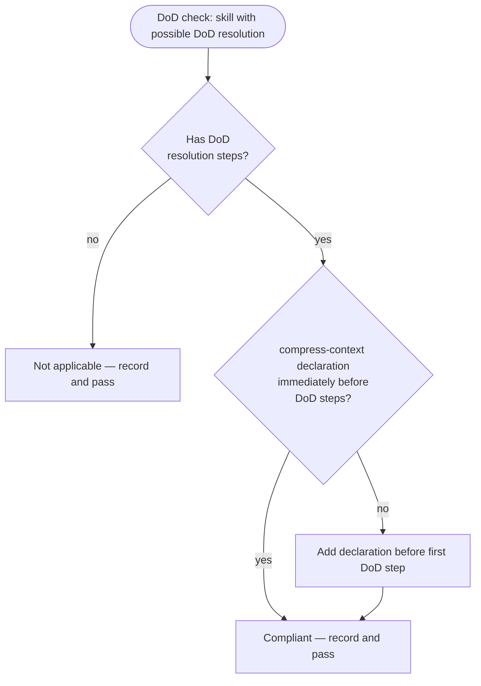

# Behaviour: Neutral DoD Resolution Context

## Actor
Skill author — writing or updating a taproot skill file that includes DoD resolution steps.

## Preconditions
- The skill being authored or updated instructs an agent to run DoD checks and record resolutions
- `check-if-affected-by: skill-architecture/neutral-dod-resolution` is present in `taproot/settings.yaml` definitionOfDone, causing this spec to be evaluated at DoD time for every skill implementation

  *Note:* If this entry is absent from settings.yaml, the constraint is not evaluated at DoD time — no error, the gate simply does not run. Adding the entry is the implementation step that activates enforcement.

## Main Flow
1. Skill author writes (or updates) a skill that includes DoD resolution steps.
2. At DoD time, the agent reads this spec and evaluates the skill against the constraint below.
3. The agent determines: **compliant**, **non-compliant**, or **not applicable** (with a stated reason).
4. If non-compliant, the agent edits the skill file directly to insert the context-isolation declaration immediately before the first DoD resolution step, then records the DoD resolution noting the correction applied.
5. Agent records the resolution via `taproot dod --resolve`.

## Constraint

### C-1: Context isolation before DoD resolution
Any skill that instructs an agent to run DoD checks and record resolutions must include a context-isolation capability declaration — currently `[invoke: compress-context]` (as defined in `agent-integration/agent-capability-invocation/usecase.md`) — immediately before the first DoD resolution step. (If a different capability is designated as the canonical context-isolation mechanism in future, this constraint follows that designation.)

Where a skill has multiple conditional paths that each independently reach DoD resolution, the declaration must precede each such branch, or a single declaration must appear before all branches diverge.

**Rationale:** An agent that has just completed a long implementation session carries accumulated context — it knows why every decision was made. When that same agent evaluates DoD conditions, it may rationalise compliance from memory rather than re-derive it from the artifacts. A context clear forces the agent to re-read specs, diffs, and truth files afresh, producing a genuinely independent evaluation.

**Compliant:**
```
4a. [invoke: compress-context]
4b. Run `taproot dod <impl-path>` and resolve each condition...
```

**Non-compliant:** A skill that runs DoD resolution steps with no preceding context isolation declaration — including an advisory hint placed *after* the commit rather than before DoD evaluation.

**Applicability:** Applies only to skills that run DoD checks on behalf of the developer. Skills that reference DoD in a What's next block only are not affected.

## Alternate Flows

### No DoD resolution steps present
- **Trigger:** The skill contains no steps that run `taproot dod` or record DoD resolutions.
- **Steps:**
  1. Agent records "not applicable — skill contains no DoD resolution steps."

## Postconditions
- Skills that run DoD checks include a `[invoke: compress-context]` declaration immediately before the resolution steps
- DoD compliance evaluations are derived from artifact reads, not session memory

## Error Conditions
- **Cannot locate first DoD step:** The skill's DoD steps are inside conditional logic that prevents unambiguous placement — agent records the violation and surfaces: "Cannot auto-correct — insert context-isolation declaration manually before the DoD resolution block."

## Flow



## Related
- `agent-integration/agent-capability-invocation/usecase.md` — dependency: `[invoke: compress-context]` is a capability declaration; this constraint requires that mechanism to exist before it can be implemented
- `skill-architecture/commit-awareness/usecase.md` — sibling: governs how commit steps are structured; this governs how DoD resolution steps are structured
- `skill-architecture/context-engineering/usecase.md` — sibling: governs overall skill context-efficiency; this specifically addresses evaluation bias from session memory accumulation

## Acceptance Criteria

**AC-1: Compliant — context isolation present**
- Given a skill with DoD resolution steps preceded by `[invoke: compress-context]`
- When the neutral-dod-resolution DoD check evaluates the skill
- Then the check passes as compliant

**AC-2: Non-compliant — isolation absent, correction applied**
- Given a skill with DoD resolution steps and no preceding context isolation declaration
- When the neutral-dod-resolution DoD check evaluates the skill
- Then the agent adds the declaration before the first DoD step and records the correction

**AC-3: Not applicable — no DoD resolution steps**
- Given a skill that contains no DoD resolution steps
- When the neutral-dod-resolution DoD check evaluates the skill
- Then the check passes as not applicable with a recorded reason

## Implementations <!-- taproot-managed -->
- [Multi-Surface — Settings Gate + Skill Declarations](./multi-surface/impl.md)

## Status
- **State:** specified
- **Created:** 2026-04-13
- **Last reviewed:** 2026-04-13
