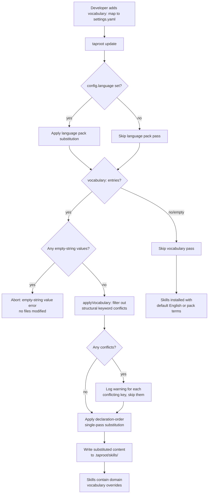

# Behaviour: Domain Vocabulary

## Actor
Developer configuring taproot for a non-development project — book authoring, financial reporting, legal review, or any other domain where dev-specific terms ("tests", "source files", "build", "implementation") don't map to project reality

## Preconditions
- taproot is initialised in the project (`taproot/` directory exists, `settings.yaml` present)
- Developer adds a `vocabulary:` map to `settings.yaml` with one or more domain overrides

## Main Flow
1. Developer adds a `vocabulary:` map to `settings.yaml`:
   ```yaml
   vocabulary:
     tests: manuscript reviews
     source files: chapters
     build: compile draft
     implementation: writing
   ```
2. Developer runs `taproot update` to apply the vocabulary overrides
3. taproot first applies the active language pack (if any), then applies the `vocabulary:` overrides as a second substitution pass
4. Domain vocabulary tokens in installed skill files (prose descriptions, CLI guidance text, example content) are replaced with the configured equivalents
5. Developer authors specs using the domain vocabulary — skills produce output using the configured terms
6. `taproot update` re-applies the vocabulary on each run, so overrides survive skill upgrades

## Substitution Semantics
- **Single-pass, declaration-order**: keys are processed in the order they appear in `settings.yaml`. Once a token is substituted, the result is not re-scanned — this prevents multi-key collisions (e.g. `tests → manuscript reviews` followed by `reviews → approvals` does NOT produce `manuscript approvals`; the substituted text `manuscript reviews` is not re-matched by the `reviews` key).
- **Exact string matching, case-sensitive**: `tests` matches the literal string `tests` but not `Tests`, `TESTS`, or `attests`. Use multiple keys if case variants need covering.
- **Declaration order governs overlap**: if one key is a prefix of another (e.g. `source` and `source files`), whichever appears first in `settings.yaml` is matched first. To ensure the longer key matches, declare it before any of its prefixes — e.g. declare `source files` before `source`. Declaring `source` first causes it to match within `source files`, preventing the longer key from ever matching.

## Alternate Flows

### Override conflicts with language pack keyword
- **Trigger:** A vocabulary override targets the same token as a structural keyword in the active language pack (e.g. overriding `## Status`)
- **Steps:**
  1. taproot logs a warning: "Vocabulary override 'Status' conflicts with a structural keyword — structural keywords take precedence; override ignored"
  2. The structural keyword is preserved; the vocabulary override for that key is skipped
  3. All non-conflicting overrides are applied

### Empty vocabulary map
- **Trigger:** `vocabulary:` is present in `settings.yaml` but has no entries
- **Steps:**
  1. taproot treats this as equivalent to no `vocabulary:` key — no substitution pass runs
  2. No warning is emitted

### Developer removes a vocabulary override
- **Trigger:** Developer removes a key from `vocabulary:` and runs `taproot update`
- **Steps:**
  1. taproot reinstalls skills from the canonical template without the removed override
  2. Previously substituted files revert to their language-pack or English default for that token

## Postconditions
- Installed skill files use the configured domain vocabulary in prose, guidance text, and examples
- Domain vocabulary overrides survive `taproot update` — re-running update re-applies them from `settings.yaml`
- Structural keywords (section headers, Gherkin keywords, state values) are never overridden by domain vocabulary — they remain under language pack control

## Error Conditions
- **Override key matches structural keyword** — taproot logs a warning and skips the conflicting override; all other overrides are applied normally
- **Empty-string vocabulary value** — if any vocabulary key maps to an empty string (e.g. `tests: ""`), `taproot update` reports: "Vocabulary override 'tests' maps to an empty string — this would silently delete the term from skill files. Provide a non-empty replacement or remove the key." No files are modified.
- **Malformed `vocabulary:` map** — `taproot update` aborts with a parse error and reports the offending entry; no files are modified

## Related
- `../../requirements-hierarchy/configure-hierarchy/usecase.md` — `settings.yaml` is the configuration surface; `vocabulary:` is a new map in the same file
- `../language-support/usecase.md` — language pack substitution runs first; domain vocabulary is applied after, on top of the language-pack result
- `../../agent-integration/update-adapters-and-skills/usecase.md` — `taproot update` is the trigger for both language pack and vocabulary substitution

## Acceptance Criteria

**AC-1: Domain vocabulary applied at `taproot update`**
- Given `vocabulary: { tests: manuscript reviews, source files: chapters }` in `settings.yaml`
- When the developer runs `taproot update`
- Then in each installed skill file, every exact occurrence of the string `"tests"` is replaced with `"manuscript reviews"` and every exact occurrence of `"source files"` is replaced with `"chapters"` — using single-pass, declaration-order substitution

**AC-2: Vocabulary overrides survive subsequent `taproot update` runs**
- Given vocabulary overrides are configured and skills have been updated once
- When the developer runs `taproot update` again (e.g. after a taproot version upgrade)
- Then the vocabulary overrides are re-applied to the freshly installed skills — no manual re-application needed

**AC-3: Domain vocabulary does not override structural keywords**
- Given a vocabulary override attempts to replace `## Status` or `Given`
- When `taproot update` runs
- Then the structural keyword is preserved, a warning is logged for the conflicting override, and non-conflicting overrides are applied

**AC-4: Vocabulary applied after language pack**
- Given `language: de` and `vocabulary: { tests: Manuskriptprüfungen }` are both configured
- When `taproot update` runs
- Then the German language pack is applied first, then the vocabulary override is applied on top — the final skill files contain both German structural keywords and the domain vocabulary term

**AC-5: Empty or absent vocabulary map produces no errors**
- Given `settings.yaml` has no `vocabulary:` key or an empty `vocabulary:` map
- When `taproot update` runs
- Then it completes without errors and applies no vocabulary substitution

**NFR-1: Vocabulary substitution adds no perceptible latency to `taproot update`**
- Given a `vocabulary:` map of up to 50 keys and 30 installed skill files
- When `taproot update` applies the vocabulary substitution pass
- Then the total additional time for the vocabulary pass is under 200ms on a standard developer machine

## Implementations <!-- taproot-managed -->
- [CLI Command](./cli-command/impl.md)

## Flow


## Status
- **State:** implemented
- **Created:** 2026-03-23
- **Last reviewed:** 2026-03-24
