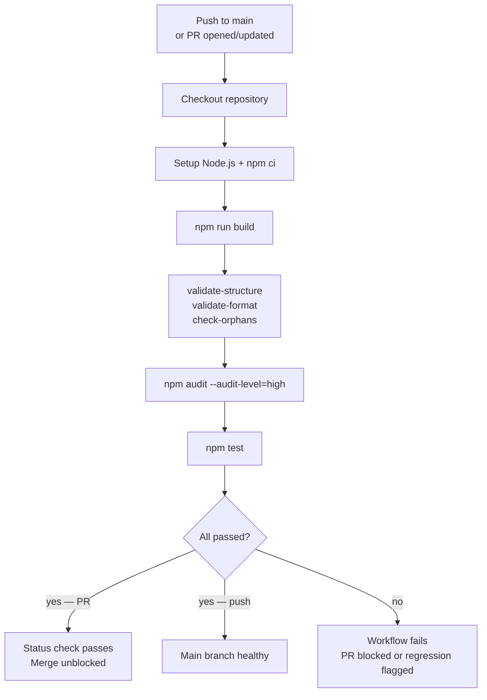

# Behaviour: CI Pipeline

## Actor
GitHub Actions — automated, triggered on every push to `main` and every pull request targeting `main`

## Preconditions
- `.github/workflows/taproot-ci.yml` exists in the repository
- The repository is hosted on GitHub
- Node.js version is pinned in the workflow (matches local development environment)

## Main Flow
1. GitHub Actions triggers the workflow on push to `main` or on a PR targeting `main`
2. Workflow checks out the repository at the triggering commit
3. Workflow sets up Node.js (pinned version) and installs dependencies: `npm ci`
4. Workflow builds the project: `npm run build`
5. Workflow runs hierarchy validation:
   - `node dist/cli.js validate-structure --path taproot/` — fails on structural errors
   - `node dist/cli.js validate-format --path taproot/` — fails on format errors
   - `node dist/cli.js check-orphans --path taproot/` — fails if orphaned implementations exist
6. Workflow runs security audit: `npm audit --audit-level=high` — fails if any high or critical CVE exists in the dependency tree
7. Workflow runs the test suite: `npm test`
8. All steps must pass; any failure marks the workflow run as failed and (on a PR) blocks the merge

## Alternate Flows

### Pull request
- **Trigger:** A PR is opened or updated targeting `main`
- **Steps:**
  1. All steps 2–7 run against the PR's head commit
  2. The workflow result is reported as a required status check — the PR cannot be merged until the workflow passes

### Push to main (post-merge)
- **Trigger:** A commit lands on `main` (e.g. after a PR merge)
- **Steps:**
  1. All steps 2–7 run against the merged commit
  2. Failure signals a regression on main — maintainer is notified via GitHub Actions failure notification

### Dependency audit failure
- **Trigger:** `npm audit --audit-level=high` reports a high or critical CVE
- **Steps:**
  1. Workflow fails at step 6 — subsequent steps do not run
  2. PR is blocked; maintainer must update or replace the affected dependency before merge

## Postconditions
- Every commit on `main` has passed: build, hierarchy validation, security audit, and tests
- Every PR is gated by the same checks before merge is permitted
- Failures are visible in the GitHub Actions UI and linked to the triggering commit or PR

## Error Conditions
- **Workflow file missing**: CI does not run — no status check is posted; PRs can be merged without validation. Detected only by noticing the absence of a status check.
- **Node version mismatch**: build or tests may fail in CI but pass locally — pinned Node version in workflow prevents this
- **`npm ci` fails** (missing or mismatched `package-lock.json`): workflow fails at step 3; maintainer must commit a valid lockfile

## Flow

## Related
- `../cut-release/usecase.md` — release workflow runs after CI passes on main; CI is the continuous gate, release is the periodic publish
- `../../requirements-hierarchy/initialise-hierarchy/usecase.md` — `taproot init --with-ci github` generates the initial `.github/workflows/taproot.yml` with the same checks

## Acceptance Criteria

**AC-1: Workflow triggers on push to main and on PRs targeting main**
- Given `.github/workflows/taproot-ci.yml` exists
- When a commit is pushed to `main` or a PR is opened targeting `main`
- Then the CI workflow is triggered automatically

**AC-2: validate-structure runs and fails the workflow on errors**
- Given the CI workflow is running
- When `node dist/cli.js validate-structure --path taproot/` exits with a non-zero code
- Then the workflow fails and no subsequent steps run

**AC-3: validate-format runs and fails the workflow on errors**
- Given the CI workflow is running
- When `node dist/cli.js validate-format --path taproot/` exits with a non-zero code
- Then the workflow fails and no subsequent steps run

**AC-4: check-orphans runs and fails the workflow on orphaned implementations**
- Given the CI workflow is running
- When `node dist/cli.js check-orphans --path taproot/` exits with a non-zero code
- Then the workflow fails and no subsequent steps run

**AC-5: npm audit blocks on high or critical CVEs**
- Given the CI workflow is running
- When `npm audit --audit-level=high` reports a high or critical vulnerability
- Then the workflow fails before tests run

**AC-6: npm test runs and fails the workflow on test failures**
- Given the CI workflow is running
- When `npm test` exits with a non-zero code
- Then the workflow fails

**AC-7: All checks pass — workflow succeeds**
- Given all validation, audit, and test steps pass
- When the workflow completes
- Then the workflow status is green and any associated PR is unblocked for merge

**AC-8: PR merge blocked when CI fails**
- Given the CI workflow is configured as a required status check on `main`
- When the workflow fails on a PR
- Then GitHub prevents the PR from being merged until the check passes

**AC-9: Node.js version is pinned in the workflow**
- Given the workflow file
- When it is read
- Then a specific Node.js version (not `latest`) is specified in the setup-node step

## Implementations <!-- taproot-managed -->
- [GitHub Actions Workflow](./github-workflow/impl.md)

## Status
- **State:** implemented
- **Created:** 2026-03-27
- **Last reviewed:** 2026-03-27
