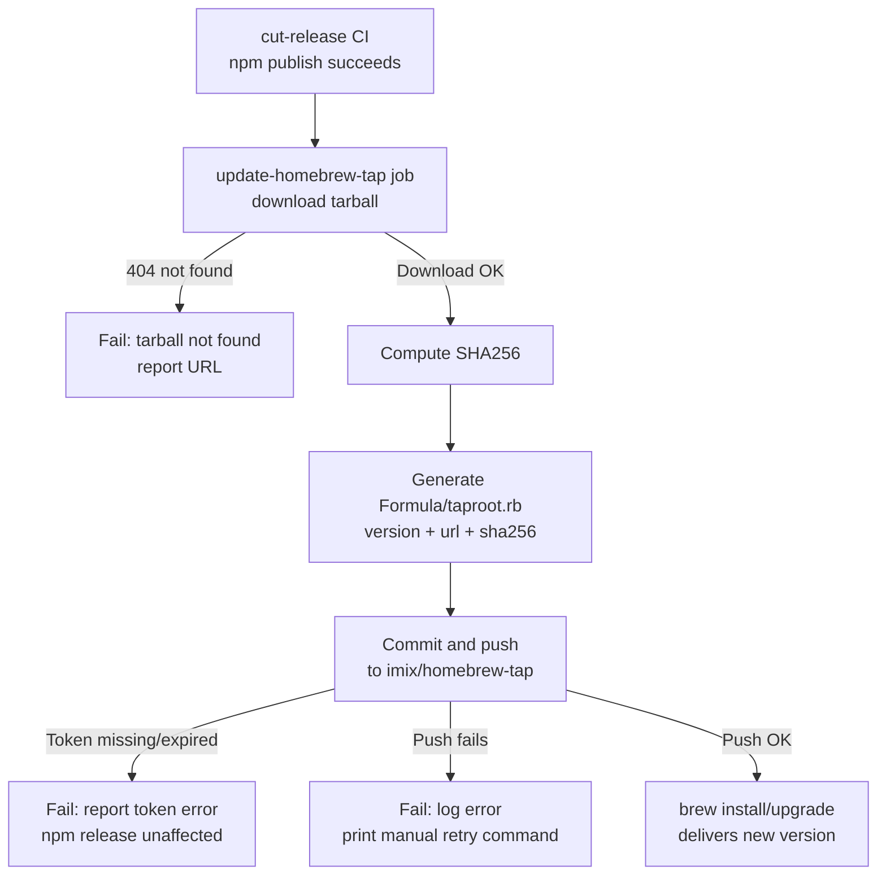

# Behaviour: Publish to Homebrew Tap

## Actor
CI system — the `update-homebrew-tap` job runs automatically after each successful npm publish; one-time formula creation is performed by the Maintainer.

## Preconditions
- `imix/homebrew-tap` GitHub repository exists
- A GitHub token with write access to `imix/homebrew-tap` is stored as `HOMEBREW_TAP_TOKEN` in the `release` GitHub Actions environment
- A GitHub Release exists for the version being published (tarball URL: `https://github.com/imix-js/taproot/archive/refs/tags/vX.Y.Z.tar.gz`)
- npm publish has succeeded for the same version (ensures the release tag exists)

## Main Flow

1. The `cut-release` CI `publish` job completes successfully (npm published, git tag pushed).
2. The `update-homebrew-tap` CI job triggers — runs in the `release` environment after `publish` succeeds.
3. CI downloads the release tarball from `https://github.com/imix-js/taproot/archive/refs/tags/v${VERSION}.tar.gz`.
4. CI computes the SHA256 of the tarball.
5. CI generates `Formula/taproot.rb` with the new `version`, `url`, and `sha256`.
6. CI commits and pushes the updated formula to `imix/homebrew-tap` with message: `taproot vX.Y.Z`.
7. Users running `brew upgrade taproot` (or `brew install imix/tap/taproot`) receive the new version.

## Alternate Flows

### First-time formula creation
- **Trigger:** `Formula/taproot.rb` does not yet exist in `imix/homebrew-tap`.
- **Steps:**
  1. Maintainer creates `Formula/taproot.rb` manually using the standard template (see Notes).
  2. Maintainer adds `HOMEBREW_TAP_TOKEN` to the `release` GitHub Actions environment.
  3. Maintainer adds the `update-homebrew-tap` job to `.github/workflows/release.yml`.
  4. Subsequent releases are fully automated.

### Push to tap fails
- **Trigger:** `git push` to `imix/homebrew-tap` exits non-zero (token expired, permission denied, network error).
- **Steps:**
  1. CI logs the error and fails the `update-homebrew-tap` job.
  2. CI reports: `"Homebrew tap update failed: <error>. Retry manually: update Formula/taproot.rb in imix/homebrew-tap to version X.Y.Z."`
  3. The npm release is unaffected — it has already succeeded.

### SHA256 mismatch on user install
- **Trigger:** A user's `brew install` fails with a checksum error (formula SHA256 doesn't match the downloaded tarball).
- **Steps:**
  1. Maintainer re-runs the CI job or manually recomputes `sha256sum` on the release tarball.
  2. Maintainer updates `Formula/taproot.rb` with the correct SHA256 and pushes.

## Postconditions
- `Formula/taproot.rb` in `imix/homebrew-tap` reflects the latest released version, URL, and SHA256.
- `brew install imix/tap/taproot` installs the newly released version.
- The npm release is unaffected if the tap update fails — Homebrew is a secondary channel.

## Error Conditions
- **`HOMEBREW_TAP_TOKEN` missing or expired:** CI job fails immediately with: `"HOMEBREW_TAP_TOKEN not set or invalid. Add or rotate the token in the 'release' GitHub environment."`
- **Tarball URL not found (404):** CI reports: `"GitHub release tarball not found for vX.Y.Z — ensure the GitHub Release was created before this job runs."`
- **`brew audit` fails on formula:** CI reports the audit output; Maintainer corrects the formula template and re-runs.

## Flow

## Related
- `../cut-release/usecase.md` — triggers this behaviour; `update-homebrew-tap` job runs after `publish` succeeds
- `../vscode-marketplace/usecase.md` — parallel distribution channel updated in the same release workflow

## Acceptance Criteria

**AC-1: Formula updated automatically after release**
- Given the `publish` CI job succeeds for version X.Y.Z
- When the `update-homebrew-tap` job runs
- Then `Formula/taproot.rb` in `imix/homebrew-tap` is updated with version X.Y.Z, the correct tarball URL, and the correct SHA256

**AC-2: Homebrew failure does not block npm release**
- Given the `update-homebrew-tap` job fails for any reason
- When the failure is detected
- Then the npm release is unaffected and a manual retry command is reported

**AC-3: Missing token produces clear recovery message**
- Given `HOMEBREW_TAP_TOKEN` is absent or expired
- When the `update-homebrew-tap` job starts
- Then CI fails immediately with a message naming the secret and the `release` environment where it must be set

**AC-4: SHA256 computed from the actual release tarball**
- Given the release tarball is available at the GitHub archive URL
- When the job runs
- Then the SHA256 written to the formula is computed from that exact tarball (not hardcoded or assumed)

## Implementations <!-- taproot-managed -->

## Status
- **State:** specified
- **Created:** 2026-03-28
- **Last reviewed:** 2026-03-28

## Notes
- **Formula template:** `depends_on "node"` + `system "npm", "install", "--prefix", prefix, "--production", "."` — standard Homebrew pattern for Node.js CLI tools. The `bin/` directory will contain the `taproot` executable.
- **Tap name:** `brew tap imix/tap` then `brew install imix/tap/taproot`.
- **Automated update mechanism:** the CI job clones `imix/homebrew-tap`, runs `sed` or a script to replace `url`, `sha256`, and `version` in the formula, commits, and pushes using the `HOMEBREW_TAP_TOKEN`.
- **Homebrew is a secondary channel:** a failed tap update is non-blocking. The primary channels (npm, VS Code Marketplace) are unaffected.
